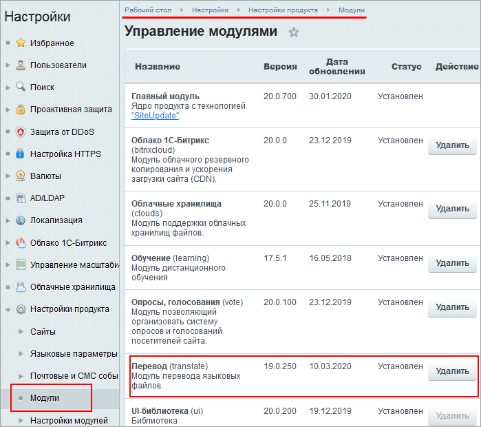
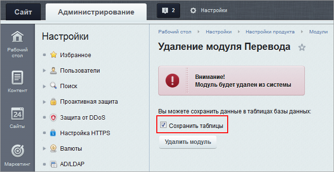

# Mодуль Перевод

**Навигация**
- [← Оглавление курса](index.md)
- [← Предыдущий: 2072 — Загрузка языковых файлов](lesson_2072.md)
- [Следующий: 12982 — Поиск языковых файлов →](lesson_12982.md)

Официальная страница урока: https://dev.1c-bitrix.ru/learning/course/index.php?COURSE_ID=48&LESSON_ID=12980

### Правим файлы для многоязычного интерфейса

Чтобы многоязычный интерфейс работал правильно, требуется где-то хранить весь текст, который используется в административном разделе. Он хранится в виде отдельных текстовых сообщений в

			языковых файлах

                    Языковой файл - представляет из себя PHP скрипт, хранящий переводы языковых фраз на тот или иной язык. Данный скрипт состоит из массива **$MESS**, ключи которого - идентификаторы языковых фраз, а значения - переводы на соответствующий язык.

	 Подробнее в курсе [Разработчик Bitrix Framework](https://dev.1c-bitrix.ru/learning/course/index.php?COURSE_ID=43&CHAPTER_ID=03695).

		 соответствующих языков. Языковые файлы размещаются в папках тех модулей и шаблонов, для которых используются эти текстовые сообщения.

Перевод языковых файлов возможен:

- вручную, путем редактирования соответствующих файлов;
- с помощью модуля **Перевод**.

Модуль **Перевод** предоставляет удобный интерфейс для поиска и перевода языковых сообщений и позволяет:

- просмотреть распределение языковых фраз по файлам системы;
- определить количество непереведенных фраз для каждого файла;
- перейти к переводу необходимых текстовых сообщений;

**Примечание**: с версии **19.0.0** модуля **translate** доступен функционал:

- Подсчёт недостающих и лишних фраз и языковых файлов;
- Поиск фраз по уже существующим переводам;
- Экспорт в CSV как полного списка фраз, так и результата поиска.

### Настройки модуля

Настройки модуля выполняются на странице Настройки &gt; Настройки продукта &gt; Настройки модулей &gt; Перевод :

Описание всех настроек приводится в [документации](https://dev.1c-bitrix.ru/user_help/settings/translate/settings.php).

### Удаление модуля

В случае необходимости

			удаления модуля

                    

		 это можно сделать на странице Настройки &gt; Настройки продукта &gt; Модули. При этом можно сохранить данные модуля (например, настройки, индекс, примеры фраз с полным переводом) в таблицах базы данных:

### Документация по теме

- [Настройки модуля Перевод](https://dev.1c-bitrix.ru/user_help/settings/translate/settings.php);
- [Языковые файлы](/learning/course/index.php?COURSE_ID=43&LESSON_ID=3695) в курсе Разработчик Bitrix Framework.
