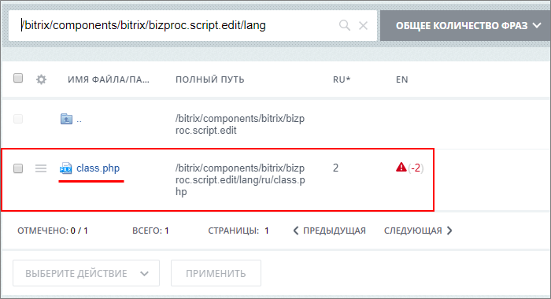
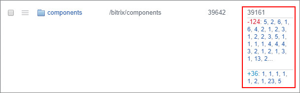
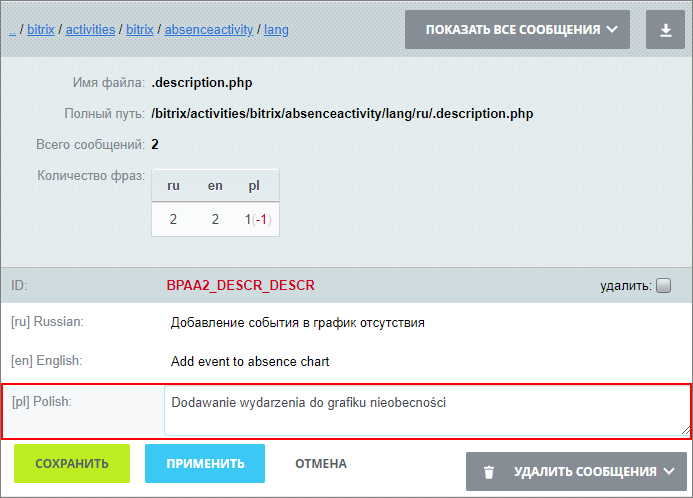
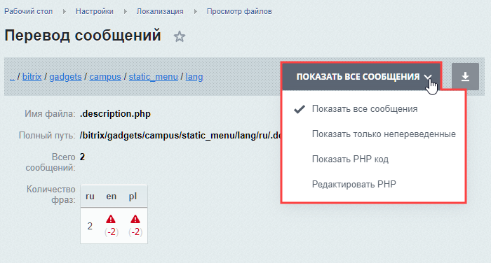

# Перевод фраз

**Навигация**
- [← Оглавление курса](index.md)
- [← Предыдущий: 12982 — Поиск языковых файлов](lesson_12982.md)
- [Следующий: 12986 — Импорт и экспорт →](lesson_12986.md)

Официальная страница урока: https://dev.1c-bitrix.ru/learning/course/index.php?COURSE_ID=48&LESSON_ID=12984

### Видеоурок

<!-- &lt;p&gt;&lt;iframe title="Перевод фраз в языковых файлах" src="//www.youtube.com/embed/joxchGw6Ayg?feature=oembed&rel=0" allowfullscreen="" width="853" height="480" frameborder="0"&gt;
&lt;/iframe&gt;
&lt;/p&gt; -->

### Перевод фразы

Откройте файл для редактирования языковых фраз одним из следующих способов:

- Откройте файл
                      
  		 по его полному пути: через поиск или перейдя по папкам каталога;
- В общем списке файлов выберите
  			действие
                      
  		 **Показать ссылки на файлы без переводов** при помощи кнопки выбора действий. Тогда в списке отобразятся
  			ссылки на файлы
                      Множество цифр синего цвета - это количество 
  		, по которым доступен переход.
- Из списка языковых файлов
  			на странице
                      Для поиска файлов перевода на конкретной странице воспользуйтесь удобным инструментом, который позволяет перейти к форме выполнения перевода языковых сообщений непосредственно со страницы, на которой эти сообщения используются (как в публичной, так и административной части сайта).
  [Подробнее](lesson_12982.md#search_file)...
  		 сайта.

В файле отображаются

			языковые сообщения

                    В форме будут отображены языковые фразы для языков, доступных для представления в одной кодировке.

		. Найдите фразу и введите перевод сообщения для нужного языка:

### Режимы просмотра

В правом верхнем углу формы вы найдете переключатель режимов просмотра и редактирования:

- **Показать все сообщения** – отображаются все языковые фразы;
- **Показать только непереведенные** – отображаются только те языковые фразы, для которых нет перевода на какой-либо из языков;
- **Показать PHP код** – просмотр оригинального файла, написанного на PHP коде, для основного языка;
- **Редактировать PHP код** – режим редактирования PHP кода файла.

### Удаление фраз

Для удаления сообщений доступны варианты:

- **Удалить** – отметьте вручную, какие фразы следует удалить. Отмеченные фразы удалятся после нажатия кнопки **Сохранить** или **Применить**;
- **Удалить все сообщения** – отмечает все языковые фразы для удаления;
- **Удалить сообщения, перевод которых отсутствует для текущего языка** – будут отмечены только те фразы, у которых отсутствует перевод для текущего языка.

### Документация по теме

- [Перевод сообщений](https://dev.1c-bitrix.ru/user_help/settings/translate/translate_edit.php);
- [Языковые файлы](/learning/course/index.php?COURSE_ID=43&LESSON_ID=3695) в курсе Разработчик Bitrix Framework.
