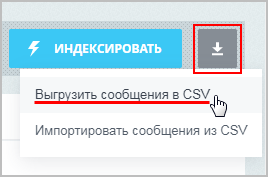

# Импорт и экспорт

**Навигация**
- [← Оглавление курса](index.md)
- [← Предыдущий: 12984 — Перевод фраз](lesson_12984.md)
- [Следующий: 3577 — Настройка вида страницы ошибки 404 →](lesson_3577.md)

Официальная страница урока: https://dev.1c-bitrix.ru/learning/course/index.php?COURSE_ID=48&LESSON_ID=12986

**Импорт и экспорт языковых файлов**


Частый случай - необходимость перевода большого количества фраз на какой-либо язык. Модуль **Перевод** позволяет легко выгружать и загружать языковые файлы в формате **CSV**.

Выполняйте выгрузку как всех файлов, так и отдельных. А также всех фраз или только без перевода.


### Экспорт


Экспорт файла выполняется на странице **Перевод языковых файлов** (Настройки &gt; Локализация &gt; Просмотр файлов) с помощью кнопки

			Выгрузить сообщения в CSV

                    

		.


Откроется форма настройки:


Для выгрузки языковых сообщений из конкретных папок или файлов требуется указать пути к ним в поле **Выгрузить сообщения только для файлов и папок**.


Второй способ экспорта конкретных папок или файлов - из списка. Отметьте их в списке и на панели действий выберите действие

			Экспортировать выделенные

                    

		.


Функция экспорта языковых сообщений также доступна в форме просмотра конкретного файла.


**Примечание**: с версии **19.0.0** модуля **translate** доступна возможность экспорта в CSV как полного списка фраз, так и

			результата поиска

                    Например, если указать в фильтре в поле **Имя файла** - admin, то в результате получим список всех файлов, которые содержат в названиях слово **admin**. Теперь при нажатии кнопки экспорта, выгрузится файл CSV с языковыми сообщениями из всех найденных файлов.

		.


## Пример экспортированного языкового файла

Ниже приведен фрагмент экспортированного файла CSV. Первая строка содержит заголовки **file** (путь к файлу), **key** (ключ языковой фразы) и **ru** / **en** (языковые фразы на русском и английском языках).


```
"file";"key";"ru";"en"
"/bitrix/components/bitrix/catalog/lang/#LANG_ID#/.description.php";"IBLOCK_CATALOG_NAME";"Каталог";"Catalog"
"/bitrix/components/bitrix/catalog/lang/#LANG_ID#/.description.php";"IBLOCK_CATALOG_DESCRIPTION";"Полный каталог";"Full catalog"
"/bitrix/components/bitrix/catalog/lang/#LANG_ID#/.description.php";"T_IBLOCK_DESC_CATALOG";"Каталог";"Catalog"
"/bitrix/components/bitrix/catalog/lang/#LANG_ID#/.parameters.php";"IBLOCK_EXTENDED_SETTINGS";"Специальные настройки";"Extended parameters"
"/bitrix/components/bitrix/catalog/lang/#LANG_ID#/.parameters.php";"ANALYTICS_SETTINGS";"Настройки аналитики";"Analytics Preferences"
"/bitrix/components/bitrix/catalog/lang/#LANG_ID#/.parameters.php";"IBLOCK_ACTIONS";"Настройки действий";"Action settings"
"/bitrix/components/bitrix/catalog/lang/#LANG_ID#/.parameters.php";"IBLOCK_SORT_ASC";"по возрастанию";"ascending"
"/bitrix/components/bitrix/catalog/lang/#LANG_ID#/.parameters.php";"IBLOCK_SORT_DESC";"по убыванию";"descending"
"/bitrix/components/bitrix/catalog/lang/#LANG_ID#/.parameters.php";"IBLOCK_TYPE";"Тип инфоблока";"Type of information block"
"/bitrix/components/bitrix/catalog/lang/#LANG_ID#/.parameters.php";"IBLOCK_IBLOCK";"Инфоблок";"Information block"
```


### Импорт


В экспортированный файл CSV внесите необходимые переводы для языковых фраз. Для этого вы можете использовать популярные программы: Блокнот или Microsoft Excel, либо другие, удобные вам, редакторы. После переходите к импорту нажатием кнопки

			Импортировать сообщения из CSV

                    

		 на странице просмотра файлов.


В открывшейся форме выберите файл для загрузки, кодировку и каким образом добавлять фразы.


По окончании импорта, в языковых файлах отобразятся изменения в соответствии с содержимым файла и настройками импорта.


### Полная локализация


Сбор всех языковых файлов локализации выполняется на странице **Выгрузка и загрузка** (Настройки &gt; Локализация &gt; Выгрузка и загрузка):


1. На вкладке **Сбор переводов** выполняется экспорт для выбранного языка. Рекомендуется выполнять выгрузку в формате архива **.tar.gz**;
2. На вкладке **Загрузка переводов** выполните загрузку
  			файла локализации
                      Допускается загрузка только архива **.tar.gz** размером до 32 МБ.
  		. Предварительно
  			создайте язык
                      Управление языками интерфейса системы выполняется на странице **Языки интерфейса** (Настройки &gt; Настройки продукта &gt; Языковые параметры &gt; Языки интерфейса). В списке отображены языки, доступные для выбора в качестве языка административного интерфейса. На выбранном языке будут отображаться системные сообщения: информационные сообщения, сообщения об ошибках, заголовки таблиц, надписи на кнопках управления и т.д.
  [Подробнее](lesson_2071.md)...
  		, для которого хотите загрузить локализацию, если его нет в списке.


**Примечание**: Подробнее о реализации механизма локализации, загрузке и выгрузке файлов локализации см. курс

			Разработчик Bitrix Framework

                    После создания локализации системы можно создать полный пакет локализации для каждого языка системы.

Подробнее в курсе [Разработчик Bitrix Framework](https://dev.1c-bitrix.ru/learning/course/index.php?COURSE_ID=43&LESSON_ID=3844&LESSON_PATH=3913.4564.4926.3844#full_loc).

		.


### Документация по теме


- Документация:
  [Загрузка и выгрузка локализации](https://dev.1c-bitrix.ru/learning/course/index.php?COURSE_ID=43&LESSON_ID=3844&LESSON_PATH=3913.4564.4926.3844) в курсе Разработчик Bitrix Framework.

  - [Просмотр файлов](https://dev.1c-bitrix.ru/user_help/settings/translate/translate_list.php);
  - [Перевод сообщений](https://dev.1c-bitrix.ru/user_help/settings/translate/translate_edit.php);
  - [Выгрузка и загрузка](https://dev.1c-bitrix.ru/user_help/settings/translate/translate_collector.php);
