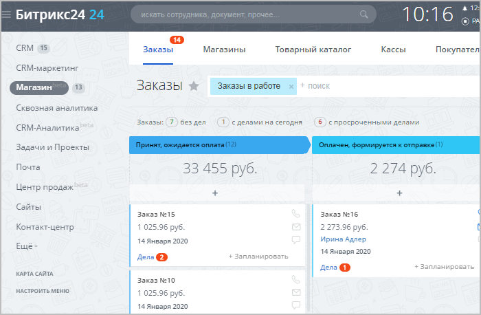
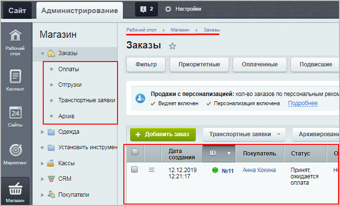
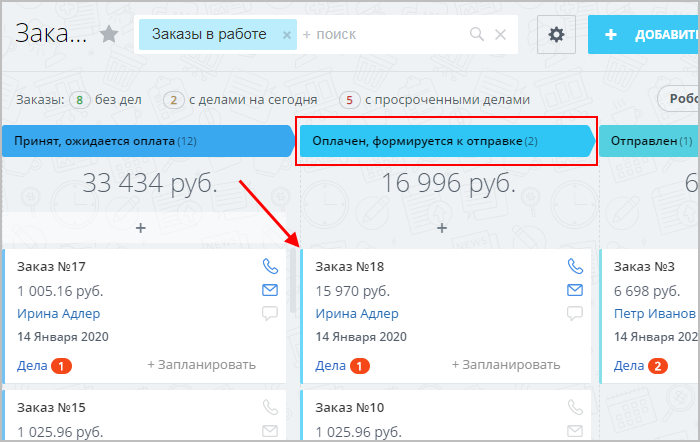
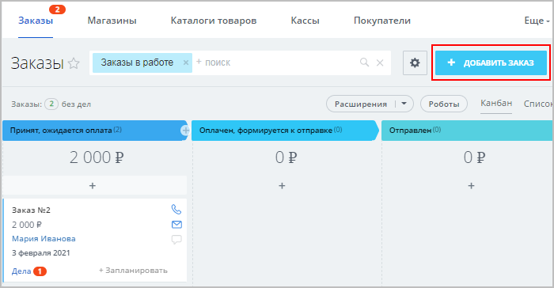
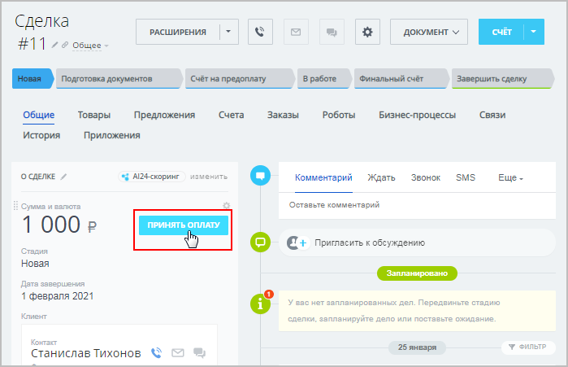
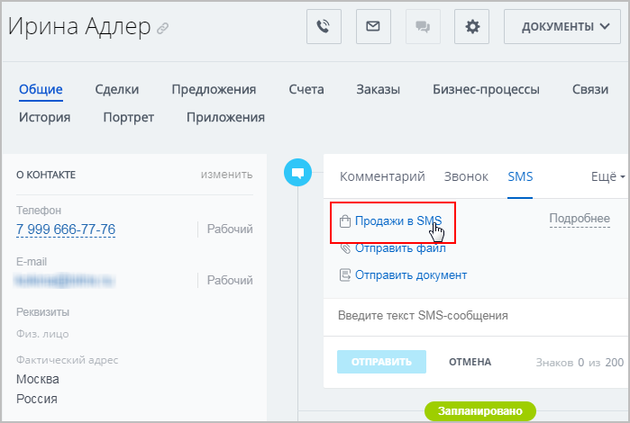
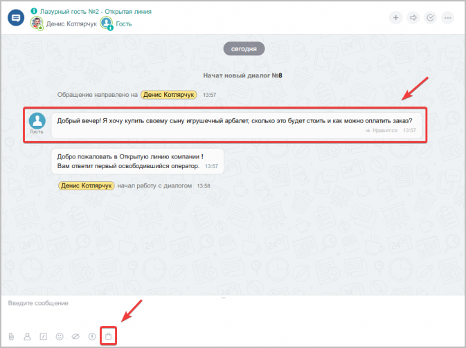
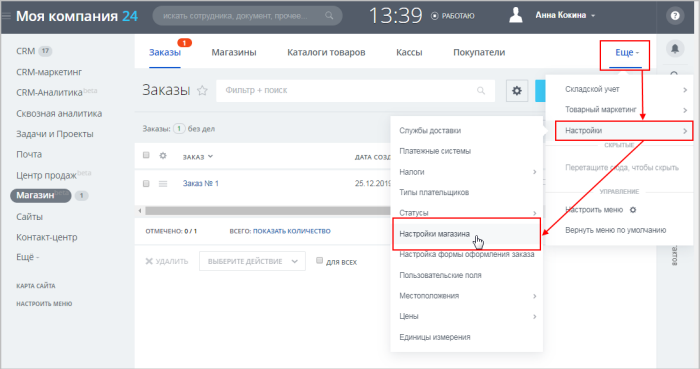
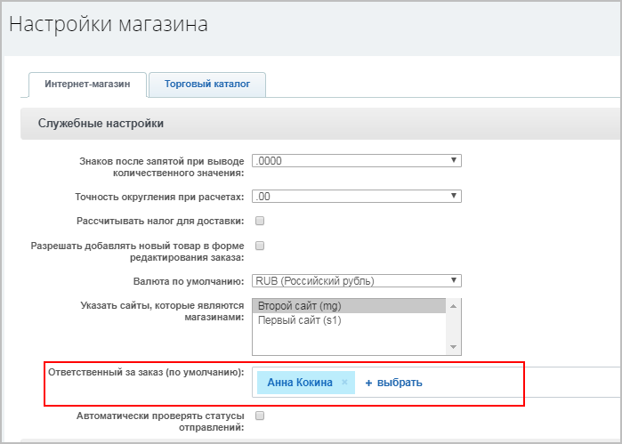

# Важные моменты

**Навигация**
- [← Оглавление курса](index.md)
- [← Предыдущий: 12906 — Дела: коммуникации с клиентами](lesson_12906.md)
- [Следующий: 12994 — Основные сценарии →](lesson_12994.md)

Официальная страница урока: https://dev.1c-bitrix.ru/learning/course/index.php?COURSE_ID=48&LESSON_ID=12990

В данном уроке описывается работа с заказами интернет-магазина в интерфейсе *Битрикс24* в режиме **Сделки + Заказы**. В этом режиме все заказы интернет-магазина отображаются в *Битрикс24* тоже в виде Заказов.

**Важно!** С версии модуля **CRM 22.200.0** в *Битрикс24* поддерживается работа только в режиме

			Без заказов

При этом сценарии вы сможете работать в сделке, а не в заказах. Работа со сделками имеет ряд преимуществ:

- Это более привычный сценарий работы, который легче использовать;
- Вся информация собирается в одной карточке. Вы сможете быстрее найти информацию о клиенте или процессе продажи;
- Можно более широко использовать автоматизацию - бизнес-процессы, приложения, туннели и направления сделок.

[Подробнее](https://helpdesk.bitrix24.ru/open/13632830/)...

		. В этом режиме все заказы, созданные на стороне интернет-магазина, отображаются в интерфейсе *Битрикс24* в виде

			Сделок

		. Подробнее о Сделках читайте [в статье Поддержки24](https://helpdesk.bitrix24.ru/open/5493461/).

Если вы уже работаете в режиме **Сделки + Заказы**, то он продолжит работать без изменений. Если вы случайно перешли в режим **Без заказов** и хотите вернуть прежний режим **Сделки + Заказы**, то обратитесь в [техподдержку](https://dev.1c-bitrix.ru/support/) (штатными средствами вернуть этот режим нельзя).

|  |
| --- |

|  | ### Немного теории |
| --- | --- |

Как вы уже

			знаете,

*«1С-Битрикс24: Интернет-магазин+CRM»* – это тот же самый *Битрикс24*

(коробочная версия корпоративного портала), но с модулями, необходимыми для

работы Интернет-магазина (как в продукте *«1С-Битрикс: Управление сайтом»*

редакции **Бизнес**). Таким образом, 12 сотрудников интернет-магазина

могут работать с заказами в удобном интерфейсе *Битрикс24*.

При этом можно настроить дополнительные каналы продаж в чатах и по SMS

без перехода на сайт.

[Подробнее](lesson_12890.md)...

		 в *«1С-Битрикс24: Интернет-магазин+CRM»* можно создать полноценный интернет-магазин, заказы которого попадают и обрабатываются в

			интерфейсе *Битрикс24*

		 (а не в

			административной части сайта,

В стандартном интернет-магазине *«1С-Битрикс: Управление сайтом»* заказы обрабатываются

в Административной части:

		 как при стандартном интернет-магазине). Соответственно, для успешной работы необходимо научиться пользоваться инструментами *Битрикс24*.

**Примечание**: Прежде, чем приступать к работе в *«1С-Битрикс24: Интернет-магазин+CRM»*, настоятельно рекомендуем изучить следующие статьи по работе в *Битрикс24*:

- [Сделки](https://helpdesk.bitrix24.ru/open/5493461/?sphrase_id=54203532)
- [Как создать заказ внутри CRM?](https://helpdesk.bitrix24.ru/open/8236909/?sphrase_id=54203724)
- [Что такое центр продаж](https://helpdesk.bitrix24.ru/open/9289135/?sphrase_id=54203156)
- [Центр продаж - с чего начать](https://helpdesk.bitrix24.ru/open/9680407/?sphrase_id=54203156)
- [Продажи в SMS](https://helpdesk.bitrix24.ru/open/9680407/?sphrase_id=54203156)

Главный плюс работы в *Битрикс24* – возможность отправлять клиенту форму оплаты товара, и, соответственно, **продавать** товары не только через интернет-магазин, но и через дополнительные каналы связи – SMS и чаты! Эти инструменты настраиваются в специальном разделе *Битрикс24* – в

			Центре продаж.

Современный бизнес всё чаще общается с клиентами в мессенджерах

и соцсетях - это помогает всегда оставаться на связи. Однако клиенты

хотят не просто общаться с менеджером, а выполнять конкретные

действия прямо в чате - создавать и оплачивать заказ, записываться

на приём, получать схему проезда.

Более того, все больше клиентов не сидят за компьютером, а используют

смартфон. Поэтому информация, которую мы отправляем клиенту,

должна быть адаптирована под смартфоны и планшеты.

Это меняет требования и к способам оплаты - клиенты предпочитают отправить

SMS или ввести номер телефона, а не заполнять данные банковской карты.

[Подробнее](https://helpdesk.bitrix24.ru/open/9289135/?sphrase_id=54203156)...

При работе с клиентами через каналы **Центра продаж** вы создаёте

			Сделки

**Сделка** - основная цель бизнеса и результат работы с клиентом.

По сути это и есть продажа товара или услуги:)

В Битрикс24.CRM сделка - важный элемент рабочего процесса.

Потенциальные клиенты постепенно приходят к сделке, а сама сделка

в процессе работы превращается в коммерческое предложение

или счёт на оплату.

[Подробнее](https://helpdesk.bitrix24.ru/open/5493461/?sphrase_id=54203532)...

		 – то есть потенциальные заказы.

Если вы отправляете из **Сделки** счёт на оплату, то автоматически создаются

			Заказы.

**Заказы** - цель и основа работы любого интернет-магазина.

В этой статье мы научимся работать с заказами внутри CRM - создавать их, обрабатывать и завершать.

[Подробнее](https://helpdesk.bitrix24.ru/open/8236909/?sphrase_id=54203724)...

		 в Интернет-магазине

|  |
| --- |

|  | ### Основные моменты при работе с заказами в режиме Сделки + Заказы |
| --- | --- |

В интерфейсе *Битрикс24* есть два раздела для работы с заказами:

- **Сделки** – все потенциальные заказы, осуществляющиеся через **Центр продаж**. Вся работа с клиентом ведётся именно в **Сделке**. При отправке клиенту счета на оплату автоматически создастся **Заказ** (незавершённые **Сделки** можно просто удалить);
- **Заказы** – все заказы **с выставленным счётом** (т.е. **все** заказы интернет-магазина и заказы, созданные при отправке клиенту счета на оплату). В этом разделе работаем на этапе формирования товара к отправке (т.е. когда товар находится в статусе
  			Оплачен, формируется к отправке
  Когда клиент оплачивает заказ, то ему автоматически присваивается статус
  **Оплачен, формируется к отправке**.
  Либо можно перевести заказ в этот статус вручную (например, перетянув заказ в нужную колонку).
  
  		).

## Способы создания Заказа в интерфейсе Битрикс24

- На странице Магазин &gt; Заказы кликнуть **Добавить заказ**:
  
- В Сделке с помощью кнопки **Принять оплату**:
  
- В карточке CRM или в Сделке отправить счёт на оплату через **Продажи в SMS**:
  
- В чате с клиентом [принять платёж](https://helpdesk.bitrix24.ru/open/9607511/):
  

**Примечание**: в

			настройках магазина

)

		 в интерфейсе *Битрикс24* установите

			ответственного

		 за заказы по умолчанию (т.е. человека, который будет указан как ответственный во всех заказах, поступающих из интернет-магазина, и сможет распределять заказы по другим ответственным).
