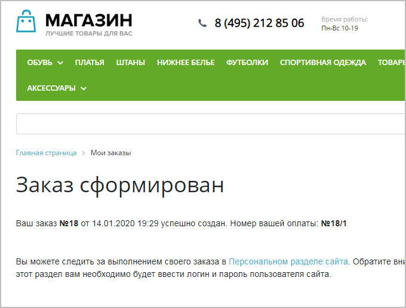
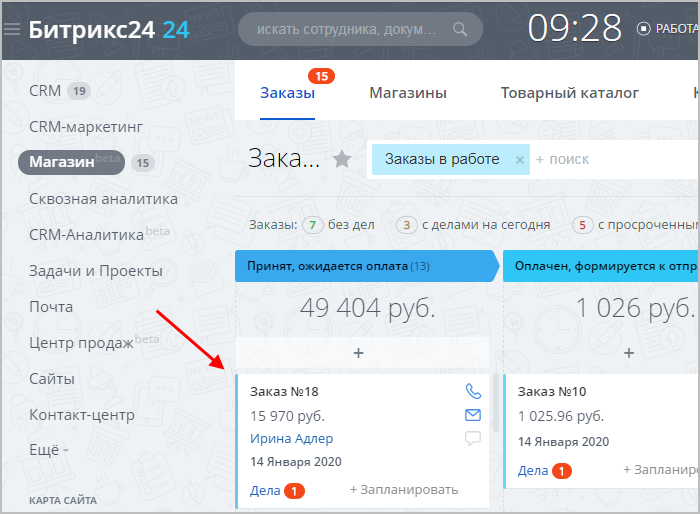
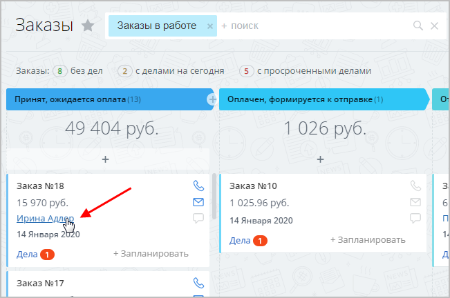

# Основные сценарии

**Навигация**
- [← Оглавление курса](index.md)
- [← Предыдущий: 12990 — Важные моменты](lesson_12990.md)
- [Следующий: 12996 — Схема работы со Сделками и Заказами →](lesson_12996.md)

Официальная страница урока: https://dev.1c-bitrix.ru/learning/course/index.php?COURSE_ID=48&LESSON_ID=12994

В данном уроке описывается работа с заказами интернет-магазина в интерфейсе *Битрикс24* в режиме **Сделки + Заказы**. В этом режиме все заказы интернет-магазина отображаются в *Битрикс24* тоже в виде Заказов.

**Важно!** С версии модуля **CRM 22.200.0** в *Битрикс24* поддерживается работа только в режиме

			Без заказов

При этом сценарии вы сможете работать в сделке, а не в заказах. Работа со сделками имеет ряд преимуществ:

- Это более привычный сценарий работы, который легче использовать;
- Вся информация собирается в одной карточке. Вы сможете быстрее найти информацию о клиенте или процессе продажи;
- Можно более широко использовать автоматизацию - бизнес-процессы, приложения, туннели и направления сделок.

[Подробнее](https://helpdesk.bitrix24.ru/open/13632830/)...

		. В этом режиме все заказы, созданные на стороне интернет-магазина, отображаются в интерфейсе *Битрикс24* в виде

			Сделок

		. Подробнее о Сделках читайте [в статье Поддержки24](https://helpdesk.bitrix24.ru/open/5493461/).

Если вы уже работаете в режиме **Сделки + Заказы**, то он продолжит работать без изменений. Если вы случайно перешли в режим **Без заказов** и хотите вернуть прежний режим **Сделки + Заказы**, то обратитесь в [техподдержку](https://dev.1c-bitrix.ru/support/) (штатными средствами вернуть этот режим нельзя).

|  |
| --- |

|  | ### Примеры возможных сценариев |
| --- | --- |

В

			предыдущем уроке

При работе с клиентами через каналы **Центра продаж** (SMS или чаты) вы создаёте **Сделки** – то есть потенциальные заказы, которые еще не оплачены. А при выставлении счёта на оплату будет автоматически создаваться **Заказ**.

[Подробнее](lesson_12990.md)...

		 вы узнали, что в *«1С-Битрикс24: Интернет-магазин+CRM»* вся работа происходит со

			Сделками.

**Сделка** - основная цель бизнеса и результат работы с клиентом.

По сути это и есть продажа товара или услуги:)

В Битрикс24.CRM сделка - важный элемент рабочего процесса.

Потенциальные клиенты постепенно приходят к сделке, а сама сделка

в процессе работы превращается в коммерческое предложение

или счёт на оплату.

[Подробнее](https://helpdesk.bitrix24.ru/open/5493461/)...

		 При оплате товара автоматически создается

			Заказ,

**Заказы** - цель и основа работы любого интернет-магазина.

В этой статье мы научимся работать с заказами внутри CRM - создавать их, обрабатывать и завершать.

[Подробнее](https://helpdesk.bitrix24.ru/open/8236909/)...

		 с которым работают на этапе формирования товара к отправке.

Рассмотрим подробнее несколько наиболее частых сценариев работы в *«1С-Битрикс24: Интернет-магазин+CRM»* на примере интернет-магазина по продаже смартфонов:

1. Клиент заказал в
  			интернет-магазине
  
  		 смартфон – в *Битрикс24* автоматически создался
  			Заказ.
  
  		 Далее возможны следующие варианты:

  - если смартфон достаточно редкий, и нам нечего предложить клиенту – ждём поступления оплаты, а далее работаем с простым **Заказом** на этапе подготовки заказа к отгрузке (т.е. когда товар будет находиться в статусе
    			Оплачен, формируется к отправке
    Когда клиент оплачивает заказ, то ему автоматически присваивается статус
    **Оплачен, формируется к отправке**.
    Либо можно перевести заказ в этот статус вручную (например, перетянув заказ в нужную колонку).
    
    		).
  - если нам есть, что еще предложить клиенту – создаём **Сделку** на новый товар, общаемся с клиентом с помощью
    			Дел
    В интерфейсе *Битрикс24* у вас появляется возможность прямо из CRM связаться с клиентом – позвонить, написать письмо на электронную почту, отправить sms, запланировать встречу и т.д. Всё это называется общим термином **Дела**.
    [Подробнее](lesson_12906.md)...
    		 и далее через
    			Центр продаж
    Современный бизнес всё чаще общается с клиентами в мессенджерах и соцсетях - это
    помогает всегда оставаться на связи. Однако клиенты хотят не просто общаться с менеджером,
    а выполнять конкретные действия прямо в чате - создавать и оплачивать заказ, записываться
    на приём, получать схему проезда.
    Более того, все больше клиентов не сидят за компьютером, а используют смартфон.
    Поэтому информация, которую мы отправляем клиенту, должна быть адаптирована
    под смартфоны и планшеты.
    Это меняет требования и к способам оплаты - клиенты предпочитают отправить
    SMS или ввести номер телефона, а не заполнять данные банковской карты.
    [Подробнее](https://helpdesk.bitrix24.ru/open/9289135/?sphrase_id=54203156)...
    		 скидываем клиенту форму оплаты, нажав кнопку
    			Принять оплату
    
    		. При отправке по SMS счёта на оплату будет автоматически создан **Заказ**.
  - если клиент сам связывается с нами (например, просит установить еще защитное стекло на купленный смартфон), то открываем карточку CRM клиента (просто
    			кликнув
    
    		 по имени в заказе) и через
    			Продажи в SMS
    
    		  скидываем клиенту форму оплаты защитного стекла и услуг по его установке. При отправке по SMS счёта на оплату будет автоматически создан **Заказ**.
2. Нам позвонил/написал потенциальный клиент
  			(создан лид)
  **Лид** - это самый-самый «холодный контакт», зацепка, которая
  может стать клиентом, а может и не стать. Это может быть email, номер
  телефона, даже какое-то событие - всё, что может послужить источником
  для ваших менеджеров по продажам; все, за что можно «зацепиться», чтобы
  в будущем получить клиента.
  [Подробнее](https://helpdesk.bitrix24.ru/open/1357950/)...
  		, который захотел приобрести зарядное устройство для смартфона. При этом он не хочет тратить время и искать/заказывать нужный товар через интернет-магазин. В этом случае мы создаем **Сделку**, находим подходящий товар и скидываем клиенту форму оплаты через **Центр продаж**. При отправке счёта на оплату будет автоматически создан **Заказ**.
3. Нам позвонил/написал потенциальный клиент (создан лид), который захотел приобрести зарядное устройство для смартфона. Но у нас сейчас нет в наличии нужной модели (т.е. не факт, что клиент приобретет товар именно у нас). Но мы все равно создаем **Сделку** и в дальнейшем работаем с ней, связываясь с клиентом при помощи **Дел**. Как только клиент согласится купить товар – скидываем клиенту форму оплаты через **Центр продаж**. При отправке счёта на оплату будет автоматически создан **Заказ**.

**Примечание**: на текущий момент Заказ из Сделки можно создать только отправив счёт на оплату через Центр продаж. При выставлении счёта по электронной почте Заказ не будет создан.
