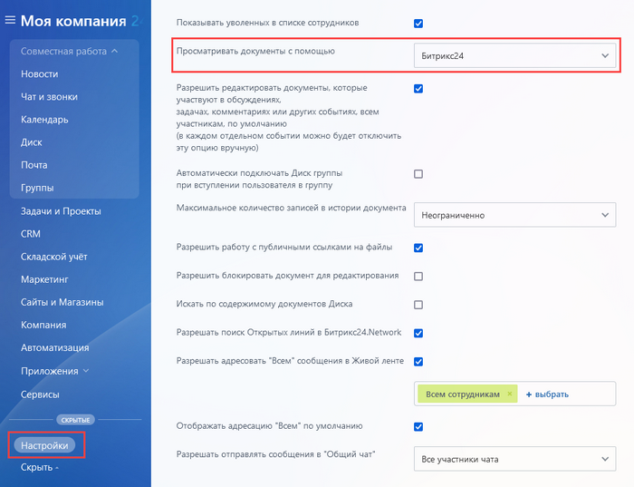
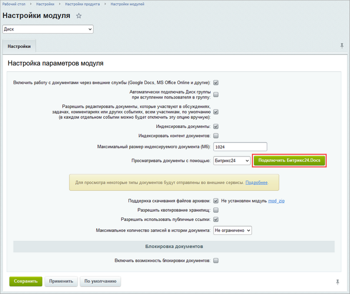
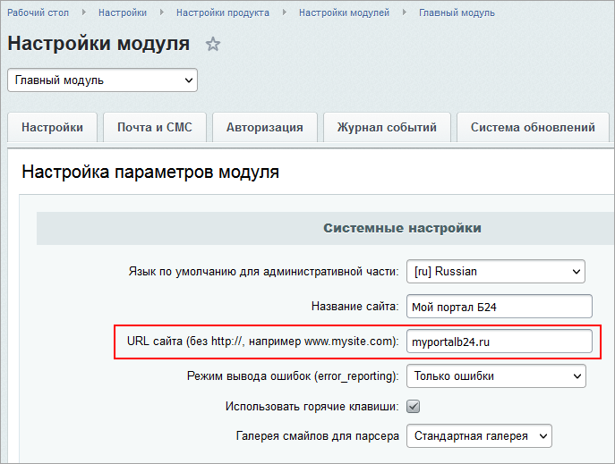

# Настройка работы с документами

**Навигация**
- [← Оглавление курса](index.md)
- [← Предыдущий: 12910 — Работа с Диском](lesson_12910.md)
- [Следующий: 32866 — Битрикс24 Доски →](lesson_32866.md)

Официальная страница урока: https://dev.1c-bitrix.ru/learning/course/index.php?COURSE_ID=48&LESSON_ID=13066

Просмотр и редактирование документов **Диска** может вестись как через внешние службы, так и через встроенный просмотрщик Битрикс24.

Для работы функционала Битрикс.Документы необходимо:

- Подключение по протоколу HTTPS с полной цепочкой сертификатов
- Активный лицензионный ключ
- Корректное и
  			синхронизированное с мировым
                      Синхронизированное время важно для совместного редактирования документов. Влияют даже секунды разницы.
  		 время на сервере

### Через просмотрщик Битрикс24

В основном, работа с файлами ведется через внутренний инструмент просмотра. Файлы форматов *pdf*, *mp3*,*tx*t, *php*, *css*, *html*, некоторые видео в формате *mp4* и *mov*, а также изображения всех форматов просматриваются только локально.

Файлы конвертируются на облачном сервисе Битрикс24. При этом на сервере файлы не хранятся, а только проходят конвертацию. Кроме того, они отправляются без каких-либо пользовательских данных и информация, откуда они приходят, не сохраняется.

Настроить по умолчанию просмотрщик документов в Битрикс24 можно в разделе портала **Настройки**. В этом случае документы *doc*, *xls*, *ppt* также будут просматриваться и редактироваться локально.

### Через Битрикс24.Документы

С версии модуля **Диск 21.800.0** появилась возможность работать с документами в новом сервисе с расширенным функционалом совместной работы - **Битрикс24.Документы**.

Подключить сервис можно в Настройка &gt; Настройки продукта &gt; Настройки модулей &gt; Диск, нажав кнопку :

 

**Обратите внимание!**
		Подключение и работа с **Битрикс24.Документы** возможны, только если ваш сайт доступен "снаружи".

		 При этом в настройках **Главного модуля** (Настройка &gt; Настройки продукта &gt; Настройки модулей &gt; Главный модуль) должен быть указан корректный

			адрес сайта

                    

		.

После этого нужно выбрать сервер и нажать кнопку **Зарегистрироваться**.

После перезагрузки страницы сервис **Битрикс24.Документы** будет подключен.

## Ограничение на количество одновременно редактируемых документов

Число сотрудников, которые могут одновременно работать с документами в режиме **Редактирование**, зависит от лицензии Битрикс24:

- Коробка Корпоративный портал 50, 100 – 10 пользователей.
- Коробка Корпоративный портал 250, 500 – 20 пользователей.
- Коробка Энтерпрайз 1000 и 1000+ – 40 пользователей.

Ограничение работает так:

Считается уникальная пара **Пользователь+Документ**. Таких уникальных пар может быть не больше 10.

Сообщение о достижении лимита возникает при попытке любого пользователя открыть любой документ, если, например:

- Один пользователь уже открыл 10 разных документов.
- 10 разных пользователей открыли один документ.
- Пять пользователей открыли один документ и параллельно эти же пять пользователей открыли другой документ.

Когда пользователи выходят из документа или когда документ закрывается, лимит восстанавливается.

Для предотвращения критического зависания (например, если клиентский портал после открытия документа некорректно отвечал на запросы **Битрикс24.Документы**) производится автоматическое закрытие сессии через 8 часов.
