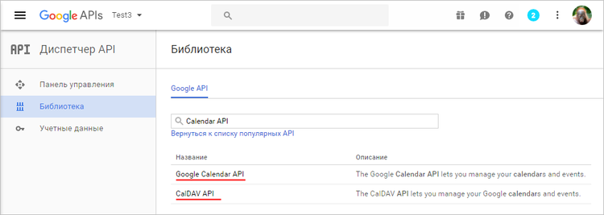
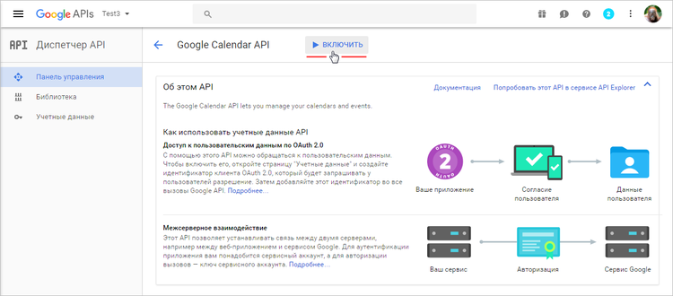
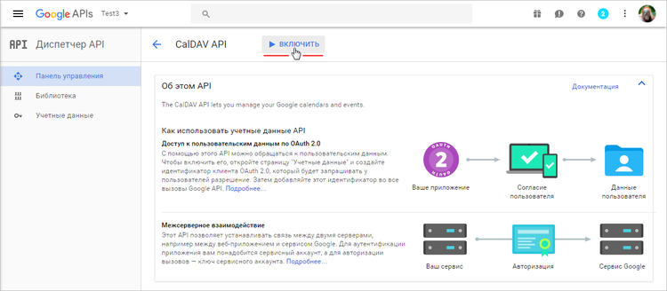

# Настройка синхронизации Календарей с Google.Calendar

**Навигация**
- [← Оглавление курса](index.md)
- [← Предыдущий: 3500 — Настройки календаря](lesson_3500.md)
- [Следующий: 9483 — Что влияет на конверсию →](lesson_9483.md)

Официальная страница урока: https://dev.1c-bitrix.ru/learning/course/index.php?COURSE_ID=48&LESSON_ID=13068

|  | ### Google |
| --- | --- |

Для синхронизации Календарей портала с **Google.Calendar** нужно:

- авторизоваться в Google и выполнить **Настройки Google** в модуле [Социальные сервисы](/learning/course/index.php?COURSE_ID=48&CHAPTER_ID=04772).
- перейти в меню **Библиотека** и найти опции
  			Calendar API и СalDAV API
                       
  		 либо быстрым поиском, либо из списка Популярных API.
- включить **Calendar API** и **СalDAV API** c помощью кнопки
  			Включить
  
  
