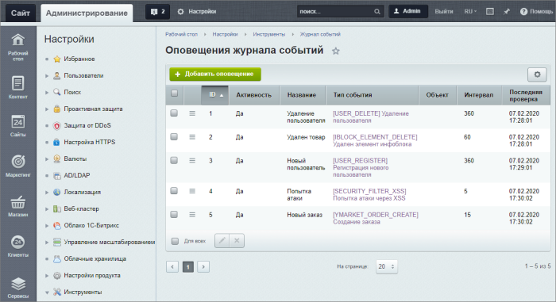
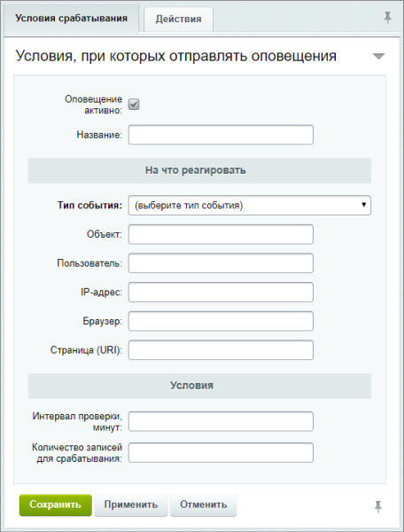

# Оповещения журнала событий

**Навигация**
- [← Оглавление курса](index.md)
- [← Предыдущий: 2034 — Журнал событий](lesson_2034.md)
- [Следующий: 4941 — Подключение редактора →](lesson_4941.md)

Официальная страница урока: https://dev.1c-bitrix.ru/learning/course/index.php?COURSE_ID=48&LESSON_ID=13104

### Следим за событиями на сайте

Не упустите важные события на Вашем сайте. Получайте сообщения на email или мобильный телефон, настроив оповещения журнала событий.

**Примечание**: Функционал оповещений журнала событий доступен с версии **20.0.600** Главного модуля (**main**).

### Настройки оповещений

Для открытия списка оповещений перейдите на страницу **Журнал событий** (Настройки &gt; Инструменты &gt; Журнал событий) и нажмите на кнопку

			Оповещения журнала событий

                    

		.

Откроется список созданных оповещений. Для создания оповещения воспользуйтесь кнопкой **Добавить оповещение**.

В открывшейся форме имеются две вкладки:

1. Условия, при которых отправлять оповещения
  
  		:

  - Укажите название оповещения и выберите активность;
  - В разделе **На что реагировать** обязательно выберите из выпадающего списка **тип события**.
    При необходимости укажите более узкие условия срабатывания оповещения (объект, пользователь, IP-адрес, браузер, страница).
  - В разделе **Условия** установите интервал проверки наличия событий в минутах и количество записей в журнале событий для срабатывания оповещения.
2. Действия для оповещения
                      
  		: укажите каким
  			способом
                      Доступна отправка оповещений по email или СМС.
  		 и куда отправлять оповещения.

**Примечание:** Детальное описание значений полей смотрите в пользовательской документации:

- [Оповещения журнала событий](https://dev.1c-bitrix.ru/user_help/settings/utilities/event_log/log_notifications.php);
- [Форма создания и редактирования оповещения](https://dev.1c-bitrix.ru/user_help/settings/utilities/event_log/log_notification_edit.php).

**Примечание**: Для отправки оповещений по СМС настройте

			службы отправки СМС

                    Модуль **Служба сообщений** позволит Вам осуществлять маркетинговую рассылку не только на электронную почту, но посредством SMS-сообщений, а также регистрироваться на сайте по номеру телефона! Все, что для этого нужно - установить сам модуль и подключить хотя бы одну из служб отправки SMS.
Подробнее в курсе [Администратор. Модули](https://dev.1c-bitrix.ru/learning/course/index.php?COURSE_ID=41&CHAPTER_ID=011227&LESSON_PATH=3911.11227).

		.

### Шаблоны оповещений

Для каждого способа отправки оповещения есть свой предустановленный шаблон:

- Почтовый шаблон (Настройки &gt; Настройки продукта &gt; Почтовые и СМС события &gt; Почтовые шаблоны): `[EVENT_LOG_NOTIFICATION] Оповещение журнала событий`;
- Шаблон СМС-сообщений (Настройки &gt; Настройки продукта &gt; Почтовые и СМС события &gt; Шаблоны СМС): `Оповещение журнала событий [SMS_EVENT_LOG_NOTIFICATION]`.

При необходимости внесите свои

			изменения

                    Почтовые шаблоны расположены на странице Настройки &gt; Настройки продукта &gt; Почтовые и СМС события &gt; Почтовые шаблоны. Чтобы отредактировать почтовый шаблон, выберите пункт **Изменить** в меню действий нужного шаблона.
Подробнее в курсе [Администратор. Модули](lesson_3523.md).

		 в шаблоны.

### Документация по теме

- [Журнал событий](lesson_2034.md);
- [Служба сообщений](https://dev.1c-bitrix.ru/learning/course/index.php?COURSE_ID=41&CHAPTER_ID=011227&LESSON_PATH=3911.11227) (курс Администратор. Модули);
- [Работа с почтовыми шаблонами](lesson_3523.md) (курс Администратор. Модули).
