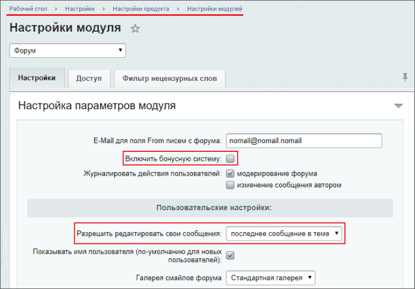
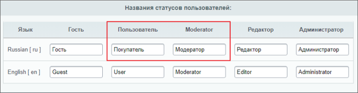
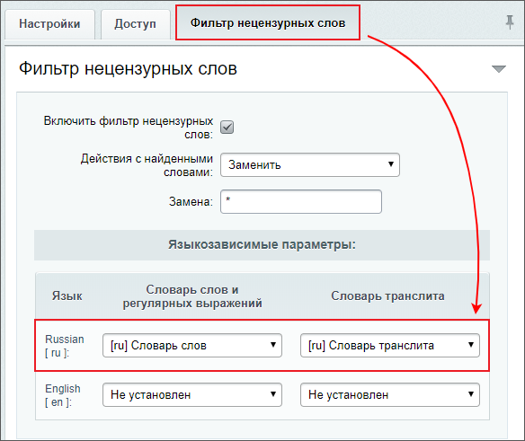

# Практические задания

**Навигация**
- [← Оглавление курса](index.md)
- [← Предыдущий: 12792 — Проверьте себя](lesson_12792.md)
- [Следующий: 5048 — Установка модуля →](lesson_5048.md)

Официальная страница урока: https://dev.1c-bitrix.ru/learning/course/index.php?COURSE_ID=48&LESSON_ID=13450

После изучения главы рекомендуем выполнить несколько практических заданий.

### Практические задания

Практические задания состоят из вопроса, скриншота или видео с конечным результатом и объяснением, как это получить в спойлере. Не торопитесь подглядывать в спойлер. 

1. Выполните настройки модуля **Форум**:
  ## Решение
  **Задание составлено по материалу урока:**
  - [Настройка модуля](lesson_2957.md).
  **Результат:**
  На странице настройки модуля **Форум** (Настройки &gt; Настройки продукта &gt; Настройки модулей &gt; Форум):
  
  
  

  1. Разрешите редактировать только последнее сообщение в теме;
  2. Отключите бонусную систему;
  3. Установите названия статусов для пользователей:

    - для пользователя - **Покупатель**;
    - для модератора - **Модератор**.
  4. Установите словари для фильтра нецензурных слов.
2. Создайте и опубликуйте на сайте форумы:
  ## Решение
  **Задание составлено по материалам уроков:**
  - [Группы форумов](lesson_2963.md).
  - [Форумы: создание и управление](lesson_2964.md).
  **Результат:**
  <!-- &lt;iframe title="линейное задание 41" src="https://www.youtube.com/embed/oJodk4YeRW8?feature=oembed&rel=0" allow="autoplay; encrypted-media" allowfullscreen="" width="853" height="480" frameborder="0"&gt;
  &lt;/iframe&gt; -->

  1. Создайте группу форумов;
  2. Создайте два форума. Один из них привяжите к группе. В настройках доступа:

    - разрешите всем зарегистрированным пользователям создавать новые темы;
    - установите для группы **Администраторы интернет-магазина** доступ **Модерирование**.
  3. Опубликуйте созданные форумы на сайте.
3. Создайте
  			обычного пользователя
                      Группа доступа - зарегистрированные пользователи
  		. Авторизуйтесь под ним на сайте и создайте тему в любом форуме, напишите сообщение, оформите подписку.
  После сделайте этого пользователя
  			модератором форума
                      Вспомните о настройках доступа форумов из предыдущего задания.
  		. Снова авторизуйтесь под ним и перенесите тему в другой форум.
  ## Решение
  **Задание составлено по материалам урока:**
  - [Назначение модератора форума](lesson_7360.md).
  **Результат:**
  <!-- &lt;iframe title="линейное задание 42" src="https://www.youtube.com/embed/k9mVl3DN8D4?feature=oembed&rel=0" allow="autoplay; encrypted-media" allowfullscreen="" width="853" height="480" frameborder="0"&gt;
  &lt;/iframe&gt; -->

### Где выполнять задания?

Демонстрационную версию с пробным периодом в 30 дней вы можете установить на свой компьютер или на хостинг. Подробная информация о настройке каждого варианта представлена в уроке [Где практиковаться и выполнять задания](https://dev.1c-bitrix.ru/learning/course/index.php?COURSE_ID=48&LESSON_ID=26638).

**Примечания:**

1. Настоятельно рекомендуем **НЕ** выполнять задания на работающем, «боевом» сайте.
2. Если вы всё же пытаетесь выполнять задания на работающем сайте, где вы не являетесь администратором, то не все задания можно выполнить.
