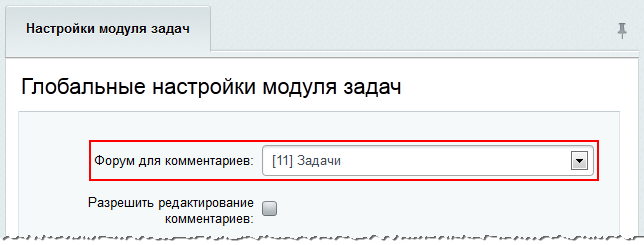
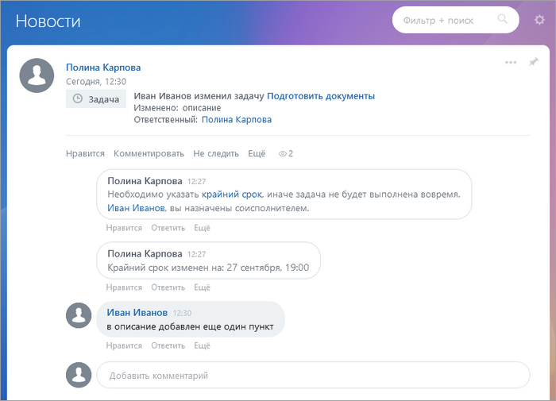
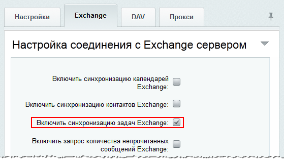

# Задачи на портале

**Навигация**
- [← Оглавление курса](index.md)
- [← Предыдущий: 32866 — Битрикс24 Доски](lesson_32866.md)
- [Следующий: 3764 — Добавление пользовательских полей для задач →](lesson_3764.md)

Официальная страница урока: https://dev.1c-bitrix.ru/learning/course/index.php?COURSE_ID=48&LESSON_ID=13758

### Оповещения о задачах в живой ленте

Начиная с 11 версии модуля поддерживается "добавление" задач в живую ленту. Для корректной работы необходимо указать **Форум для комментариев** в настройках модуля **Задачи**:

После чего в живой ленте будут отображаться история изменения задач и комментарии к ним:

**Примечание:** В живой ленте будут отображаться только те задачи, к которым у сотрудника есть доступ.

### Синхронизация задач с Exchange

Для соединения задач и их синхронизации с *Exchange* сервером необходимо произвести настройки модуля **DAV** (Настройки &gt; Настройки продукта &gt; Настройки модулей &gt; DAV)

<!-- ИНФОРМАЦИЯ УСТАРЕЛА

&lt;div class="tab"&gt;

&lt;h3 class="tab-title"&gt;Настройка помощи&lt;/h3&gt;

&lt;a name="task_help"&gt;&lt;/a&gt;

&lt;p&gt;При смене шаблона портала с &lt;b&gt;"Лайт"&lt;/b&gt; на &lt;b&gt;"Битрикс24"&lt;/b&gt; (либо собственный) подсказки к задачам, вызываемые по кнопке &lt;b&gt;Помощь&lt;/b&gt; не соответствуют тому, что видит пользователь на своём мониторе. Это несоответствие создают затруднения в использовании задач у неопытных пользователей. Для замены картинок в подсказках сделайте следующее:&lt;/p&gt;

&lt;p&gt;В папке &lt;code&gt;bitrix/modules/tasks/install/public/js/tasks/css/images&lt;/code&gt; есть файл &lt;b&gt;task-legend-sprite.gif&lt;/b&gt;. Создайте под этим же именем новый файл с новыми картинками подсказок, соответствующими вашему дизайну. Замените им старый файл. &lt;/p&gt;

&lt;p&gt;&lt;div class="hint"&gt;&lt;b&gt;Примечание&lt;/b&gt;: Важно, что бы размеры составных частей и их число точно соответствовало начальному. Если эти параметры не соответствуют исходным, то необходимо отредактировать настройки css в файле &lt;code&gt;bitrix/modules/tasks/install/public/js/tasks/css/tasks.css&lt;/code&gt;.&lt;/div&gt;&lt;/p&gt;

&lt;/div&gt;

&lt;div class="tab"&gt;

&lt;h3 class="tab-title"&gt;Установка и подключение  модуля (для порталов со старой версией задач)&lt;/h3&gt;

&lt;a name="module_setup"&gt;&lt;/a&gt;
&lt;p&gt;При установке &lt;i&gt;«Битрикс24 в коробке»&lt;/i&gt; с нового дистрибутива модуль устанавливается автоматически. В корпоративных порталах установленных ранее этот модуль отсутствует. Чтобы установить модуль и начать использовать новые задачи вместо старых выполните следующее:&lt;/p&gt;

&lt;ul class="fa fa-circle sz-sm"&gt;
  &lt;li&gt;Установите обновление &lt;b&gt;Модуль Задачи&lt;/b&gt; (&lt;span class="path"&gt;Настройки &gt; Обновления&lt;/span&gt;);&lt;/li&gt;
  &lt;li&gt;Затем установите модуль &lt;b&gt;Задачи&lt;/b&gt;, который появится в списке модулей (&lt;span class="path"&gt;Настройки &gt; Настройки продукта &gt; Модули&lt;/span&gt;) после обновлений:
    &lt;p&gt;&lt;img src="/images/portal_admin/system_administration/tasks/tasks_mod_install.png" alt="Установка модуля &quot;Задачи&quot;" &gt;&lt;/p&gt;

  &lt;/li&gt;

  &lt;li&gt;Во время установки модуля  будет предложена конвертация старых задач. Это позволит перенести и подключить все старые задачи в новый модуль &lt;b&gt;Задачи&lt;/b&gt;, так как старые и новые задачи не совместимы:
      &lt;p&gt;&lt;img src="/images/portal_admin/system_administration/tasks/tasks_convert.png" alt="Конвертация задач"  &gt;&lt;/p&gt;

    &lt;p&gt;После чего на  экране будет отображено общее количество сконвертированных задач&lt;/p&gt;
      &lt;p&gt;&lt;img src="/images/portal_admin/system_administration/tasks/tasks_converted.png" alt="Количество сконвертированных задач" &gt;&lt;/p&gt;

    &lt;p&gt;а на странице &lt;b&gt;Задачи&lt;/b&gt; будет новый интерфейс&lt;/p&gt;
	  &lt;p&gt;&lt;a href="javascript:ShowImg('/images/portal_admin/system_administration/tasks/new_tasks_page.png',993,599,'Новый интерфейс задач')"&gt;
&lt;img src="/images/portal_admin/system_administration/tasks/new_tasks_page_sm.png" alt="Нажмите на рисунок, чтобы увеличить"/&gt;&lt;/a&gt;&lt;/p&gt;

  &lt;/li&gt;
&lt;/ul&gt;

&lt;p&gt;&lt;div class="hint"&gt;&lt;b&gt;Примечание:&lt;/b&gt; Переключиться обратно на старые задачи и интерфейс можно, отключив опцию &lt;b&gt;Использовать задачи 2.0&lt;/b&gt; в настройках модуля &lt;b&gt;Интранет&lt;/b&gt; (&lt;span class="path"&gt;Настройки &gt; Настройки продукта &gt; Настройки модулей &gt; Интранет&lt;/span&gt;):
  &lt;p&gt;&lt;img src="/images/portal_admin/system_administration/tasks/tasks_intranet_mod_settings.png" alt="Настройки модуля &quot;Интранет&quot;" border="0" width="739" height="407" &gt;&lt;/p&gt;
Но тогда, задачи, созданные в новом интерфейсе, будут недоступны для старого и наоборот.&lt;/div&gt;&lt;/p&gt;

&lt;p&gt;Если при установке модуля вы по ошибке не произвели конвертацию старых задач, то:
&lt;ul class="fa fa-circle sz-sm"&gt;
  &lt;li&gt;Отключите &lt;b&gt;Задачи 2.0&lt;/b&gt; в настройках модуля &lt;b&gt;Интранет&lt;/b&gt; (&lt;span class="path"&gt;Настройки &gt; Настройки продукта &gt; Настройки модулей &gt; Интранет&lt;/span&gt;):
  &lt;p&gt;&lt;img src="/images/portal_admin/system_administration/tasks/tasks_intranet_mod_settings.png" alt="Настройки модуля &quot;Интранет&quot;" border="0" width="739" height="407" &gt;&lt;/p&gt;
  &lt;/li&gt;

  &lt;li&gt;Удалите модуль &lt;b&gt;Задачи&lt;/b&gt; и затем установите его заново
    &lt;p&gt;&lt;img src="/images/portal_admin/system_administration/tasks/tasks_mod_install.png" alt="Установка модуля &quot;Задачи&quot;" &gt;&lt;/p&gt;
  &lt;/li&gt;
&lt;/ul&gt;

&lt;p&gt;Если уже были созданы новые задачи с помощью модуля &lt;b&gt;Задачи&lt;/b&gt;, но необходимо добавить старые, то выполните аналогичные действия, но на шаге удаления модуля сохраните данные в таблицах базы данных:&lt;/p&gt;
  &lt;p&gt;&lt;img src="/images/portal_admin/system_administration/tasks/tasks_mod_del.png" alt="Удаление модуля &quot;Задачи&quot;" &gt;&lt;/p&gt;
&lt;/p&gt;

&lt;/div&gt; -->

**Ссылки по теме:**

- [Настройки модуля "Задачи"](http://dev.1c-bitrix.ru/user_help/content/tasks/settings.php) (Пользовательская документация)
- [Автоматическая смена ответственного в задачах](http://dev.1c-bitrix.ru/community/webdev/group/78/blog/automatic-exchange-of-responsibility-in-problems/) (Блог)
