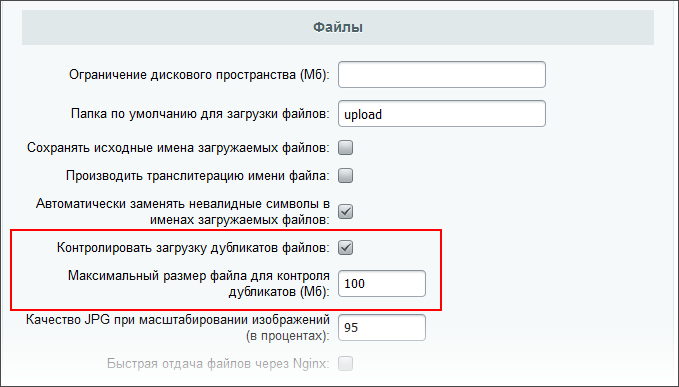

# Контроль дубликатов

**Навигация**
- [← Оглавление курса](index.md)
- [← Предыдущий: 2030 — Агенты](lesson_2030.md)
- [Следующий: 19992 — Рекомендации по очистке места на диске →](lesson_19992.md)

Официальная страница урока: https://dev.1c-bitrix.ru/learning/course/index.php?COURSE_ID=48&LESSON_ID=13776

|  | ### Экономим место на дублях |
| --- | --- |


Система прав доступа давая большие возможности в плане управления доступом имеет недостаток при работе с файлами. К каждому файлу имеют доступ только те, "кому положено". Но если один и тот же файл должен принадлежать разным сущностям, например в CRM, то появляется большое количество одинаковых их дублей с разными правами. Это способствует неэффективному использованию дискового пространства. Как на физическом, так и на облачном сервере.


Для экономии места рекомендуется использовать контроль дубликатов загружаемых файлов. В

			настройках Главного модуля

                    В Административном разделе по пути: Настройки &gt; Настройки продукта &gt; Настройки модулей &gt; Главный модуль

		, в секции  **Файлы** есть опции:





По умолчанию эти опции включены.


#### Как работает этот механизм


При загрузке локального файла считается хэш

			md5

                    MD5 (технически называемый алгоритмом дайджеста сообщений MD5) - это криптографическая хэш-функция, основной целью которой является проверка того, что файл остался неизменным. Вместо того чтобы подтверждать идентичность двух наборов данных путем сравнения необработанных данных, MD5 делает это, создавая контрольную сумму для обоих наборов, а затем сравнивая контрольные суммы, чтобы убедиться, что они одинаковы.


[Подробнее](https://ru.wikipedia.org/wiki/MD5)...

		 от его контента. Ориентировочно, на файл 100 Мб (настройка по умолчанию) уходит 0.2 - 0.3 секунды. Для облачных файлов ограничения по размеру нет, хэш считает облачное хранилище.


Затем по размеру и хэшу загружаемого файла ищется возможный оригинал, загруженный ранее. Если оригинал найден, в таблице **b_file** добавляется запись, ссылающаяся на существующий физический файл. В таблицу дубликатов добавляется ссылка со счетчиком использования. При удалении файла отслеживаются ссылки дубликатов на него, то есть файл не будет отображаться нигде, где он был ранее виден.


В работе механизма используется [CFile::SaveFile()](https://dev.1c-bitrix.ru/api_help/main/reference/cfile/savefile.php). Дополнительно, существует возможность явно добавить дубликат без физической загрузки с помощью:


```
 CFile::AddDuplicate(
   $FILE_ID
).
```


Где FILE_ID - идентификатор файла.


**Примечание**: Теоретически существует возможность, когда к сущности будет добавлен не тот файл, если совпал размер и md5. Но вероятность этого для отдельного сайта или портала исчезающе мала.
