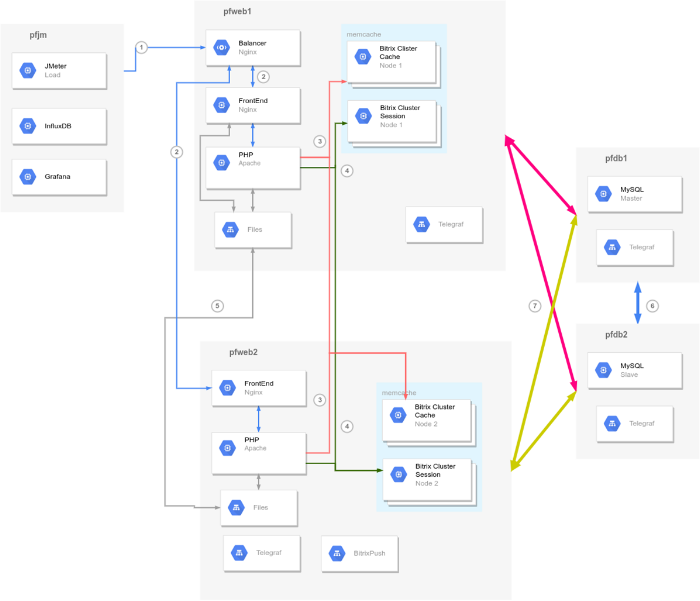
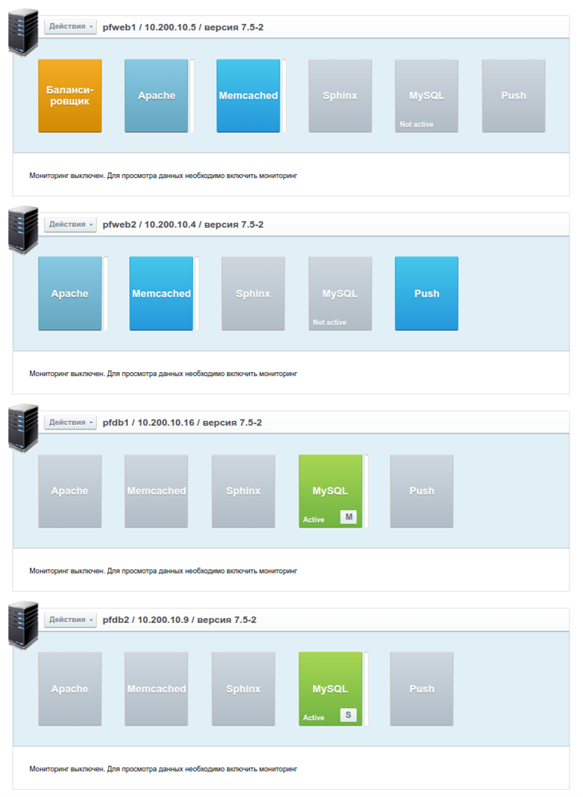
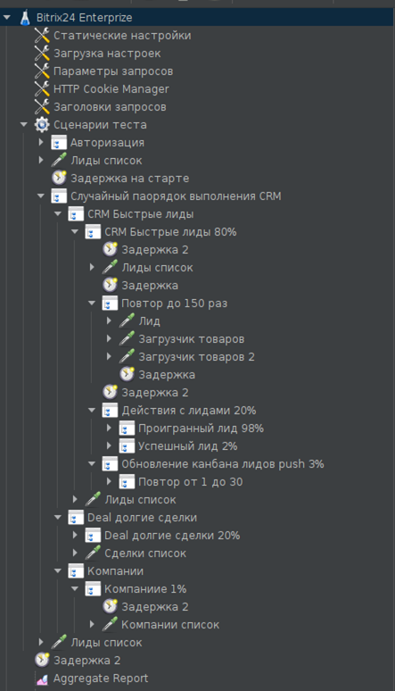
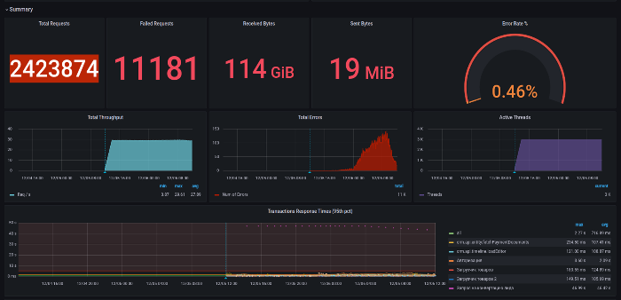
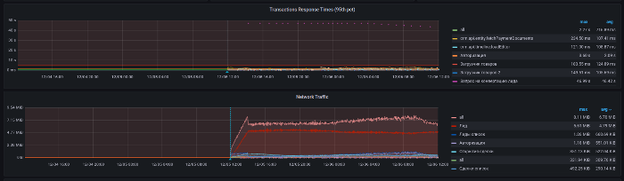
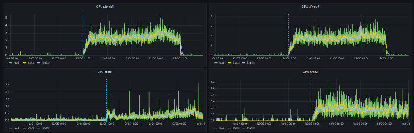

# Нагрузочное тестирование CRM 2022 года

**Навигация**
- [← Оглавление курса](index.md)
- [← Предыдущий: 5023 — Нагрузочное тестирование 2021](lesson_5023.md)
- [Следующий: 9149 — Технические требования →](lesson_9149.md)

Официальная страница урока: https://dev.1c-bitrix.ru/learning/course/index.php?COURSE_ID=48&LESSON_ID=15302

В ноябре 2022 года мы провели нагрузочное тестирование продукта «Битрикс24» в редакции [«Энтерпрайз»](https://www.bitrix24.ru/prices/self-hosted.php) (коробочная версия), для оценки производительности построенного на его основе CRM-решения.

### Описание

В ходе нагрузочного тестирования на CRM-систему, развернутую в кластерном решении и наполненную большим количеством тестовых данных, подавалась нагрузка, имитирующая поведение реальных пользователей. В процессе нагрузки выполнялись наборы операций, свойственные типовым сценариям работы в CRM: авторизация в системе, работа с базой клиентов, обработка лидов, работа со сделками и обновление их статусов, обмен мгновенными сообщениями, загрузка документов.

Исходя из потребностей крупных корпоративных заказчиков мы определили ключевые цели такого тестирования:

- Смоделировать работу CRM-системы в крупной компании (десятки тысяч сотрудников, тысячи пользователей CRM, большое количество данных и высокая интенсивность информационных потоков)
- Продемонстрировать стабильную работу CRM без наличия ошибок, в случае одновременной работы с ней нескольких тысяч сотрудников
- Подтвердить эффективность встроенных технологий масштабирования и отказоустойчивости в продукте «Битрикс24» на доступном оборудовании
- Обеспечить низкое время отклика решения не более 1 секунды.

### Тестовый стенд

#### Оборудование

Для выполнения теста были выбраны виртуальные выделенные серверы. Это позволило эмулировать полноценное кластерное решение при одновременной оптимизации издержек на развертывание и поддержку инфраструктуры. По аналогии с предыдущими тестами использовано доступное на рынке оборудование среднего ценового сегмента.

Использованы серверы трех конфигураций:

1. Сервер баз данных (2 шт.):
  Intel Xeon (Skylake, IBRS): 2294 MHz (10 ядер), RAM 48 ГБ, HDD 300 Гб
2. Сервер приложений (2 шт.):
  Intel Core (Haswell, noTSX, IBRS): 1995 MHz (6 ядер), RAM 24 ГБ, HDD 200 Гб
3. Генератор нагрузки (1 шт.):
  Intel Xeon (Skylake, IBRS): 2294 MHz (10 ядер), RAM 24 ГБ, HDD 300 Гб.

#### Веб-окружение и кластерное решение

Условные обозначения в схеме:

| \| **pfweb1, pfweb2** \| Кластер из двух серверов приложений (веб-серверов):
 CentOS 7.9, Nginx 1.20.2, Apache 2.4.6, PHP 8.0.19.  
 Балансировка выполнялась с помощью Nginx на pfweb1 \| \| --- \| --- \| \| **pfdb1, pfdb2** \| Кластер из двух серверов баз данных:
 CentOS 7.9, Percona Server (MySQL) 8.0.29,
 Конфигурация Master / Slave. \| \| **pfjm** \| Сервер генерации нагрузки с использованием Jmeter 5.3.3
 InfluxDB для получения и хранения данных от Jmeter и Grafana для отображения и визуализации результатов теста \| \| **процессы и потоки данных (1-7)** \| 1. Тестовый трафик 2. Балансирование нагрузки 3. Работа с кластерным кешем 4. Работа с кластерными сессиями 5. Синхронизация файлов между нодами Lsync 6. Репликация БД 7. Подключения к БД ядра для работы продукта \| |
| --- |

Серверы были сконфигурированы и объединены в кластер, включающий 2 сервера баз данных и 2 сервера приложений. Данная конфигурация является типовой и наиболее распространенной, позволяет обеспечить высокую производительность кластера с одновременным обеспечением отказоустойчивости.

Программное обеспечение серверов было сконфигурировано с помощью продукта [1С-Битрикс: Виртуальная машина](https://www.1c-bitrix.ru/download/vmbitrix.php) для Linux 7.5.2. Кластерное решение реализовано на основе технологии [Веб-кластер](https://www.1c-bitrix.ru/products/cms/modules/web-cluster/), входящей в Enterprise-редакцию Битрикс24.

После разворачивания тестового стенда и проведения «пристрелочных тестов», была выполнена тонкая настройка серверов.

Перечень изменений веб-окружения:

- модифицированы параметры ОС:

  - *echo 1024 65000 &gt; /proc/sys/net/ipv4/ip_local_port_range*
  - *sysctl -w net.ipv4.tcp_tw_recycle=1*
  - *sysctl -w net.ipv4.tcp_tw_reuse=1*
- *sync_binlog* увеличен до 1000
- *innodb_buffer_pool_size* увеличен до 34 ГБ
- *max_heap_table_size* установлен в 256 МБ
- *max_heap_table_size, max_heap_table_size* установлены в 90 МБ
- *myisam_sort_buffer_size* увеличен до 64 МБ
- *max_connections* увеличен до 305

Настройка кластера в модуле «Веб-кластер» продукта Битрикс24.

#### Тестовое внедрение интранет-портала

В кластерном решении было выполнено развертывание коробочной версии продукта Битрикс24, редакция «Энтерпрайз», версия 22.375 (по версии Главного модуля).

Параметры тестового CRM-решения:

1. Типовое коробочное решение «Битрикс24, редакция Энтерпрайз», версия 22.375 с последними обновлениями, задействован модуль «Веб-кластер» для построения кластерного решения.
2. Демонстрационный контент на момент старта финального теста:

  - **500 тыс. компаний,**
  - **1,515 млн контактов,**
  - **995 тыс. лидов,**
  - **500 тыс. сделок,**
  - **144 тыс. товаров в каталоге,**
  - **9,391 млн событий CRM,**
  - **4,522 млн записей в таймлайне CRM,**
  - **36 тыс. сообщений в живой ленте.**
3. Количество сотрудников в базе данных портала на момент старта финального теста: 22 198 (распределены по 14 структурным подразделениям)

### Методика

Для тестирования выбрали два основных сценария использования CRM:

- Сценарий «Быстрые лиды»
  Большое количество менеджеров (до 500 и более) обрабатывают поток входящих лидов для дальнейшей квалификации лида в проигрыш или конвертации в сделку по приобретению товаров/услуг.
- Сценарий «Длинные сделки».
  Большое количество менеджеров (до 100 и более) работают со сделками, количество которых лимитировано на 1 человека. Каждый день менеджер добавляет в свои сделки новые статусы и изменения: планирует встречи, загружает документы, комментарии и звонки, корректирует спецификацию.  Отличительная особенность: большой объем товаров в сделке.

Тест предусматривал, что компания использует оба сценария одновременно, это характерно для крупной компании с несколькими направлениями бизнеса.

Сценарий нагрузки был выбран достаточно ресурсоемким, что позволяет проверить работу блока CRM и всего продукта Битрикс24 в условиях сложных проектов.

Сценарии теста приведены ниже.

| \| Сценарий (% нагрузки) \| Действие \| Вес, % \| \| --- \| --- \| --- \| \| **Быстрые лиды (80%)** \| Авторизация \| 100 \| \| Список лидов \| 100 \|  \| \| Список лидов повторный \| 100 \|  \| \| Лид \| 100 \|  \| \| Загрузка товара \| 100 \|  \| \| Загрузка товара 2 \| 100 \|  \| \| Проигранный лид \| 18 \|  \| \| Успешный лид \| 2 \|  \| \| Обновление канбана лидов, пуш \| 100 \|  \| \| Список лидов \| 100 \|  \| \| **Долгие сделки (20%)** \| Авторизация \| 100 \| \| Список лидов \| 100 \|  \| \| Список сделок \| 100 \|  \| \| Открытие сделки \| 100 \|  \| \| Загрузка платежных документов \| 100 \|  \| \| Добавление звонка \| 5 \|  \| \| **Компании (1%)** \| Авторизация \| 100 \| \| Список лидов \| 100 \|  \| \| Список компаний \| 100 \|  \| |
| --- |

Нагрузку создавали с помощью [JMeter](https://jmeter.apache.org/) версии 5.5. Данные теста записывали в InfluxDB, высокопроизводительную БД, предназначенную для обработки высокой нагрузки записи и запросов.

Для визуализации аналитики использовали приложение Grafana. Сбор информации о нагрузке выполнялось через приложение Telegraf.

Cценарии тестирования в JMeter:

### Результаты

CRM на базе «Битрикс24» в редакции «Энтерпрайз» в тестовом внедрении и на тестовых сценариях, которые эмулируют CRM-решение в крупной компании, размещенная на кластере из 4 физических серверов, в 24-часовом тесте обеспечивала стабильную одновременную работу с CRM 3 000 сотрудников.

Система мониторинга продемонстрировала 2 423 874 обращения к системе за сутки, при этом среднее время отклика составило 0.713 сек для 95% обращений. Серверные ошибки отсутствовали. Некоторые из графиков, иллюстрирующих ход тестирование, утилизацию памяти, процессора, приведены ниже.

Общий статус тестирования: количество потоков, динамика по количеству запросов в секунду, общее количество обработанных запросов и количество ошибок:

Время отклика. 95 перцентиль для некоторых страниц и их трафик в рамках теста:

Использование CPU на серверах баз данных и серверах приложений:

### Выводы

Результаты проведенного тестирования «Битрикс24» в редакции «Энтерпрайз» подтвердили **высокую производительность продукта** и стабильность при работе с большими нагрузками. Демонстрационная CRM-система, развернутая в кластерном решении из 4 серверов, обеспечила **одновременную работу 3 тысяч пользователей**, что соответствует примерному профилю нагрузки для CRM в крупной корпорации.

При этом система обеспечила **быстрый отклик** для подавляющего большинства запросов **не превышающий 1 сек**, что, безусловно, делает работу с CRM комфортной для пользователя. Технология масштабирования и модуль «Веб-кластер» в составе Битрикс24 подтверждает свою эффективность.

Методика тестирования, сценарии и профили нагрузки максимально приблизили условия в тесте к реальным. Это дает возможность использования результатов данного тестирования как эталонных, на которые можно опираться при проектировании новых проектов. Несмотря на то, что в задачи тестирования не входило нахождение пиковых значений нагрузки, которые может выдержать система в принципе, полученный результат достаточен для большинства проектов с запасом.

Методику тестирования, конфигурацию портала и тестового стенда компания «1С-Битрикс» готова предоставить по запросу нашим корпоративным заказчикам и интеграторам, как основу для проведения полномасштабного тестирования собственных разработанных порталов или их прототипов, проверки гипотез, расчета запаса прочности решения при пиковых нагрузках. Разворачиваемые стенды могут дополняться индивидуальными условиями, в частности интеграциями с корпоративными системами предприятия, которые планируются в проекте.  Это позволит получить более точные результаты.

Для запроса дополнительной информации по тестированию обратитесь в компанию "1С-Битрикс" любым удобным способом.
