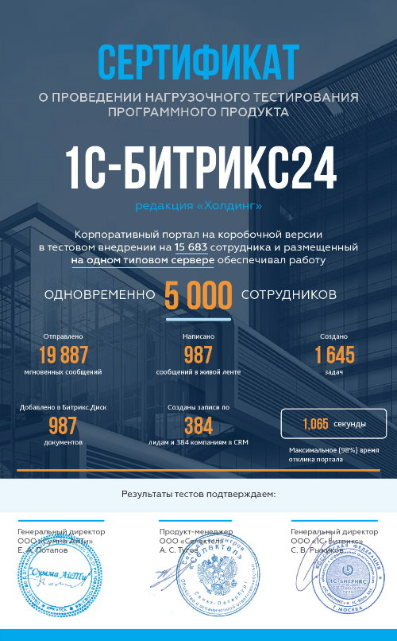
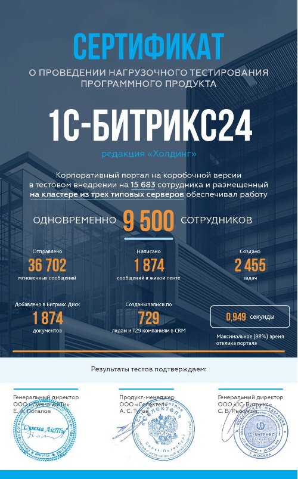

# Нагрузочное тестирование 2015

**Навигация**
- [← Оглавление курса](index.md)
- [← Предыдущий: 6823 — Отправка сообщений в живую ленту](lesson_6823.md)
- [Следующий: 5023 — Нагрузочное тестирование 2021 →](lesson_5023.md)

Официальная страница урока: https://dev.1c-bitrix.ru/learning/course/index.php?COURSE_ID=48&LESSON_ID=15304

В декабре 2015 года компания «1С-Битрикс» совместно с компаниями [Selectel](https://selectel.ru/) и [ITSumma](https://www.itsumma.ru) провели нагрузочное тестирование последней версии продукта «1С-Битрикс24» для проверки производительности системы в условиях внедрения на крупном предприятии с большим числом сотрудников и высокой нагрузкой.

### Описание

В ходе нагрузочного тестирования в течение 24 часов на развернутый портал, наполненный большим количеством тестовых данных, подавалась нагрузка, имитирующая поведение реальных пользователей. Виртуальные пользователи делали типовые операции: выполняли авторизацию, работали с лентой Новостей, задачами и документами, создавали записи в CRM, писали мгновенные сообщения и т.п. Для каждого виртуального пользователя выбиралась роль, сценарий которой он исполнял в бесконечном цикле. После выполнения сценария пользователь ожидал определенное время.

Таким, образом, в тесте моделировалось реальное использование интранет-портала в компании, когда в структуру портала заведены все сотрудники, и часть из них периодически обращаются к нему в течение рабочего дня, выполняя наборы типовых действий.

#### Задачами нагрузочного теста были:

- определение максимального числа одновременно работающих пользователей на портале на доступном выделенном оборудовании
- определение количества выполненных сотрудниками действий в системе
- исследование эффективности масштабирования системы с использованием технологии веб-кластера
- оценка стабильности работы системы под нагрузкой, быстрого времени отклика
- оптимизация конфигурации серверного программного обеспечения, выявление ограничений, определение методов дальнейшего масштабирования

### Условия

#### Параметры установки:

- Готовый коробочный шаблон портала «1С-Битрикс24»
- Демонстрационные данные: 15683 сотрудника, 38146 сообщений в ленте Новостей, 10460 задач, 194368 мгновенных сообщений, 2286 файлов на Битрикс.Диске, 4966 лидов и 697 компаний в CRM
- Включенная технология [Композитный сайт](https://www.1c-bitrix.ru/composite)
- Другие параметры конфигурации продукта и окружения приведены в детальном отчете

#### Тестируемое ПО:

- «1С-Битрикс24: Энтерпрайз»
- Версия: 15.0.4
- Установка: на 1 сервере, а также на кластере из 2-х и 3-х типовых серверов

#### Тестовая среда

Аппаратное обеспечение предоставлено компанией Selectel: Intel Xeon E3-1270v3 3.5 ГГц, 32 ГБ RAM, 2 х 240 ГБ SSD.

Программное обеспечение сервера сконфигурировано с помощью продукта [1С-Битрикс: Виртуальная машина](https://www.1c-bitrix.ru/download/vmbitrix.php). Произведено обновление PHP до версии 5.6.9.

#### Параметры проведения теста

Тестирование проводилось системой Yandex.Tank, версии 1.7.10. Yandex.Tank выбрана как надежная, зарекомендовавшая себя система, которая позволяет, на наш взгляд, предоставить наиболее подробные данные по проведенному тестированию. Результаты тестирования Yandex.Tank проверены во множестве проведенных нагрузочных тестирований компанией Яндекс и признаются независимыми экспертами.

В качестве генератора нагрузки использовалось приложение [JMeter 2.13](https://jmeter.apache.org/). JMeter - открытая и гибкая система проведения нагрузочного тестирования, которая достаточно давно используется различными компаниями для проверки систем под эмуляцией реальных нагрузок.

В качестве SLA-времени ответа выбрана 99-процентиль &lt;1000мс (99% запросов выполняются быстрее 1000мс), как максимально допустимое приемлемое время генерации страницы для интернет-магазина. Тест выполняется при максимальной загруженности процессора/диска/памяти, на которой сохраняется данный SLA.

Поскольку в рамках нагрузочного тестирования на проект подается критическая для оборудования нагрузка, допускается возникновение ошибок. Доля запросов с ошибочными ответами (невыполненных запросов) не должна превышать 0.5% от общего числа запросов. Тестирование всех конфигураций производилось в условиях равномерной нагрузки. В реальном проекте нагрузка будет неравномерной (варьироваться в зависимости от времени суток, сезона, проведенных маркетинговых кампаний и т.д.). Суточные показатели для работающего проекта будут в 2,5-3 раза меньше, а результаты тестов в условиях реальных приложений могут служить ориентиром для настройки приложения и принятия решения о необходимости масштабирования.

### Тестирование 1

Корпоративный портал на коробочной версии «1С-Битрикс24»

			редакция«Энтерпрайз

                    На момент тестирования редакция называлась «Холдинг»

		 в тестовом внедрении на 15683 сотрудника и размещенный на одном типовом сервере способен обеспечить одновременную работу 5000 сотрудников, которые за сутки:

- Отправили 19887 мгновенных сообщений
- Написали 987 сообщений в ленте Новостей
- Создали 1645 задач
- Добавили в Битрикс.Диск 987 документов
- Создали записи по 384 лидам и 384 компаниям в CRM

При этом максимальное (98%) время отклика портала не превысило 1,065 сек.

### Тестирование 2

Корпоративный портал на коробочной версии «1С-Битрикс24»

			редакция«Энтерпрайз

                    На момент тестирования редакция называлась «Холдинг»

		 в тестовом внедрении на 15683 сотрудника и размещенный на кластере из двух типовых серверов способен обеспечить одновременную работу 7500 сотрудников (+50%), которые за сутки:

- Отправили 19887 мгновенных сообщений
- Написали 1473 сообщений в ленте Новостей
- Создали 2455 задач
- Добавили в Битрикс.Диск 1473 документов
- Создали записи по 571 лидам и 571 компаниям в CRM

При этом максимальное (98%) время отклика портала не превысило 1,224 сек.

### Тестирование 3

Корпоративный портал на коробочной версии «1С-Битрикс24»

			редакция«Энтерпрайз

                    На момент тестирования редакция называлась «Холдинг»

		 в тестовом внедрении на 15683 сотрудника и размещенный на кластере из трех типовых серверов способен обеспечить одновременную работу 9500 сотрудников (+90%), которые за сутки:

- Отправили 36702 мгновенных сообщений
- Написали 3124 сообщений в ленте Новостей
- Создали 2455 задач
- Добавили в Битрикс.Диск 3124 документов
- Создали записи по 729 лидам и 729 компаниям в CRM

При этом максимальное (98%) время отклика портала не превысило 0,949 сек.

### Выводы

Результаты тестирования продукта «1С-Битрикс24» подтвердили высокую производительность платформы и стабильность при работе с большими нагрузками (отсутствие резких отклонений на периоде 24-часового тестирования). Всего на трех серверах с порталом смогли одновременно работать 9 500 пользователей в компании из 15 683 человек. При этом система обеспечила быстрый (даже по меркам интернет-проектов) отклик, не превышающий 1 сек, что, безусловно, делает работу с порталом комфортной для современного пользователя.

Нагрузка на интранет-порталы, рабочие инструменты компании, значительно отличается от типовой нагрузки на интернет-проекты. В них значительно выше доля хитов с записью информации и выполнением различных действий (загрузка, индексация, отправка уведомлений и.т.д.), чем на интернет-сайтах. Доля хитов «на чтение» значительно ниже.

Технология [Веб-кластера](https://dev.1c-bitrix.ru/learning/course/index.php?COURSE_ID=48&CHAPTER_ID=04750), отлично зарекомендовавшая себя в продукте «1С-Битрикс: Энтерпрайз», оказалась эффективной и для интранет-порталов на базе «1С-Битрикс24». Редакция «Холдинг» позволяет эффективно горизонтально масштабироваться по числу серверов с коэффициентом масштабирования 1,4. Для реальных проектов коэффициент масштабирования может быть выше за счет лучшего соотношения операций чтения/записи, чем в нагрузочном тесте.

Таким образом, клиенты могут динамично развивать свое портальное решение, охватывая им новые структурные подразделения и вовлекая тысячи и десятки тысяч новых пользователей без изменения архитектуры и кода проекта. Кроме того, для самых крупных предприятий с территориально-распределенной структурой и десятками и сотнями тысяч пользователей существует дополнительный сценарий масштабирования, когда портальное решение представляет собой набор копий «1С-Битрикс24» для территориальных подразделений, каждая из которых обрабатывает локальную нагрузку, но при этом все порталы связаны друг с другом с помощью «Интеграционной шины», позволяя взаимодействовать друг с другом сотрудникам различных филиалов.
