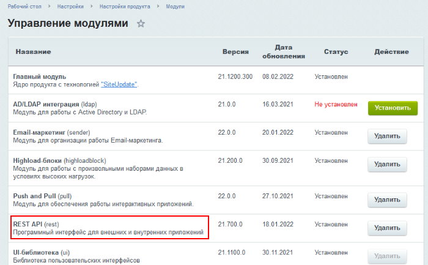
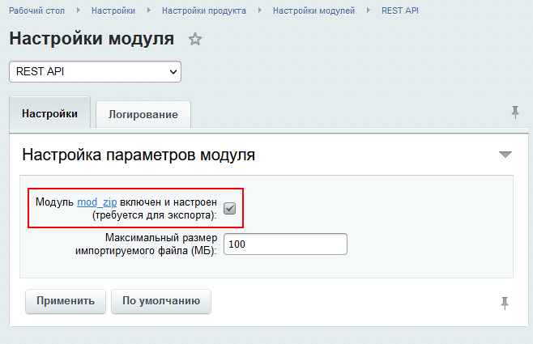
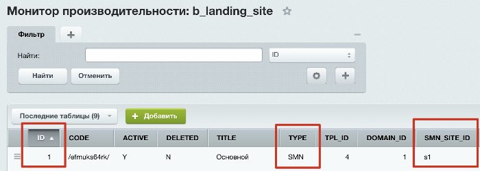
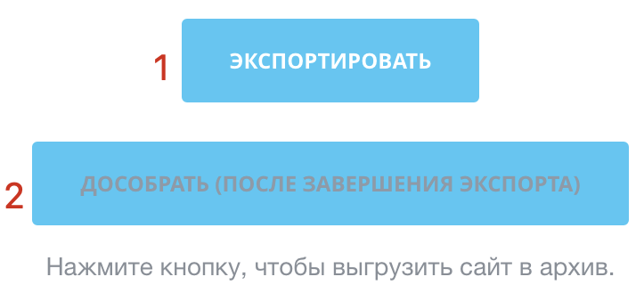
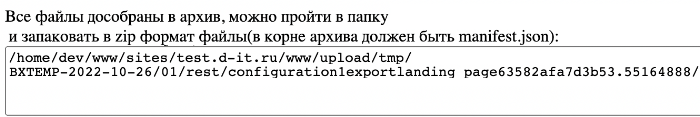
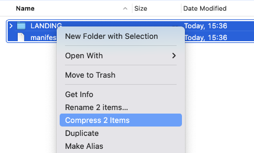

# Перенос сайта24 в Битрикс24

**Навигация**
- [← Оглавление курса](index.md)
- [← Предыдущий: 11975 — Блок с компонентом внутри](lesson_11975.md)
- [Следующий: 20376 — Проверьте себя →](lesson_20376.md)

Официальная страница урока: https://dev.1c-bitrix.ru/learning/course/index.php?COURSE_ID=48&LESSON_ID=15306

Если требуется перенести Сайт24 из "1С-Битрикс: Управление сайтом" в Битрикс24, то выполните следующие действия:


1. Если в "1С-Битрикс: Управление сайтом" не установлен
  			модуль REST API
                      
  		, то нужно его установить.
2. В настройках модуля REST API установите флажок о том, что
  			модуль mod_zip установлен и включён
                      
  		, даже если это не так.
3. В "1С-Битрикс: Управление сайтом" создайте файл **site_export.php**, например в папке `/examples`.
  ## site_export.php
  ```
  <?require($_SERVER["DOCUMENT_ROOT"]."/bitrix/header.php");
  $APPLICATION->SetTitle("");
  ?><?
  $APPLICATION->IncludeComponent(
  	"bitrix:ui.sidepanel.wrapper",
  	"",
  	[
  		"POPUP_COMPONENT_NAME" => "bitrix:rest.configuration",
  		"POPUP_COMPONENT_TEMPLATE_NAME" => ".default",
  		"POPUP_COMPONENT_PARAMS" => [
  			"SEF_MODE" => "Y",
  			'SEF_FOLDER' => \Bitrix\Rest\Marketplace\Url::getConfigurationUrl(),
  		],
  		"PAGE_MODE" => false,
  		"USE_PADDING" => false,
  		"RELOAD_GRID_AFTER_SAVE" => 'all'
  	]
  );?>
  ```
4. Добавьте правило в **urlrewrite.php**. Если файл будет лежать в папке `/examples`, то правило получиться таким:
  ```
  array(
   "CONDITION" => "#^/marketplace/configuration/#",
   "RULE" => "",
   "ID" => "bitrix:rest.configuration",
   "PATH" => "/examples/site_export.php",
  ),
  ```
5. В таблице **b_landing_site** найдите сайт типа SMN (поле `TYPE`) с идентификатором основного сайта в "1С-Битрикс: Управление сайтом" (поле `SMN_SITE_ID`):
  
6. В "1С-Битрикс: Управление сайтом" перейдите по пути  /marketplace/configuration/export_landing_page/1/, где 1 — ID из пункта 5.
  Далее, если у вас уже настроен **mod_zip**, то архив уже сформирован. Скачайте его и переходите к пункту 10. Если не настроен и настраивать нет возможности, то выполните шаги 7-9.
7. Скачайте файл [rest_mod_zip.php](https://dev.1c-bitrix.ru/docs/chm_files/rest_mod_zip.zip) и разместите его рядом с
  			init.php
                      init.php - необязательный файл в рамках структуры файлов Bitrix Framework. Он автоматически подключается в прологе.
  [Подробнее ...](https://dev.1c-bitrix.ru/learning/course/index.php?COURSE_ID=43&LESSON_ID=2916)
  		. Затем подключите его в init.php:
  ```
  <?php
  include_once('rest_mod_zip.php');
  ```
8. Снова запустите пункт 5 и сначала экспортируете, потом (именно после процесса) переходите по второй кнопке:
  
9. Там будет указан путь, где лежат файлы архива:
  
  Упакуйте все
  			в архив
                      
  		.
10. Полученный архив загрузите в ваш Битрикс24.
  **Примечание**: Если сайт переносится в облачный Битрикс24, то перед загрузкой архива вместо п.10 в файле **page_1_00.json** (где 1 — ID сайта) поменяйте в поле **TYPE** значение на нужное из п. 10.
11. Загруженный сайт имеет тип **SMN**. Зайдите все в таблицу **b_landing_site**, найдите в ней новозагруженный сайт и либо выставьте ему в **TYPE**:

  - `PAGE`, если это просто сайт,
  - либо `STORE`, если это магазин.
