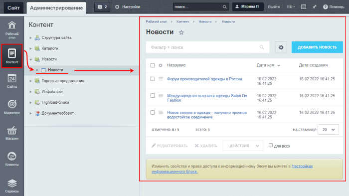

# Логика интерфейса административного раздела

**Навигация**
- [← Оглавление курса](index.md)
- [← Предыдущий: 4508 — Административный раздел](lesson_4508.md)
- [Следующий: 1984 — Административная панель управления →](lesson_1984.md)

Официальная страница урока: https://dev.1c-bitrix.ru/learning/course/index.php?COURSE_ID=48&LESSON_ID=1839

Интерфейс административного раздела логически разграничен на области, обеспечивающие доступ к разным функциональным возможностям системы.

### Видеоурок

### Как ориентироваться в административной части

Можно сказать, что интерфейс построен по иерархическому принципу. Вышестоящие области переключают зависимые в тот или иной режим работы. Это позволяет

			скрыть

                    Т.е. не отображать на текущий момент.

		 возможности, в которых нет потребности в данный момент и вынести на первый план требуемые функции. Такая организация интерфейса обеспечивает его наглядность и не перегруженность.

Интерфейс административного раздела содержит следующие области:

- 1
  			Административная панель
                      Команды общего назначения.
  [Подробнее ...](lesson_1984.md)
  		;
- 2
  			Административное меню
                      Весь большой и разнообразный функционал 1С-Битрикс для удобства работы с ним разбит в Административном меню на логические блоки. В зависимости от того, установлены ли те или иные модули, состав административного меню может различаться...
  [Подробнее ...](lesson_7977.md)
  		;
- 3
  			Меню функций
                      Содержимое Меню функций зависит от того, какой блок выбран в Административном меню . Например, выбрав Контент, вы получите такой вид панели...
  [Подробнее ...](lesson_2735.md)
  		;
- 4
  			Рабочая область
                      Рабочая область - это место, где производится большинство операций по управлению сайтом...
  [Подробнее ...](lesson_1975.md)
  		.

Вернемся к иерархическому принципу. При переключении пунктов в **Административном меню**, меняется содержимое в подчиненной области, а именно, в **Меню функций**. Переходим в Меню функций и выбираем нужный пункт в нём. В результате меняется содержимое в **Рабочей области**. Таким образом мы выбираем только тот функционал административного раздела, который нужен нам в текущий момент, а остальной функционал при этом скрыт.

Приведем пример:

В Административном меню выбран пункт **Контент** и в Меню функций отображены все функции, связанные с контентом (Структура сайта, Каталоги, и т.д.). Затем в Меню функций выбран пункт **Новости**, вследствие чего в Рабочей области отображается **список новостей**.

### Заключение

Интерфейс системы построен по иерархическому принципу: вышестоящие области интерфейса переключают зависимые области в тот или иной режим работы. Это позволяет скрыть ненужный в данный момент функционал системы и вынести на первый план требуемые функции. Такая организация интерфейса обеспечивает его наглядность и неперегруженность.
