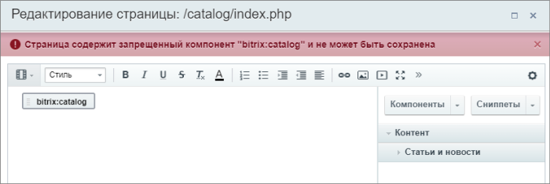

# Настройки отображения компонентов

**Навигация**
- [← Оглавление курса](index.md)
- [← Предыдущий: 2026 — Настройка визуального редактора](lesson_2026.md)
- [Следующий: 1903 — Сниппеты в визуальном редакторе →](lesson_1903.md)

Официальная страница урока: https://dev.1c-bitrix.ru/learning/course/index.php?COURSE_ID=48&LESSON_ID=1902

|  | ### Определяем компоненты с которыми можно работать |
| --- | --- |

По умолчанию пользователю предоставляется полный

			список компонентов

		, которые он  может размещать на редактируемой странице. Эту возможность администратор сайта может ограничить. Для этого:

- Перейдите на страницу настроек модуля **Управление структурой** (Настройки &gt; Настройки продукта &gt; Настройки модулей &gt; Управление структурой).
- Заполните поле **Разрешенные компоненты**.
  

Ограничение работает так: если в поле нет ничего, то разрешены все. Если в поле добавлен хотя бы один компонент, то будет разрешен только он (все остальные запрещены). Иными словами, для запрета доступа к единственному компоненту в это поле нужно внести все компоненты, которые разрешены.

При добавлении компонентов необходимо вводить их

			системные имена

                    Системное имя можно увидеть в форме редактирования компонента:

 либо названия можно брать из [Пользовательской документации](https://dev.1c-bitrix.ru/user_help/components/index.php)

		, а не те, под которыми компоненты отображаются в Визуальном редакторе. Для пакетного добавления в этом поле можно использовать маски вида: **news.*** (т.е. указывать общую начальную часть названия и прописывать символ "звёздочки"). Все компоненты, попадающие под эту маску, будут разрешены к использованию. Каждое название компонента или маски вводится с новой строки.

Для пользователей этот запрет внешне будет проявляться в том, что в визуальном редакторе при вызове панели **Компоненты** будут

			видны только разрешенные компоненты.

Поле работает только с системными компонентами, то есть с теми, которые размещены в пространстве имен **bitrix**. Если ваш компонент размещен не в папке `www\bitrix\components\...` (в структуре папок на веб-сервере), то он будет проигнорирован.

После ввода разрешенных компонентов для всех пользователей (в том числе и для администратора сайта) при попытке редактирования страниц
с ранее размещенными компонентами (которые теперь запрещены) и сохранении изменений будет показано

			предупреждение

		. Сохранение останется недоступно, до тех пор пока не будут удалены запрещенные компоненты со страницы или снят запрет администратором.

**Примечание**: Полные названия и описание компонентов смотрите в [документации](https://dev.1c-bitrix.ru/user_help/components/index.php).
