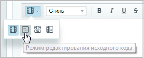

# Работа с PHP-скриптом

**Навигация**
- [← Оглавление курса](index.md)
- [← Предыдущий: 4482 — Работа с визуальным редактором](lesson_4482.md)
- [Следующий: 6637 — Обеспечение безопасности →](lesson_6637.md)

Официальная страница урока: https://dev.1c-bitrix.ru/learning/course/index.php?COURSE_ID=48&LESSON_ID=1904

Визуальный редактор может работать в двух режимах. Визуальный режим – более простой и интуитивно понятный вариант. Мы сразу видим, как будут выглядеть элементы на странице, и используем панель инструментов для форматирования текста. Второй вариант – режим исходного кода. Он предназначен для опытных пользователей, умеющих работать с кодом, и позволяет произвести дополнительную настройку (например, задать значения параметров или разместить произвольный PHP-скрипт).

|  | ### Работа с PHP-скриптом |
| --- | --- |

**Примечание**: Правом на работу с произвольным PHP-скриптом обладает только пользователь с правами администратора сайта.


В визуальном редакторе можно разместить произвольный PHP-скрипт следующим способом: перейдя в

			режим редактирования исходного кода




		 (или смешанный режим) и написав требуемый код. Тогда в визуальном режиме (или

			в соответствующем поле смешанного режима


		 ) появится тот же ярлык , содержание PHP-кода которого можно будет редактировать в режиме работы с исходным кодом и в области **Свойства**.

**Внимание!** Есть некоторые тонкости при прерывании HTML кода PHP-скриптом.

Например, можно писать так:

```
 <a href="<? echo 'www.oursite.ru';?>" title="Посетите сайт">OurSite</a>
```

 Аналогично и с рисунками (тег img).


 Перечислим атрибуты, которые обрабатываются для ссылок, рисунков и аудио:

 для тега `<a>` атрибуты: `href, title, class, style`

 для тега `` атрибуты: `src, alt, class, style`

 для тега `<audio>` атрибуты: `src, autoplay, control, loop, preload`

 Т.е. вместо этих атрибутов можно вставлять `<? ...... ?>`


 Код таблицы тоже можно прерывать PHP-скриптом:

```
 <table >  <? ........ ?>  <tr>  <? ........ ?>  <td>  </td>  <? ........ ?>  </tr>  <? ........ ?> </table>
```


Важно то, что визуальный редактор не показывает PHP-код в начале и в конце страницы. Например, строки в начале кода главной страницы не будут показаны при редактировании этой страницы с помощью визуального редактора:


```
<?require($_SERVER["DOCUMENT_ROOT"]."/bitrix/header.php");$APPLICATION->SetPageProperty("title", "Демонстрационная версия продукта «1С-Битрикс: Управление сайтом 6.0»");$APPLICATION->SetPageProperty("NOT_SHOW_NAV_CHAIN", "Y");$APPLICATION->SetTitle("Новости интернет-магазина");?>
```


Код, вызывающий файл **footer.php**, тоже не будет показан в HTML-редакторе:


```
<?require($_SERVER["DOCUMENT_ROOT"]."/bitrix/footer.php");?>
```
