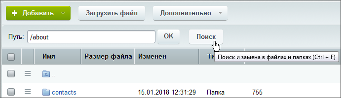
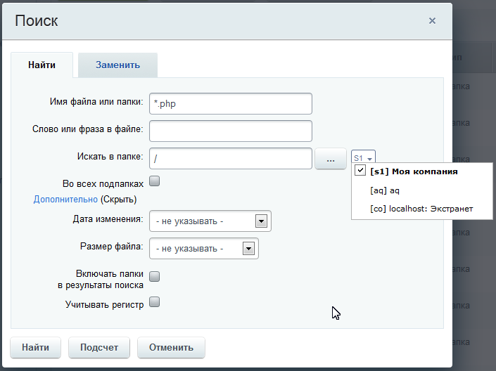

# Загрузка и поиск файлов

**Навигация**
- [← Оглавление курса](index.md)
- [← Предыдущий: 2023 — Управление правами доступа](lesson_2023.md)
- [Следующий: 2018 — Расширенный режим настройки меню →](lesson_2018.md)

Официальная страница урока: https://dev.1c-bitrix.ru/learning/course/index.php?COURSE_ID=48&LESSON_ID=1932

### Загрузка файлов

Для

			загрузки файлов

		 перейдите с помощью

			**Менеджера файлов**

                    Некоторые операции по работе со структурой можно выполнить только из административной части. В этом случае контент-менеджер может воспользоваться Менеджером файлов, который предоставляет широкие возможности по работе с файлами и папками, а принципы его работы повторяют знакомый всем проводник Windows.

Подробнее в курсе [Контент-менеджер](https://dev.1c-bitrix.ru/learning/course/index.php?COURSE_ID=34&LESSON_ID=1853).

		 в папку, в которую нужно загрузить файл и нажмите кнопку  на контекстной панели **Менеджера файлов**. Откроется сама форма загрузки файлов:

Число загружаемых файлов неограниченно.

**Примечания**:

- По умолчанию в настройках системы установлено ограничение на размер загружаемого файла в 2 мегабайта. Если есть необходимость изменить это ограничение, то это можно сделать в файле **php.ini** в параметре `upload_max_filesize`.
- Система поддерживает использование файлов с именами как на латинице, так и на кириллице, без ограничений по регистру. Недопустимо только использование спецсимволов: \ / ? * &lt; &gt; " '.

### Поиск файлов

В рамках файловой структуры есть механизм поиска файлов, размещающийся на контекстной панели в виде кнопки

			Поиск

                    

		. Откроется окно поиска:

Поиск ищет как по имени, так и по содержимому. Ограничения можно наложить следующие:

- По папке или сайту
- Дате изменения;
- Размеру файла;
- Регистру.

Кнопка **Подсчёт** покажет общее число файлов, удовлетворяющих указанным условиям поиска.

С помощью поиска можно произвести замену слова или фразы в файле. Для этого воспользуйтесь закладкой **Замена**.

### Документация по теме

- [Менеджер файлов](https://dev.1c-bitrix.ru/user_help/content/fileman/fileman/fileman_admin.php)
- [Загрузка нового файла](https://dev.1c-bitrix.ru/user_help/content/fileman/fileman/fileman_file_upload.php)
