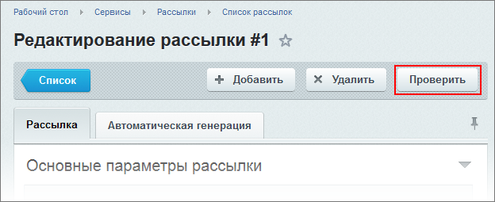
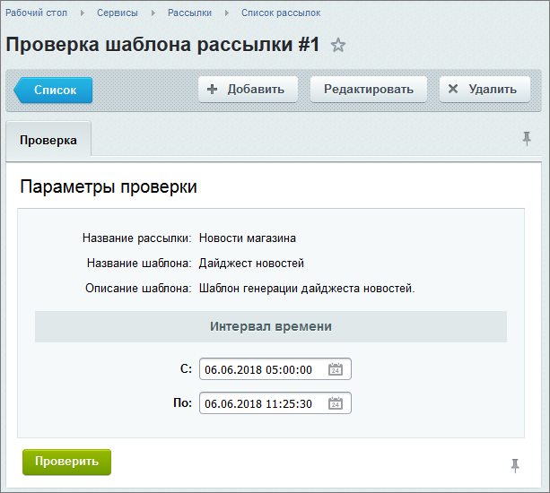
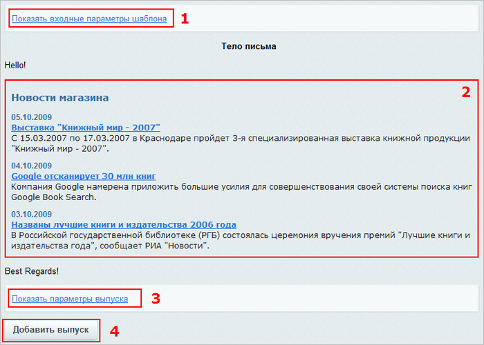
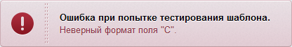
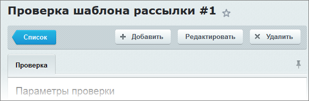

# Просмотр выпуска

**Навигация**
- [← Оглавление курса](index.md)
- [← Предыдущий: 6759 — Как создать автоматическую рассылку](lesson_6759.md)
- [Следующий: 2951 — Организация подписки на рассылку →](lesson_2951.md)

Официальная страница урока: https://dev.1c-bitrix.ru/learning/course/index.php?COURSE_ID=48&LESSON_ID=1948

|  | ### Как просмотреть выпуск автоматической рассылки |
| --- | --- |

После сохранения параметров рассылки рекомендуем проверить вид выпуска, в котором он будет отправлен подписчикам. Откройте рассылку на редактирование и воспользуйтесь кнопкой

			Проверить

                    

		. Эта кнопка откроет

			страницу с параметрами

                    

		 шаблона. Если параметры верны, то можно приступать к проверке внешнего вида. Этому служит зелёная кнопка **Проверить**.

Если проверка прошла, то вы увидите форму, где:

1. **входные параметры шаблона**;
2. **сообщение** в том виде, в котором оно будет отправлено подписчикам;
  **Примечание**: если в сообщении содержатся динамические данные (например, выборка новостей), то в сообщении будет размещена выборка данных за промежуток времени между датами последней и последующей генерации сообщения. При этом в настройках инфоблока, используемого в рассылке, поле **Начало активности** должно иметь значение по умолчанию **Текущие дата и время**.
3. **параметры выпуска** - параметры, задаваемые при
  			создании выпуска
                      Каждая рассылка может разослать бесконечное число выпусков. Создав рассылку вы создали, образно говоря, телеканал, передачами в котором служат выпуски.
  [Подробнее](lesson_2952.md)...
  		.
4. **Добавить выпуск** - c помощью этой кнопки сообщение, сгенерированное на основе выбранного шаблона, может быть сохранено в списке выпусков, а затем отправлено вручную.

Если проверка не пройдена, то отобразится сообщение с указанием ошибок:

Вернуться к форме настройки созданной рассылки можно с помощью кнопки

			Редактировать

                    

		.

Создание и редактирование

                    Поставляемый в дистрибутиве образец шаблона рассылки требует адаптации под конкретный сайт.
[Подробнее...](http://dev.1c-bitrix.ru/learning/course/index.php?COURSE_ID=41&LESSON_ID=4810)

		 шаблонов рассылки может выполнять только Администратор.
