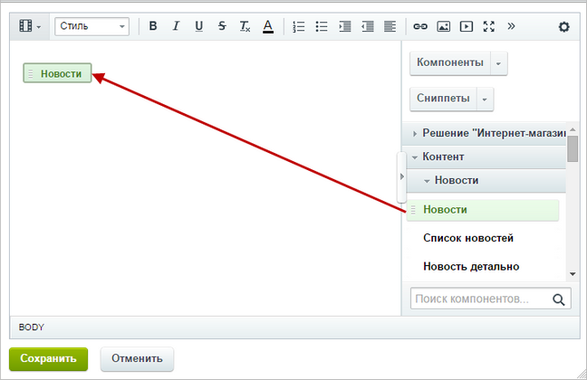
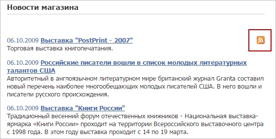

# Экспорт в RSS

**Навигация**
- [← Оглавление курса](index.md)
- [← Предыдущий: 2002 — Импорт данных](lesson_2002.md)
- [Следующий: 1998 — Отображение данных из RSS →](lesson_1998.md)

Официальная страница урока: https://dev.1c-bitrix.ru/learning/course/index.php?COURSE_ID=48&LESSON_ID=1995

### Экспорт в RSS

Новости, товары и т.д. вы можете экспортировать в другие системы. Выполните несколько простых действий:

1. В настройках типа инфоблоков отметьте опцию
  			Использовать экспорт в RSS
                      
  		.
2. В настройках модуля **Информационные блоки** (Настройки &gt; Настройки продукта &gt; Настройки модулей &gt; Информационные блоки) укажите
  			путь к директории
                      
  **Примечание**: путь к директории указывается относительно корневой папки.
  		, в которую выполняется экспорт данных.
3. Выполните настройки экспорта в RSS для конкретного инфоблока. Для этого откройте форму редактирования этого инфоблока и вкладку **RSS**. Описание параметров вы найдете в [документации](https://dev.1c-bitrix.ru/user_help/content/iblock/iblock_edit.php#rss).
4. Настройте компонент на экспорт данных.
  Можно использовать простой компонент
  			RSS новости (экспорт).
                      Компонент предназначен для создания страницы, которая отдает выбранные новости вашего сайта в формате RSS.
  						[Описание компонента «RSS новости (экспорт)» в пользовательской документации.](http://dev.1c-bitrix.ru/user_help/detail.php?ID=62990)
  		 В его настройках укажите информационный блок, количество дней для экспорта и другие параметры. Результат экспорта будет аналогичен приведенному ниже примеру.

### Пример настройки компонента для RSS-экспорта

Рассмотрим экспорт данных в формате **RSS** из информационного блока (например, новости), используя настройки комплексного компонента

			Новости

                    Комплексный компонент позволяет создать новостной раздел на сайте. Доступен просмотр детальной информации, списка элементов, настройка экспорта в rss, организация голосования за новости (или другие элементы инфоблоков), настройка отзывов, вывода материалов по темам, настройки ЧПУ и многое другое.

						[Описание компонента «Новости (комплексный компонент)» в пользовательской документации.](http://dev.1c-bitrix.ru/user_help/detail.php?ID=62967)

		:

1. Создайте страницу и
  			разместите
                      
  		 на ней комплексный компонент **Новости**.
2. Настройте все необходимые параметры: источник данных, настройки RSS и другие:
  
  **Примечание**: предварительно убедитесь, что в настройках типа инфоблоков разрешен экспорт данных в формате **RSS**.

В результате созданная страница имеет вид:

Переход по ссылке **rss** открывает страницу со

			списком элементов

                    

		 в формате **RSS**.

### Заключение

Вы познакомились с настройкой экспорта данных со своего сайта в формате RSS. Почитайте [следующий урок](lesson_1998.md) и вы узнаете, как на своем сайте показать принятые в формате RSS данные.
