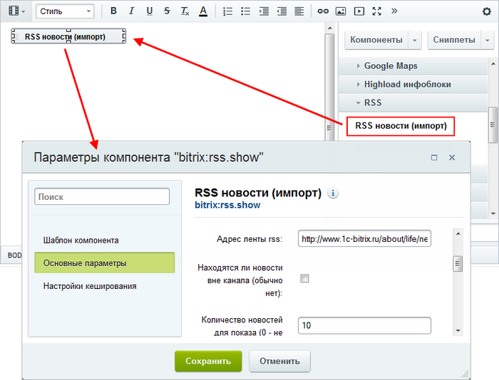
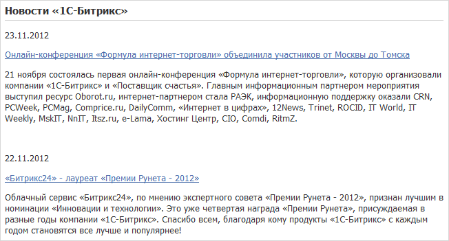

# Отображение данных из RSS

**Навигация**
- [← Оглавление курса](index.md)
- [← Предыдущий: 1995 — Экспорт в RSS](lesson_1995.md)
- [Следующий: 13036 — Практические задания →](lesson_13036.md)

Официальная страница урока: https://dev.1c-bitrix.ru/learning/course/index.php?COURSE_ID=48&LESSON_ID=1998

### Отображение данных из RSS

Нужно опубликовать на сайте данные, полученные в формате RSS? Используйте компонент

			RSS новости (импорт)

                    Компонент предназначен для импорта новостей с другого сайта.

						[Описание компонента «RSS новости (импорт)» в пользовательской документации.](http://dev.1c-bitrix.ru/user_help/detail.php?ID=62989)

		:

1. Разместите компонент **RSS новости (импорт)** на странице.
2. Настройте его
  			параметры
                      
  		. Обязательно укажите
  			Адрес ленты rss
                      Чтобы получить адрес ленты, на стороннем сайте нажмите кнопку  и скопируйте ссылку в строке браузера.
  		 сайта, с которого производится импорт.

В итоге страница имеет следующий вид:

### Заключение

Для публикации полученной в формате RSS информации разместите и настройте компонент **RSS новости (импорт)**.
