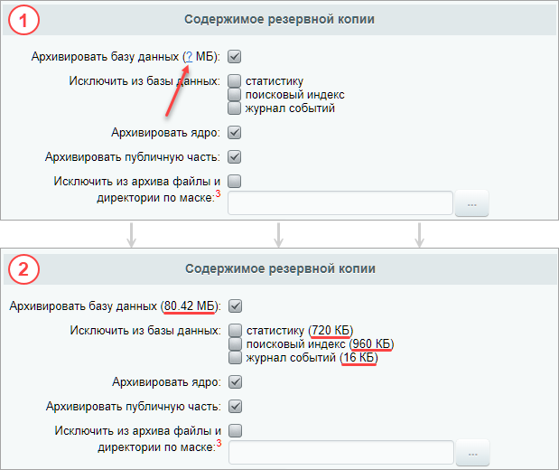
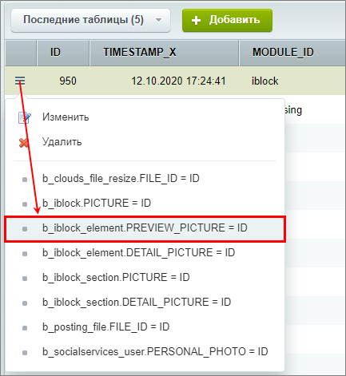
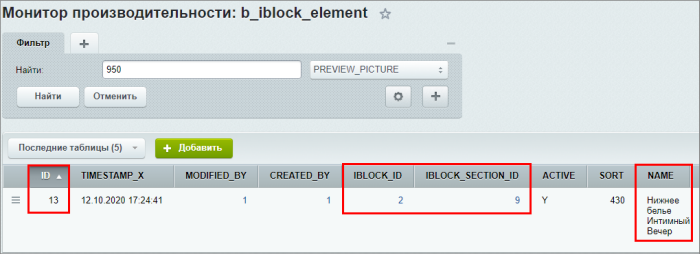

# Рекомендации по очистке места на диске

**Навигация**
- [← Оглавление курса](index.md)
- [← Предыдущий: 13776 — Контроль дубликатов](lesson_13776.md)
- [Следующий: 20216 — Оптимизация использования места на хостинге →](lesson_20216.md)

Официальная страница урока: https://dev.1c-bitrix.ru/learning/course/index.php?COURSE_ID=48&LESSON_ID=19992

В процессе работы любого сайта занимаемое им место со временем

			увеличивается

                    Происходит это по разным причинам: накопление объемного контента, устаревших файлов, статистики и других данных.

		. Если место закончилось, то наиболее простое и безопасное решение этой проблемы - увеличить его. Если такой возможности нет, то описанные в уроке рекомендации для продуктов 1С-Битрикс могут помочь Вам освободить некоторое место на диске.

### Очистка демо-данных

Немалое количество места занимают демоданные. Усугубляется это тем, что они также попадают в архивы резервных копий, создаваемые в папке сайта, чем увеличивают занимаемое место ещё больше.

В коробочной версии *Битрикс24* есть специальный инструмент - [Мастер очистки данных](lesson_2354.md).

В *1C-Битрикс: Управление сайтом* доступна

			чистая установка

                    Выберите установку решений через Marketplace, затем **Чистая установка "1С-Битрикс"**.

Подробнее в курсе [Установка и настройка](https://dev.1c-bitrix.ru/learning/course/index.php?COURSE_ID=135&LESSON_ID=2061&LESSON_PATH=10495.4495.4522.4538.2061).

		. Если у Вас уже установлен сайт с демоданными, то понадобится удалять их вручную.

#### Список демоданных в 1C-Битрикс: Управление сайтом

Точный список зависит от Ваших потребностей. Некоторым требуется удалить абсолютно всё, а кто-то желает удалить только наполнение, а структуру демо-сайта и шаблоны оставить.

Перечислим демо-данные:

- Инфоблоки
                      Удалите инфоблоки целиком, либо только их разделы и элементы, если они нужны Вам.
  		 (Например: Каталог, Торговые предложения, Новости в интернет-магазине);
- Шаблоны сайта `/bitrix/templates`;
- Статические папки и файлы (Такие, как раздел О магазине (`/about`));
- Highload-блоки
                      Модуль **Highload-блоки** работает с произвольными наборами данных в условиях высоких нагрузок.
  Подробнее в курсе [Администратор. Модули](https://dev.1c-bitrix.ru/learning/course/index.php?COURSE_ID=41&CHAPTER_ID=06638).
  		;
- Папка `/upload/iblock` содержит все изображения из демо инфоблоков. Если у Вас ещё нет собственных инфоблоков, то можно очистить её полностью.
- Несколько демо-сайтов в папках:

  - `/bitrix/wizards/bitrix/demo`
  - `/bitrix/modules/bitrix.eshop`
  - `/bitrix/modules/bitrix.sitecommunity`
  - `/bitrix/modules/bitrix.sitecorporate`
  - `/bitrix/modules/bitrix.siteinfoportal`
  - `/bitrix/modules/bitrix.sitepersonal`

### Резервные копии

Удалите устаревшие резервные копии, которые хранятся **локально**. Сделать это можно через список резервных копий Настройки &gt; Инструменты &gt; Резервное копирование &gt; Список резервных копий или вручную в папке `/bitrix/backup/`.

Также рекомендуем включить хранение резервных копий в облачном хранилище, чтобы не занимать место на сервере.

Подробнее о резервных копиях можно почитать в уроке: [Хранение и шифрование резервных копий](lesson_7080.md).

Создавая резервную копию в экспертом режиме, можно добиться уменьшения размера резервной копии с помощью

			дополнительных настроек

                    Резервную копию можно сохранить как на локальный носитель, так и в облачное хранилище. В обоих случаях возможно изменение настроек этого процесса. Для этого перейдите на закладку **Параметры** и активируйте опцию **Включить экспертные настройки создания резервной копии**.

[Подробнее](lesson_5330.md)...

		. Воспользуйтесь этим, но только если хорошо понимаете за что отвечают эти настройки.

### Поисковый индекс, статистика и лог

На странице создания резервной копии (Настройки &gt; Инструменты &gt; Резервное копирование &gt; Создание резервной копии) есть возможность посмотреть объем занимаемого базой данных места. Для этого во вкладке **Параметры** включите экспертный режим и нажмите на знак  ?  в параметре **Архивировать базу данных** 1:

Как показано на скриншоте 2, теперь появились данные о занимаемом месте. Причем отображается как общая цифра для всей Базы данных, так и отдельно для Статистики, Поискового индекса и Журнала событий. Эта информация даст понимание, разрослась ли какая-то из вышеперечисленных частей системы.

Как уменьшить количество собираемых данных в статистике и журнале событий описано в [следующем уроке](lesson_20216.md#full_list). Там вы найдете таблицу, в которой собраны все возможные настройки.

Ограничить размер создаваемого поискового индекса можно [настройками модуля Поиск](lesson_2046.md), определив маски включения и исключения, а также максимальный размер индексируемого документа.

Для актуализации поискового индекса нужно выполнять полную переиндексацию. В некоторых случаях лучше использовать прием удаления модуля Поиск из системы с полной очисткой файлов поискового индекса и восстановление его обратно. Все подробности описаны в уроке [Индексация](lesson_2048.md#refresh_index).

### Большие файлы

Поищите и удалите ненужный контент на сайте, который содержит объемные файлы.

Искать их удобно с помощью таблицы базы данных **b_file**. Перейдите на страницу Настройки &gt; Производительность &gt; Таблицы. В поле **Фильтр по имени таблицы** внесите **b_file** и откройте указанную таблицу. Для поиска файлов отсортируйте записи в таблице по убыванию колонки **FILE_SIZE**, чтобы видеть самые большие файлы на сайте.

**Внимание**! В самой таблице не вносите никаких изменений. Используйте её только для поиска файлов.

Проанализируйте найденные файлы и решите, что с ними делать.

## Пример поиска файлов с помощью таблиц базы данных

Рассмотрим такие результаты отсортированной по размеру таблицы:

Какую полезную информацию мы можем из неё получить (по самому большому файлу)?

- Самый большой файл имеет размер **FILE_SIZE** - 2 149 632 байта (~ 2,04 МБ);
- Это изображение формата .png (**CONTENT_TYPE** - image/png);
- Файл используется в модуле инфоблоки (**MODULE_ID** - iblock);
- Расположен в папке iblock/02c (поле таблицы **SUBDIR**) (см. папку **upload**);
- Название файла указано в **FILE_NAME**, 02c38cfe59084d8f1231db35b83e4d73.png.

С помощью полученной информации, мы можем перейти в папку с файлом и посмотреть этот файл:

Другой способ найти файл - выполнить

			поиск файла

                    В рамках файловой структуры есть механизм поиска файлов, размещающийся на контекстной панели в виде кнопки Поиск.

Подробнее в курсе [Контент-менеджер](lesson_2771.md#search).

		 в файловой структуре, например, по его названию.

Также мы можем посмотреть взаимосвязи с другими таблицами базы данных, для поиска полезной информации. Например, если мы просмотрим связные таблицы, то обнаружим, что наш файл имеет связь с таблицей

			b_iblock_element

                    

		. И в ней есть информация об элементе инфоблока, в котором используется это изображение:

### Очистка кеша

Вы можете почистить файлы кеша из административного раздела на странице Настройки &gt; Настройки продукта &gt; Автокеширование. Перейдите во вкладку **Очистка файлов кеша** и выберите очистить **все**. Тем самым Вы освободите дисковое пространство от файлов кэша.

Либо удалите его вручную, очистив папки `/bitrix/managed_cache/`,  `/bitrix/resize_cache/` и `/bitrix/cache/`. Возможно в этих папках из-за некорректно выставленных прав происходит накапливание данных кеша.

Подробнее об очистке кеша и возможной проблеме с правами описано в отдельном уроке: [Очистка файлов кеша](https://dev.1c-bitrix.ru/learning/course/index.php?COURSE_ID=35&LESSON_ID=2164&LESSON_PATH=3906.6663.2129.2164).

Если у Вас включена технология

			Композитный сайт

                    В *Bitrix Framework* есть своя технология ускорения открытия страницы: **Композитный сайт**.

Подробнее в курсе [Технология Композитный сайт](https://dev.1c-bitrix.ru/learning/course/index.php?COURSE_ID=39&INDEX=Y)

		, то дополнительно к папкам, указанным выше, можно очистить папку `/bitrix/html_pages`. В ней хранится композитный кеш.

**Внимание**! Вероятно, что такая очистка поможет временно и пригодится только для срочного освобождения места на диске. Выполнять её постоянно не рекомендуется.

**Важно понимать**, что производительность сайта после очистки снизится, т.к. кеш начнет создаваться заново. И сам кеш может постепенно вырасти до прежних размеров.

### Другие рекомендации

- Если на сайте много больших картинок (например, по несколько Мб), то рассмотрите вариант их оптимизации без заметной потери качества;
- Рекомендуем поискать, может у Вас есть неиспользуемые модули, шаблоны или компоненты. Иногда присутствуют ненужные данные от давно удаленных модулей;
- Поработайте с папкой `/upload/`, в которой могут храниться уже не нужные файлы (например, по умолчанию, в ней сохраняются различные файлы экспорта);
- Если Вы пользуетесь модулем **Веб-аналитика**, проверьте настройки модуля на закладке **Время хранения**. Большой период времени хранения приводит к увеличению размера базы данных статистики. При необходимости -
  			очистите ненужные данные
                      Настройки модуля задают параметры обработки рекламных кампаний, определения страны и города по IP-адресу, параметры сбора статистики и управляют правами доступа к модулю.
  Подробнее в курсе [Администратор. Модули](lesson_2101.md)
  		.
