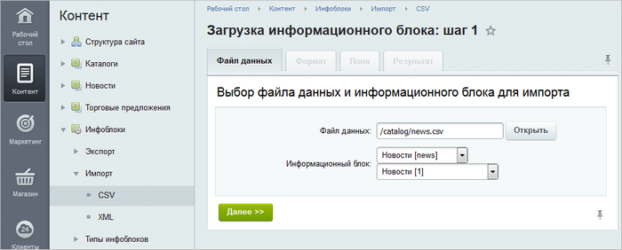
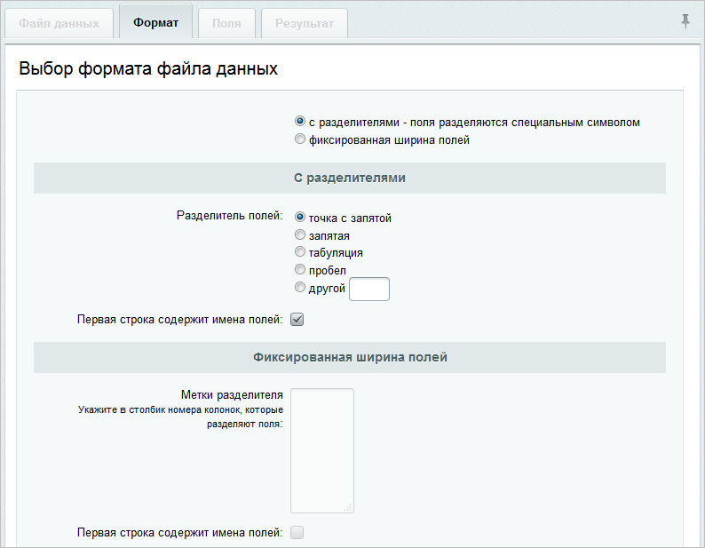
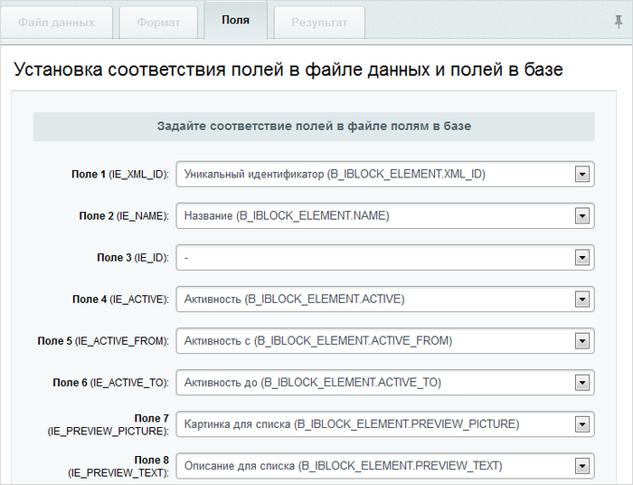
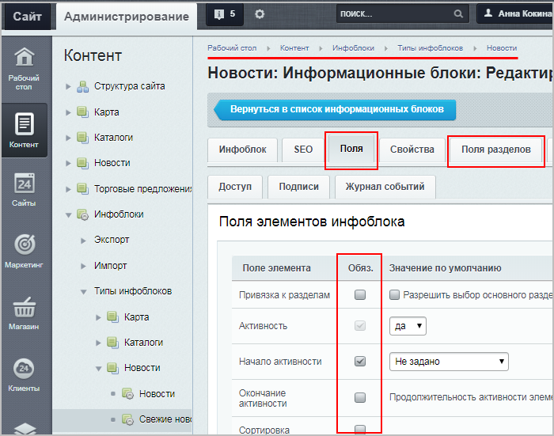

# Импорт данных

**Навигация**
- [← Оглавление курса](index.md)
- [← Предыдущий: 2012 — Как подготовить CSV-файл для загрузки данных](lesson_2012.md)
- [Следующий: 2001 — Экспорт данных →](lesson_2001.md)

Официальная страница урока: https://dev.1c-bitrix.ru/learning/course/index.php?COURSE_ID=48&LESSON_ID=2000

### Загрузка данных в инфоблок

Наполняете инфоблок данными? Сберегите свое время и силы. Подготовьте CSV-файл с данными, а встроенный инструмент импорта быстро загрузит все данные в инфоблок.

**Важно!** Если инфоблок содержит товары, то используйте другой инструмент импорта: Магазин &gt; Настройки &gt; Импорт данных. Подробнее в курсе

			Администратор. Бизнес.

Модуль **Торговый каталог** позволяет выполнять экспорт и импорт данных информационных блоков, работающих в режиме торгового каталога (Магазин &gt; Настройки).

Для импорта по умолчанию доступны несколько профилей и форматов данных Магазин &gt; Настройки &gt; Импорт данных.

[Подробнее](/learning/course/index.php?COURSE_ID=42&CHAPTER_ID=03457)...

1. Откройте страницу **Загрузка информационного блока** (Контент &gt; Инфоблоки &gt; Импорт &gt; CSV):
  
2. Задайте параметры:
  **Примечание:** уровень глубины вложенности загружаемых разделов
  			определяется
                      
  		 настройками модуля **Информационные блоки**.
  Нажмите **Далее**.

  - **Файл данных** - с помощью кнопки **Открыть...** выберите файл в CSV-формате с сервера или загрузите с локального компьютера.
  - **Информационный блок** - в выпадающих списках выберите сначала тип, а затем и сам инфоблок, данные в который импортируете.
3. Укажите
  			формат
                      
  		 вашего файла с данными. Нажмите **Далее**.
4. Задайте
  			соответствия
                      
  		 между полями в файле и полями информационного блока, в который выполняется загрузка.
  **Важно!** Обязательно должно быть выбрано хотя бы одно из полей
  			Уникальный идентификатор
  Поле **Уникальный идентификатор** указывается при редактировании существующих элементов. Представляет собой комбинацию из букв латинского алфавита и цифр. В первую очередь база данных сверяется именно по XML_ID.
  		 **(B_IBLOCK_ELEMENT.XML_ID)** или
  			Название
  Поле **Название** указывается при создании новых элементов.  XML_ID будет добавлен автоматически при импорте (в этом случае XML_ID будет равен порядковому номеру ID), либо же можно (но не обязательно) добавить его вручную.
  		 **(B_IBLOCK_ELEMENT.NAME)**. Эти поля используются для сопоставления записей в файле записям в базе данных.
  Также проверьте настройки
  			инфоблока
  В данном примере опция **Начало активности** отмечена как обязательная, поэтому в создаваемом
  файле csv тоже должна быть колонка с указанием начала активности элемента.
  
  		 (Контент &gt; Инфоблоки &gt; Типы инфоблоков &gt; [ваш тип инфоблока]/[ваш инфоблок]), в который Вы хотите загрузить файл: если во вкладках **Поля** или **Поля разделов** какие-либо поля отмечены как **обязательные**, то эти колонки должны быть **обязательно** и в загружаемом csv-файле.
  О дополнительных настройках читайте
  			в документации.
  **Путь к картинкам** - для загрузки элементов с иллюстрациями необходимо предварительно выгрузить картинки в какую-либо папку на сайте с помощью любого FTP-клиента. Путь к папке с изображениями, нужно указать в этом поле.
  **Использовать настройки инфоблока для обработки изображений** - при отмеченной функции изображения, добавленные при импорте будут преобразовываться согласно настройкам инфоблока.
  [Подробнее](https://dev.1c-bitrix.ru/user_help/content/iblock/import/import_csv.php#s_3)...
5. Нажмите кнопку **Загрузить данные**. Начинается импорт инфоблока, и в форме отображается ход процесса загрузки. По окончании выводится соответствующее
  			сообщение
                      
  		.
  Перейдите к списку элементов инфоблока и проверьте результат загрузки данных.

**Примечание:** при импорте больших объёмов данных рекомендуется отключать индексацию созданных элементов модулем **Поиск**. Это существенно увеличит скорость создания элементов. Если в инфоблоке больше 100 тысяч записей, то производительность уже серьезно начинает зависеть от аппаратных возможностей сервера и настроек программного обеспечения (MySQL в первую очередь).

### Заключение

Итак, вы познакомились с загрузкой данных в инфоблок из CSV-файла. Почитайте материалы следующей главы и узнайте, как правильно выгружать и загружать данные в формате XML.

### Документация по теме

- [Импорт в формате CSV](https://dev.1c-bitrix.ru/user_help/content/iblock/import/import_csv.php)
