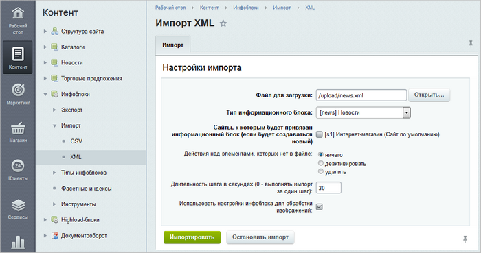
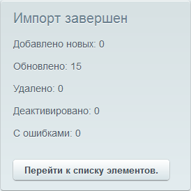

# Импорт данных

**Навигация**
- [← Оглавление курса](index.md)
- [← Предыдущий: 2001 — Экспорт данных](lesson_2001.md)
- [Следующий: 1995 — Экспорт в RSS →](lesson_1995.md)

Официальная страница урока: https://dev.1c-bitrix.ru/learning/course/index.php?COURSE_ID=48&LESSON_ID=2002

Представьте, что у вас есть XML-файл,

			данные

Встроенный инструмент позволяет переносить не только содержимое инфоблоков, но и все свойства (в том числе и пользовательские свойства разделов) и изображения.

		 из которого следует занести в инфоблок. Экономьте время с инструментом импорта и загружайте данные за 3 простых шага.

**Важно!** Перед выполнением импорта настоятельно рекомендуется сделать резервную копию сайта.

### Шаг 1

## Дополнительная информация. Видеоролик о формате и редактировании XML-файла

Откройте страницу **Импорт XML** (Контент &gt; Инфоблоки &gt; Импорт &gt; XML):

### Шаг 2

Задайте параметры импорта:

- **Файл для загрузки** – с помощью кнопки **Открыть...** выберите файл в формате **XML** с сервера или загрузите с локального компьютера.
- **Тип информационного блока** – выберите тип, к которому должен относиться загружаемый инфоблок.
- **Сайты, к которым будет привязан информационный блок (если будет создаваться новый)** – отметьте сайт, к которому привязан инфоблок.
  **Примечание:** если загружаемый инфоблок **уже существует в системе** (существование инфоблока проверяется только по полю **Внешний код**), то независимо от выбранного типа инфоблока и сайтов, он заново загружен не будет. Имеющиеся элементы будут обновлены, новые - добавлены, а над теми элементами, которые отсутствуют в файле, будет выполнено заданное действие в параметре **Действия над элементами, которых нет в файле**. Пользователь, запустивший импорт, будет отмечен как изменивший обновленный элемент.
  Если же такого инфоблока в системе **нет**, то он будет создан в указанном типе, привязан к выбранным сайтам и его содержимое будет загружено.
  Поле **Внешний код** отображается в форме редактирования инфоблока только в том случае, если в настройках модуля **Информационные блоки** отмечена опция **Показывать код загрузки из внешних источников**.
  При импорте больших объемов данных рекомендуется отключить индексацию созданных элементов модулем **Поиск**. Это существенно увеличит скорость создания элементов.
- **Действия над элементами, которых нет в файле** – выберите действие над элементами инфоблока. Оно будет выполняться над имеющимися элементами в инфоблоке, но при этом отсутствующими в файле загрузки.
- **Длительность шага в секундах** – укажите количество секунд выполнения шага импорта. Если указано **0**, то импорт инфоблока будет осуществлен за один шаг.
- **Использовать настройки инфоблока для обработки изображений** – отметьте опцию, чтобы добавленные изображения преобразовывались согласно настройкам инфоблока.

### Шаг 3

Нажмите кнопку **Импортировать**. Начинается импорт инфоблока, над формой отображается ход процесса загрузки файла. По окончании выводится соответствующее

			сообщение

                    

		.

Перейдите к списку элементов инфоблока и проверьте результат загрузки данных.

**Примечание:** если при импорте списочных свойств значения отсутствуют в метаданных, но есть у элементов, то они не удаляются. Если свойство **Символьный код** в исходном файле пустое, то система заполняет его транслитом из названия (если в закладке [Поля](http://dev.1c-bitrix.ru/user_help/content/iblock/iblock_edit.php#filds) формы настройки инфоблока для поля **Символьный код** было указано **Транслитерировать из названия при добавлении элемента**).

Если в процессе импорта произойдут ошибки, то система сообщит об этом. К сожалению, получить детальную информацию по ошибкам не представляется возможным. Но можно воспользоваться следующим способом: выполнить экспорт загруженного с ошибками инфоблока и сопоставить полученный XML-файл с исходным.

### Заключение

Итак, вы узнали, как загружать данные в инфоблок из XML-файла. Почитайте материалы следующей главы и ознакомьтесь с обменом данных в формате RSS.

### Документация по теме

- [Импорт в формате XML](https://dev.1c-bitrix.ru/user_help/content/iblock/import/import_xml.php)
- [Описание структуры файлов XML](https://dev.1c-bitrix.ru/api_help/sale/xml/index.php)
