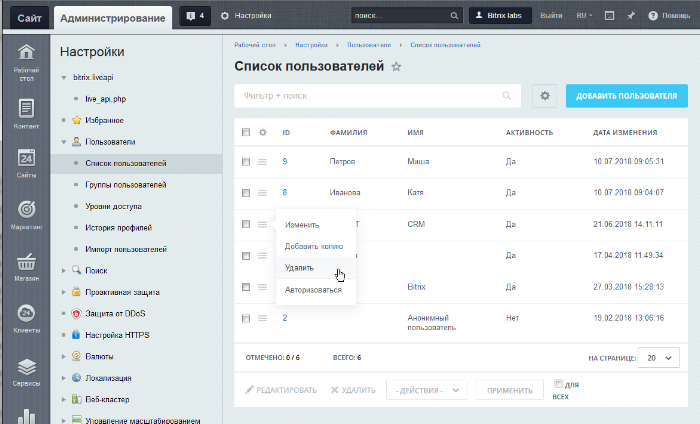
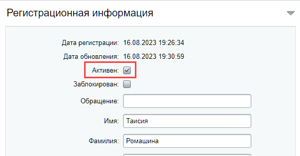
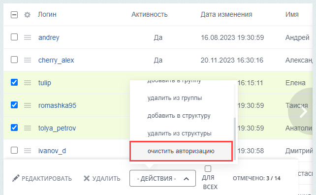
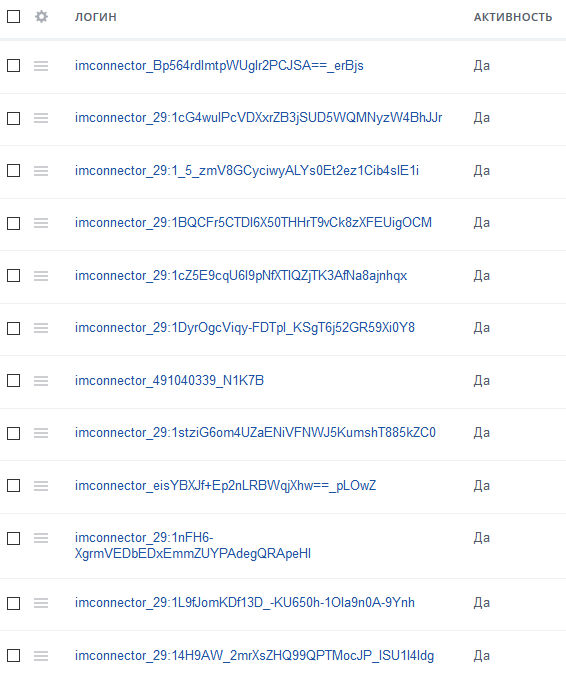
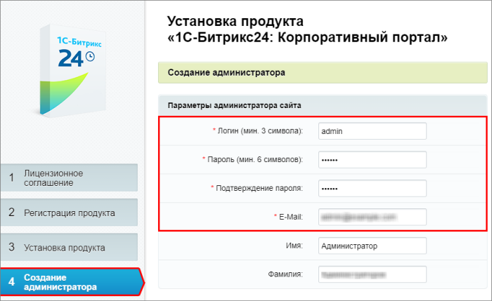

# Работа с учетными записями пользователей

**Навигация**
- [← Оглавление курса](index.md)
- [← Предыдущий: 7173 — Регистрация и разграничение прав](lesson_7173.md)
- [Следующий: 2487 — Группы пользователей →](lesson_2487.md)

Официальная страница урока: https://dev.1c-bitrix.ru/learning/course/index.php?COURSE_ID=48&LESSON_ID=2004

### Управление учетными записями

Управление учетными записями пользователей в системе выполняется на странице **Список пользователей** (Настройки &gt; Пользователи &gt; Список пользователей):

Для добавления нового пользователя служит кнопка **Добавить пользователя**, расположенная на контекстной панели.

## О лицензируемых пользователях в коробочной версии «Битрикс24»

Редакция «Битрикс24» коробочной версии приобретается на определённое количество сотрудников: 50, 100, 250 человек и так далее. Сравнение редакций и цены вы найдёте по ссылке [Сколько стоит коробочная версия Битрикс24](https://www.bitrix24.ru/prices/self-hosted.php).

Учётные записи пользователей в продукте могут быть активными и не активными. Определить активность легко по флагу

			Активен

                    

		 в карточке пользователя. В свою очередь активные пользователи при определённых условиях попадают в **лицензированные**.

Количество лицензированных пользователей = доступные по лицензии + число дополнительно приобретённых пользователей.

Когда активный пользователь становится лицензируемым? Для этого необходимы два условия:

1. Учётная запись пользователя должна быть активной;
2. Пользователю достаточно один раз авторизоваться на портале под своим логином и паролем.

Таким образом, как только пользователь впервые авторизуется на портале, он занимает одно место в количестве пользователей, определённых лицензией. Получить информацию о лицензируемых пользователях возможно двумя способами:

- На странице Marketplace &gt; Обновление платформы в поле
  			Максимальное количество пользователей
                      
  		. Здесь вы узнаете максимально доступное количество и сколько уже используется;
- На странице Настройки &gt; Пользователи &gt; Список пользователей по фильтру **Лицензируемые пользователи** с отметкой «Да». Так вы посмотрите сколько у вас таких пользователей и кто именно входит в них.

**Внимание!** Экстранет пользователи тоже учитываются в лицензируемых.

Чтобы «освободить место» – деактивируйте учётную запись ненужного пользователя. В этом случае он перестанет учитываться как лицензируемый. Но при восстановлении активности такой сотрудник вновь попадёт в список. Другой способ – очистить данные об авторизации пользователей с помощью группового действия

			очистить авторизацию

                    

		 в списке.

В процессе работы система автоматически создаёт различных пользователей, которых вы можете обнаружить в списке. Они также имеют активные учётные записи, но на портале самостоятельно не авторизуются и в лицензируемые не попадут. Примеры таких пользователей:

1. При первом выставлении счета в CRM создается системный пользователь с именем **anonymous_[набор символов]**. Его удаление приведет к невозможности выставления счетов.
2. При работе «Открытых линий» для каждого внешнего клиента на портале создается пользователь типа экстранет. Обнаружив таких пользователей в
  			списке пользователей
                      
  		, не пугайтесь, вас не взломали. Это системные пользователи.

### Изменение учётной записи

Форма редактирование параметров пользователя вызывается с помощью двойного клика левой кнопкой мыши по записи пользователя, либо с помощью пункта **Изменить** в контекстном меню. С помощью команды **Авторизоваться** администратор может в один клик выйти из своего аккаунта и

			авторизоваться под выбранным аккаунтом

                    Команда доступна только для пользователей группы Администраторы. Отдельно дать к ней доступ пользователям других групп нельзя.

Обратите внимание, что если выбранный пользователь не является **администратором**, то после нажатия кнопки **Авторизоваться** откроется форма авторизации в административный раздел. Это происходит потому, что пользователь не имеет доступа к странице списка пользователей. Для дальнейшей работы под учетной записью выбранного пользователя можно воспользоваться кнопкой возврата на сайт в левом верхнем углу.

		.

Форма управления учетной записью пользователя имеет следующий вид:

Значения полей формы в большинстве случаев интуитивно понятны. Если возникнут вопросы, то подробное описание полей формы приводится в [пользовательской документации](http://dev.1c-bitrix.ru/user_help/settings/users/user_edit.php) продукта.

В больших проектах с несколькими администраторами есть смысл вести историю изменений учётных записей. Для этого используется опция **Сохранять историю изменения полей профиля пользователя** в настройках **Главного модуля**. Сами изменения отображаются на странице Настройки &gt; Пользователи &gt; История профилей.

### Учётная запись администратора

Учетная запись администратора создаётся при установке системы автоматически с идентификатором `1`. Параметры администратора сайта, обязательные для заполнения:

- Логин (мин. 3 символа);
- Пароль, ограничение для которого - не менее 6 символов;
- Подтверждение пароля, указанного выше;
- E-Mail.

Этот пользователь обладает максимально возможным доступом к системе. В дальнейшем регистрационные данные администратора могут быть изменены, но саму запись удалить невозможно.

**Примечание:** Для администратора сайта настоятельно рекомендуется использовать сложный пароль длиной более 6 символов. После окончания установки перейдите к настройкам группы **Администраторы** на закладку **Безопасность** и установите дополнительные параметры (описание параметров в [документации](https://dev.1c-bitrix.ru/user_help/settings/users/group_edit.php)).

## Настройки безопасности для группы Администраторы в коробочной "Битрикс24"

В коробочной версии *Битрикс24* после установки системы для группы **Администраторы** по умолчанию выставлены повышенные настройки безопасности:

Создавать новый пароль администратору потребуется с учетом этих настроек, либо он может переопределить эти настройки на другие значения.

Если по каким-то причинам пароль к администраторскому аккаунту утерян, то

			восстановите его.

Несомненно, администратор сайта должен обладать хорошей памятью. Особенно если сайтов много. И для каждого сайта свой пароль. И занимается администратор сайтами не одновременно, а периодически.

Но в какой-то момент может оказаться так, что один из паролей все-таки будет подзабыт. В такой ситуации можно восстановить пароль администратора одним из нижеперечисленных способов.

[Подробнее](lesson_2161.md)...
