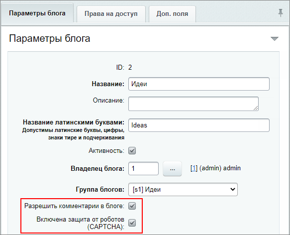
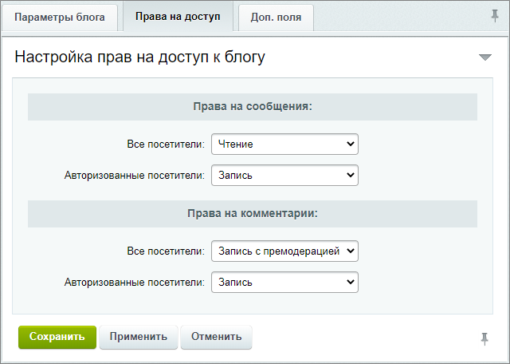
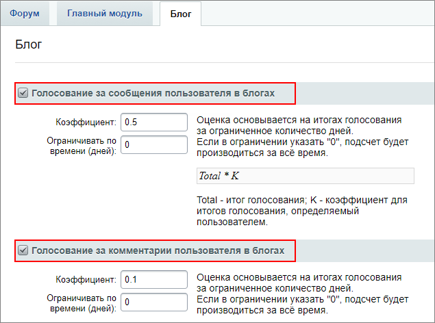
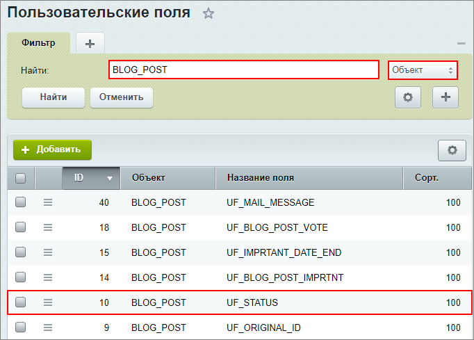
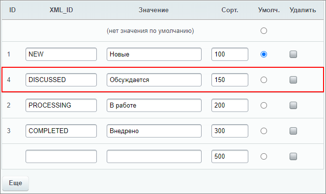
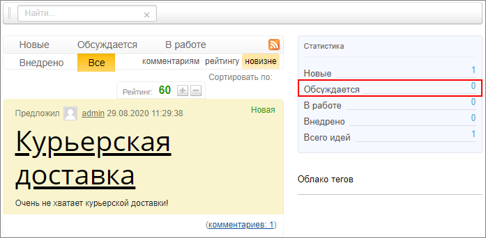

# Практические задания

**Навигация**
- [← Оглавление курса](index.md)
- [← Предыдущий: 20008 — Проверьте себя](lesson_20008.md)
- [Следующий: 3374 — Настройки модуля →](lesson_3374.md)

Официальная страница урока: https://dev.1c-bitrix.ru/learning/course/index.php?COURSE_ID=48&LESSON_ID=20128

После изучения главы рекомендуем выполнить несколько практических заданий.

### Практические задания

Практические задания состоят из вопроса, скриншота или видео с конечным результатом и объяснением, как это получить в спойлере. Не торопитесь подглядывать в спойлер. 

1. Создайте и настройте блог для менеджера идей c возможностью комментирования. Включите CAPTCHA. Установите права доступа:
  ## Решение
  **Задание составлено по материалу урока:**
  - [Создание сервиса](lesson_6906.md).
  **Результат:**
  На странице создания блога (Сервисы &gt; Блоги &gt; Блоги, кнопка **Новый блог**) заполним обязательные поля и установим требуемые опции:
  
  Установим права доступа в соответствии с заданием:
  

  - Права на сообщения: **чтение** для всех посетителей и **запись** для авторизованных пользователей;
  - Права на комментарии: **запись с премодерацией** для всех посетителей и **запись** для авторизованных пользователей;
2. Настройте возможность голосования за сообщения и комментарии.
  ## Решение
  **Задание составлено по материалу урока:**
  - [Создание сервиса](lesson_6906.md).
  **Результат:**
  На странице Сервисы &gt; Рейтинги &gt; Список рейтингов, Рейтинг  зададим настройки голосования:
  
3. Добавьте новый статус "Обсуждается" (DISCUSSED) и установите его вторым в списке.
  ## Решение
  **Задание составлено по материалам урока:**
  - [Создание и редактирование статусов](lesson_11137.md).
  **Результат:**
  На странице **Пользовательские поля** (Настройки &gt; Настройки продукта &gt; Пользовательские поля) найдем нужное поле и откроем форму редактирования:
  
  Добавим новый статус:
  

По желанию, можете выполнить дополнительное задание для проверки результатов настроек (понадобятся знания из курса Контент-менеджер):

- Добавьте категории для идей и разместите компонент Идеи в публичном разделе, указав блог и инфоблок. Теперь проверьте  работу настроек из предыдущих заданий.
  ## Решение
  **Задание составлено по материалам урока курса Контент-менеджер:**
  - [Создание Менеджера идей](https://dev.1c-bitrix.ru/learning/course/index.php?COURSE_ID=34&LESSON_ID=4695&LESSON_PATH=3905.4753.2610.4695).
  Выполнение задания можно проверить с помощью обучающего [видеоурока](https://dev.1c-bitrix.ru/learning/course/index.php?COURSE_ID=34&LESSON_ID=4695&LESSON_PATH=3905.4753.2610.4695) из курса Контент-менеджер.
  **Результат:**
  Видим созданный нами статус:
  
  Авторизованные пользователи могут писать сообщения / комментарии и голосовать за них. А неавторизованным доступно только написание комментариев, которые будут опубликованы после модерации.

### Где выполнять задания?

Демонстрационную версию с пробным периодом в 30 дней вы можете установить на свой компьютер или на хостинг. Подробная информация о настройке каждого варианта представлена в уроке [Где практиковаться и выполнять задания](https://dev.1c-bitrix.ru/learning/course/index.php?COURSE_ID=48&LESSON_ID=26638).

**Примечания:**

1. Настоятельно рекомендуем **НЕ** выполнять задания на работающем, «боевом» сайте.
2. Если вы всё же пытаетесь выполнять задания на работающем сайте, где вы не являетесь администратором, то не все задания можно выполнить.
