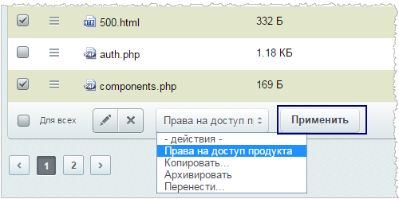
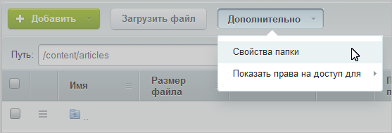
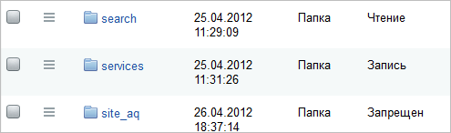

# Управление доступом к папкам и файлам

**Навигация**
- [← Оглавление курса](index.md)
- [← Предыдущий: 2160 — Права на файлы](lesson_2160.md)
- [Следующий: 2022 — Дополнительная проверка прав доступа →](lesson_2022.md)

Официальная страница урока: https://dev.1c-bitrix.ru/learning/course/index.php?COURSE_ID=48&LESSON_ID=2019

### Зачем это нужно

Система предусматривает возможность отключения просмотра физической структуры сайта в Административном разделе. Это может быть полезно по следующим соображениям:

- если у какой-то группы пользователей есть такие права администрирования, которые в принципе могут привести к негативным последствиям в случае неграмотных действий;
- если квалифицированный администратор сайта в отъезде, отпуске и т. д., то полезно скрыть физическую структуру, оберегая проект от непредвиденных случайностей;
- чтобы контент-менеджеры не пребывали в недоумении, почему одни и те же страницы, разделы могут быть отображены дважды (в рамках физической и логической структуры): пусть работают только с логической структурой.

### Как отключить просмотр физической структуры

Для отключения просмотра физической структуры на странице настроек модуля **Управление структурой** (Настройки &gt; Настройки продукта &gt; Настройки модулей &gt; Управление структурой) установите флажок в поле

			Не отображать раздел "Файлы и папки" в меню "Структура сайта"

		.

**Примечание**: Если в файловом менеджере продукта не отображаются файлы и папки и без включения функции **Не отображать раздел "Файлы и папки" в меню "Структура сайта"**, то это происходит:

- либо в результате ошибки в настройках сайта (Настройки &gt; Настройки продукта &gt; Сайты &gt; Список сайтов). Значение поля **Путь к корневой папке веб-сервера для этого сайта** не соответствует реальному пути к **DOCUMENT_ROOT**.
- либо на корневую папку сайта (**DOCUMENT_ROOT**) установлены права недостаточные для чтение её содержимого. В данном случае надо установить на папку наиболее полные права.

### Как настроить права доступа к управлению структурой

По команде Дополнительно &gt; Показать права на доступ для &gt; *нужная группа

* отображается текущее право группы пользователей на доступ к папкам и файлам системы.

Настройка прав доступа к управлению структурой сайта выполняется в **Менеджере файлов** (Контент &gt; Структура сайта). Для настройки прав:

- Перейдите в раздел **Файлы и папки** (Контент &gt; Структура сайта &gt; Файлы и папки)
- Отметьте нужные файлы и папки в **Колонке флажков**;
- Выберите действие
  			Права на доступ продукта
  
  		 на панели групповых операций и нажмите кнопку **Применить**:
  В
  			форме настройки прав доступа
  
  		 укажите уровень доступа каждой группы пользователей к выбранным файлам и папкам.

## Права, которые могут быть назначены Группам пользователей

- **Запрещен**: доступ группы пользователей к каталогу или файлу будет закрыт;
- **Чтение**: пользователи группы смогут просматривать информацию файла или каталога в публичном разделе сайта;
- **Запись**: пользователи смогут редактировать файлы;
- **Документооборот**: пользователям разрешено создавать и редактировать файлы через модуль Документооборот;
- **Полный доступ**: пользователи получают права не только на изменение каталогов или файлов, но и на управление правами доступа всех групп пользователей к ним;
- **Наследовать**: для настраиваемых каталогов или файлов будут назначены те же права, что и для вышележащих каталогов.

**Обратите внимание**: Если установлено право доступа **Наследовать […]**, то реальное право доступа определяется полем **Все группы**, для которых уровень доступа **Наследовать**. Иными словами, по умолчанию для всех групп установлено только право на чтение (кроме администратора сайта, который может все).

Для настройки прав доступа к текущей директории (например, к корневой папке) нужно воспользоваться кнопкой **Свойства папки**, расположенной на контекстной панели:

Права групп пользователей на доступ к директории сайта **наследуются всеми вложенными папками и файлами**. Иными словами, задав право, скажем, на чтение одной папки, задаются права на чтение для всех вложенных в неё папок.

## Задание прав на примере группы Редакторы сайта

Предоставим группе пользователей **Редакторы сайта** право на управление разделом **Контент** (папка `/content/`). Для всех остальных разделов и файлов установим для данной группы право на просмотр (**Чтение**). Для этого:

1. Установим право на доступ к корневому каталогу для группы **Редакторы сайта** равным **Чтение**;
2. Для всех вложенных папок и файлов, кроме папки `/content/` (раздел **Контент**), установим право доступа для группы **Редакторы сайта**равным **Наследовать [чтение]**:
3. Установим для группы пользователей **Редакторы сайта**право доступа к папке `/content/` (раздел **Контент**) равным **Запись**, а для всех вложенных файлов и папок каталога `/content/` установим право доступа для группы **Редакторы сайта** равным **Наследовать [запись]**.

         В результате проделанных операций пользователи группы **Редакторы сайта**получат право на просмотр всех файлов сайта, а также право на создание и редактирование подразделов и файлов в разделе **Контент** (`/content/`).

Управление доступом к файлам и папкам также возможно и из

			публичного раздела

                    Запрет на доступ к той или иной информации на сайте - достаточно частая операция. В "1С-Битрикс: Управление сайтом" создана гибкая система задачи прав на доступ к информации, вы всегда можете показать только то что хотите и кому хотите

		.

Чтобы пользователь мог редактировать те или иные страницы/разделы и на панели управления были соответствующие кнопки, для требуемой группы пользователей необходимо установить права на запись:

- для нужных
  			каталогов
  
- или
  			отдельных файлов
  

**Внимание!** Для изменений контента в Публичной части сайта пользователям необходим доступ на чтение к папке `/bitrix/admin`. Это папка, в которой расположен визуальный HTML-редактор. Без этого редактирование будет возможно только в текстовом режиме.

Нельзя закрыть доступ только к определенным папкам в разделе "Файлы и папки" (так, чтобы они не отображались для какой-либо группы пользователей). Чтобы группа пользователей могла работать **только с конкретными папками, а остальные не видела**, нужно закрывать доступ ко всему разделу "Файлы и папки" и открывать этой группе доступ к конкретным папкам, давая прямые ссылки на эти папки (группа пользователей сможет работать по прямым ссылкам, но файловой структуры не увидит).

### Пример решения проблемы

Была правильно создана группа и к ней приписан пользователь. Группе назначены следующие права доступа к административным частям модулей:

- Главный модуль - полный доступ;
- Управление структурой - полный доступ.

Но в административной части сайта пользователи созданной группы не имеют доступа к страницам и при авторизации выдается

			сообщение об ошибке

		.

**Решение:** По умолчанию новые пользователи имеют только право чтения для всех папок сайта, кроме папки `/bitrix/admin/`. Следовательно, для получения доступа вам необходимо установить права на чтение папки `/bitrix/admin/`.

### Важно запомнить!

- Права групп пользователей на доступ к директории сайта могут быть **унаследованы всеми вложенными папками и файлами**
- Все пользователи, которым требуется вносить хоть какие-то изменения в Публичной части сайта, должны иметь доступ на чтение к папке `/bitrix/admin`.

|  | #### Документация по теме: |
| --- | --- |

- [Права доступа](https://dev.1c-bitrix.ru/user_help/content/fileman/fileman/fileman_access.php?clear_cache=Y)
