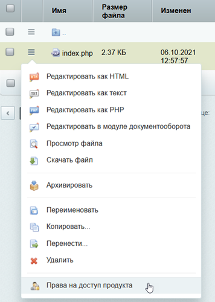
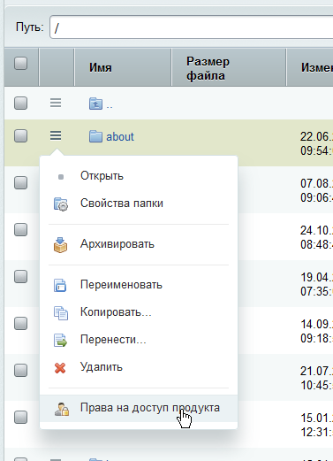
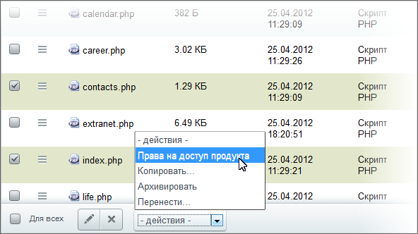

# Управление правами доступа

**Навигация**
- [← Оглавление курса](index.md)
- [← Предыдущий: 1929 — Управление свойствами страниц и разделов](lesson_1929.md)
- [Следующий: 1932 — Загрузка и поиск файлов →](lesson_1932.md)

Официальная страница урока: https://dev.1c-bitrix.ru/learning/course/index.php?COURSE_ID=48&LESSON_ID=2023

### Пускать "кого нужно". Видеоурок

Управлять правами доступа в «1С-Битрикс: Управление сайтом» возможно и с

			публичной

                    Полным правом задавать доступ обладает администратор сайта. Контент-менеджеру делегируется ограниченный набор прав на управление.

[Подробнее ...](https://dev.1c-bitrix.ru/learning/course/index.php?COURSE_ID=34&CHAPTER_ID=06675&LESSON_PATH=3905.4461.6675)

		 и с административной части. В «Битрикс24 в коробке» права задаются только из административного раздела. Детальное описание управления правами на доступ к файлам и разделам дан ниже, в уроке

			Управление доступом к папкам и файлам

                    Система предусматривает возможность отключения просмотра физической структуры сайта в Административном разделе. Это может быть полезно по следующим соображениям...

[Подробнее ...](lesson_2019.md)

		. Здесь расскажем о способах перехода к форме задания прав.

### Как перейти к настройке прав?

Самый простой способ открыть форму настройки прав - воспользоваться пунктом **Права на доступ продукта** из контекстного меню для

			файла

                    

		 или

			папки

                    

		. Правда, это доступно только в рамках физической структуры.

Открыть форму настройки прав раздела в рамках логической или физической структуры сайта можно ещё одним способом, воспользоваться командой **Свойства папки**:

Задать права странице можно только в рамках физической структуры, как указано выше. Зато можно задавать права сразу нескольким файлам одновременно:

### Документация по теме

- [Задание прав с публичной части для «1С-Битрикс: Управление сайтом» (учебный курс "Контент-менеджер")](https://dev.1c-bitrix.ru/learning/course/index.php?COURSE_ID=34&CHAPTER_ID=06675&LESSON_PATH=3905.4461.6675)
- [Права доступа](http://dev.1c-bitrix.ru/user_help/content/fileman/fileman/fileman_access.php)
