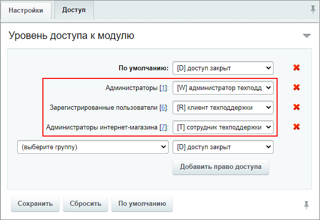
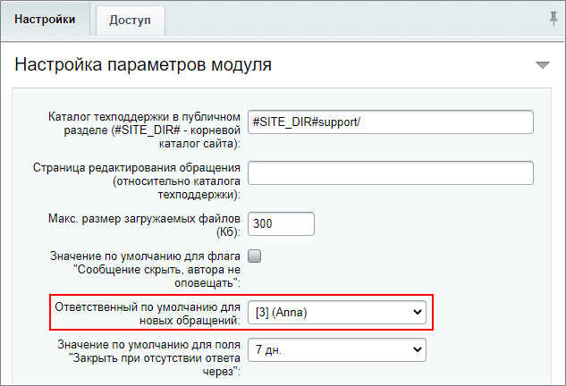

# Практические задания

**Навигация**
- [← Оглавление курса](index.md)
- [← Предыдущий: 20018 — Проверьте себя](lesson_20018.md)
- [Следующий: 2982 — Публикация фото галерей →](lesson_2982.md)

Официальная страница урока: https://dev.1c-bitrix.ru/learning/course/index.php?COURSE_ID=48&LESSON_ID=20254

После изучения главы рекомендуем выполнить несколько практических заданий.

### Практические задания

Практические задания состоят из вопроса, скриншота или видео с конечным результатом и объяснением, как это получить в спойлере. Не торопитесь подглядывать в спойлер. 

Перед выполнением практических заданий создайте дополнительно двух пользователей. Одного из них добавьте в группу **Зарегистрированные пользователи**, а другого - в группу **Администраторы интернет-магазина**.

1. Выполните следующие настройки в модуле Техподдержка:
  ## Решение
  **Задание составлено по материалу урока:**
  - [Настройки модуля Техподдержка](lesson_9109.md).
  **Результат:**
  На странице настроек модуля **Техподдержка** (Настройки &gt; Настройки продукта &gt; Настройки модулей &gt; Техподдержка) сначала установим настройки доступа на закладке **Доступ**:
  
  После можно установить ответственного по умолчанию на закладке **Настройки**:
  

  1. Настройте права доступа:

    - Зарегистрированные пользователи - **Клиент техподдержки**;
    - Администраторы интернет-магазина - **Сотрудник техподдержки**;
    - Администраторы - **Администратор техподдержки**.
  2. Установите ответственным по умолчанию пользователя из группы **Администраторы ИМ**.
2. Создайте одно
  			расписание работы
                      Например, график с 9 до 21, Сб и Вс выходной.
  		 и один уровень поддержки с такими настройками:
  ## Решение
  **Задание составлено по материалу урока:**
  - [Уровни поддержки (SLA)](lesson_2620.md).
  **Результат:**
  <!-- &lt;iframe title="линейное задание 54" src="https://www.youtube.com/embed/7IkeJH0p8RQ?feature=oembed&rel=0" allow="autoplay; encrypted-media" allowfullscreen="" width="853" height="480" frameborder="0"&gt;
  &lt;/iframe&gt; -->

  1. время реакции - 1 день;
  2. выслать напоминание - за 2 часа;
  3. ответственный по умолчанию - пользователь группы **Администраторы ИМ**;
  4. расписание - созданное вами ранее;
  5. создавать обращения с таким SLA могут зарегистрированные пользователи.
3. Для высокой критичности обращения установите ответственным Администратора.
  ## Решение
  **Задание составлено по материалам уроков:**
  - [Справочники](lesson_2619.md);
  - [Назначение ответственного за обращение](lesson_2621.md).
  **Результат:**
  На странице Сервисы &gt; Техподдержка &gt; Справочники &gt; Критичности откроем форму редактирования для критичности **Высокая**:
  
4. Создайте интерфейс техподдержки в публичном разделе и напишите обращение от пользователя группы **Зарегистрированные пользователи** со средней критичностью.
  ## Решение
  **Задание составлено по материалам урока:**
  - [Создание публичного интерфейса](lesson_2641.md).
  **Результат:**
  <!-- &lt;iframe title="линейное задание 55" src="https://www.youtube.com/embed/2HEf2Fp0pSw?feature=oembed&rel=0" allow="autoplay; encrypted-media" allowfullscreen="" width="853" height="480" frameborder="0"&gt;
  &lt;/iframe&gt; -->
5. Поработайте с обращением из административного раздела:
  ## Решение
  **Задание составлено по материалам урока:**
  - [Работа с обращениями](lesson_2625.md).
  **Результат:**
  <!-- &lt;iframe title="линейное задание 56" src="https://www.youtube.com/embed/VwsSwz2pQy8?feature=oembed&rel=0" allow="autoplay; encrypted-media" allowfullscreen="" width="853" height="480" frameborder="0"&gt;
  &lt;/iframe&gt; -->

  - Обработайте созданное в задании № 4 обращение как сотрудник техподдержки. Напишите в нем скрытый комментарий и переведите на Администратора с высокой критичностью;
  - Теперь рассмотрите обращение как Администратор и закройте его;
  - Проверьте обращение в публичном разделе под пользователем, что создал обращение. Оставьте оценку.

### Где выполнять задания?

Демонстрационную версию с пробным периодом в 30 дней вы можете установить на свой компьютер или на хостинг. Подробная информация о настройке каждого варианта представлена в уроке [Где практиковаться и выполнять задания](https://dev.1c-bitrix.ru/learning/course/index.php?COURSE_ID=48&LESSON_ID=26638).

**Примечания:**

1. Настоятельно рекомендуем **НЕ** выполнять задания на работающем, «боевом» сайте.
2. Если вы всё же пытаетесь выполнять задания на работающем сайте, где вы не являетесь администратором, то не все задания можно выполнить.
