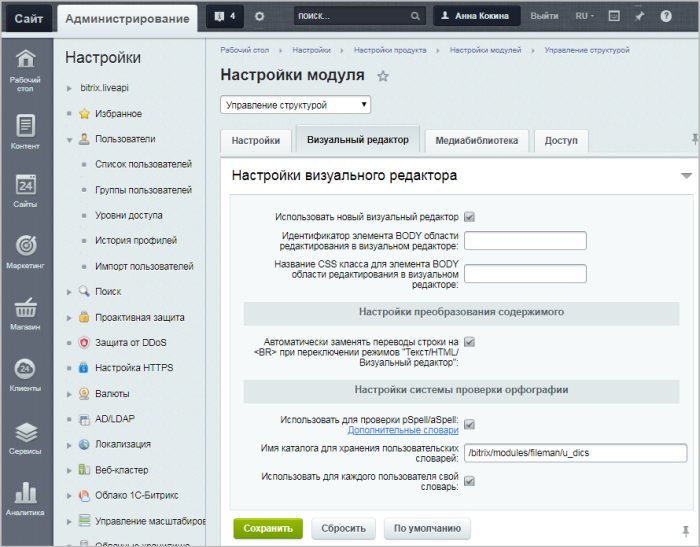
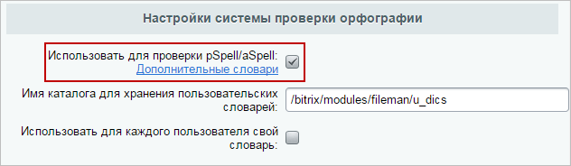

# Настройка визуального редактора

**Навигация**
- [← Оглавление курса](index.md)
- [← Предыдущий: 4941 — Подключение редактора](lesson_4941.md)
- [Следующий: 1902 — Настройки отображения компонентов →](lesson_1902.md)

Официальная страница урока: https://dev.1c-bitrix.ru/learning/course/index.php?COURSE_ID=48&LESSON_ID=2026

### Настройка визуального редактора

Системные настройки визуального редактора производятся  в настройках модуля **Управление структурой** (Настройки &gt; Настройки продукта &gt; Настройки модулей &gt; Управление структурой) на закладке **Визуальный редактор**.

Первой опцией в настройках визуального редактора является выбор самого редактора. Вы можете пользоваться новой версией редактора, либо вернуться к

			старой (до версии 9.5)

                    Старый редактор не рекомендуется при использовании последних версий продукта, т. к. многие функции могут быть ограничены, например, проверка орфографии. Кроме того, форматирование сохраненного текста может существенно отличаться при переходе от старого редактора к новому и наоборот.

		. Здесь и далее мы будем иметь в виду и описывать **новую** версию.

Визуальный редактор предоставляет возможность проверки орфографии введенного текста только с помощью

			pSpell

**Pspell** (Portable Spell Checker Interface Library) – портативная библиотека интерфейса проверки орфографии.

		 (проверка производится в браузере, при условии если pSpell установлен на сервере).

Для того, чтобы визуальный редактор мог использовать это расширение, его надо подключить. Для этого нужно зайти в Настройки &gt; Настройки модулей &gt; Управление структурой &gt; Визуальный редактор.

### Документация по теме

- [Настройки визуального редактора](http://dev.1c-bitrix.ru/user_help/content/fileman/settings.php#htmleditor)
- [Управление стилями](https://dev.1c-bitrix.ru/learning/course/index.php?COURSE_ID=43&CHAPTER_ID=04938&LESSON_PATH=3913.2704.4930.4938) (глава курса "Разработчик Bitrix Framework" о работе со стилями css)
