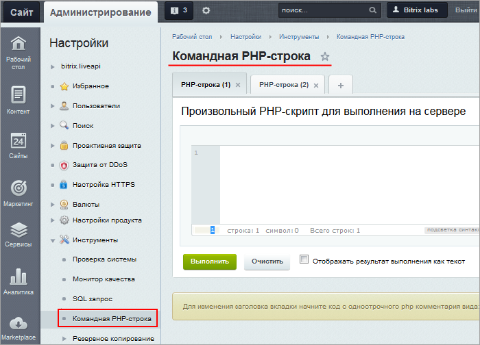

# SQL запрос и Командная PHP строка

**Навигация**
- [← Оглавление курса](index.md)
- [← Предыдущий: 11785 — Монитор качества](lesson_11785.md)
- [Следующий: 2027 — Настройки PHP →](lesson_2027.md)

Официальная страница урока: https://dev.1c-bitrix.ru/learning/course/index.php?COURSE_ID=48&LESSON_ID=2029

### SQL запрос

Форма SQL запрос (Настройки &gt; Инструменты &gt; SQL запрос) предназначена для выполнения

			SQL запросов

                    SQL (сокращение от англ. Structured Query Language) — это структурированный язык запросов, созданный для того, чтобы получать из базы данных необходимую информацию. Главные задачи SQL — составлять запросы так, чтобы находить среди большого объёма информации ту, что нужна для конкретных целей, сортировать её, структурировать и представлять в наиболее простом и понятном виде.

		 к базе данных. Возможно выполнение любых запросов на языке SQL.

Результат выполнения запроса отобразится под окном ввода запросов.

С версии 24.100.0 Главного модуля результат можно получить в виде CSV-файла. Для этого нажмите вариант Выполнить и скачать.

**Важно!** Система не устанавливает никаких ограничений на SQL запросы, поэтому будьте крайне внимательны при выполнении запросов типа UPDATE, DELETE, DROP и так далее.

### Командная PHP-строка

Форма Командная

			PHP-строка

                    На основе PHP создан Bitrix Framework — платформа для разработки веб-приложений.
[Подробнее...](https://dev.1c-bitrix.ru/learning/course/index.php?COURSE_ID=43&INDEX=Y)

		 (Настройки &gt; Инструменты &gt; Командная PHP-строка) предназначена для исполнения некоторого кода, вызывающего

			функции API Битрикса

                    API — Application Programming Interface,  программный интерфейс приложения. Это механизм, который позволяет двум программным компонентам взаимодействовать друг с другом, используя набор определений и протоколов.
[Подробнее...](https://dev.1c-bitrix.ru/api_d7/index.php)

		 без создания новых страниц на сайте. Доступно несколько закладок для выполнения разного кода одновременно.

