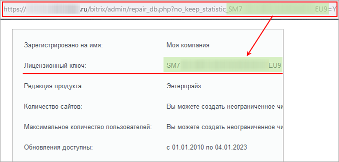
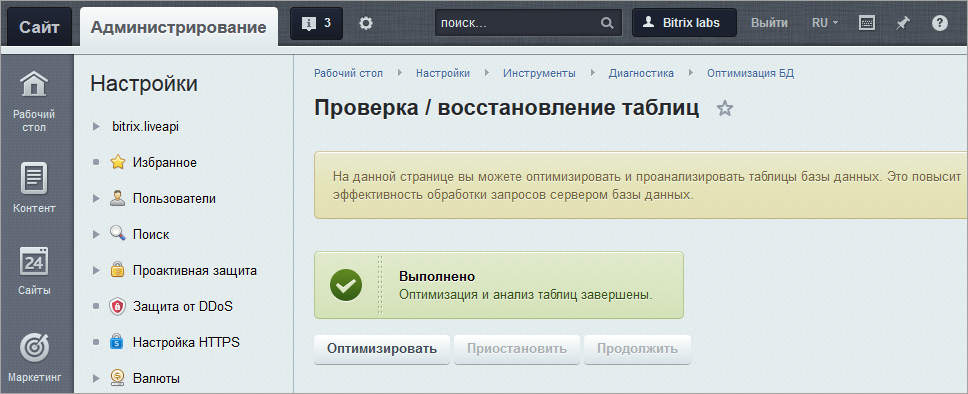

# Проверка и оптимизация БД

**Навигация**
- [← Оглавление курса](index.md)
- [← Предыдущий: 2027 — Настройки PHP](lesson_2027.md)
- [Следующий: 2034 — Журнал событий →](lesson_2034.md)

Официальная страница урока: https://dev.1c-bitrix.ru/learning/course/index.php?COURSE_ID=48&LESSON_ID=2032

### Проверка БД

На странице **Проверка / восстановление таблиц** (Настройки &gt; Инструменты &gt; Диагностика &gt; Проверка БД) вы можете проверить и восстановить таблицы

			базы данных

                    Универсальное место хранения информации на сайте. Специальная программа, легко загружающая и выгружающая любую информацию. Существенно экономит место на хостинге, время при обработке информации, вычислительные ресурсы сервера. Без Базы данных не работает ни одна современная система управления сайтом...
[Подробнее...](https://dev.1c-bitrix.ru/learning/course/index.php?COURSE_ID=34&LESSON_ID=3446)

		. Использование скрипта проверки и восстановления позволит оперативно восстановить работу сайта.

## Как понять, что База данных "поломалась"?

- Ошибка подключения к БД:

[Решение проблемы.](https://dev.1c-bitrix.ru/learning/course/index.php?COURSE_ID=32&LESSON_ID=3296)

Ошибки запросов:

[Решение проблемы.](https://dev.1c-bitrix.ru/learning/course/index.php?COURSE_ID=32&LESSON_ID=3297)

**Внимание!** Восстановление таблиц работает только для базы данных **MySQL** и таблиц типа **MyISAM**.

**Внимание!** Не открывайте эту страницу одновременно в нескольких копиях - это может повредить вашу базу данных. Операция может занять длительное время, если размер базы данных велик!

**Примечание:** Если повреждены

			таблицы статистики

                    При запуске SQL-запроса на выполнение, сервер выполняет достаточно много сложных многоэтапных операций. Формированием плана выполнения запроса занимается оптимизатор запросов. Он анализирует множество различных факторов, в том числе количество и распределение данных в таблицах и индексах базы данных.  Собирать эти сведения при каждом запросе крайне неэффективно, поэтому они собираются периодически и хранятся в **таблицах статистики**.

		 и

			нет возможности перейти в административный раздел

                    То есть вы авторизованы на сайте как Администратор, но не можете перейти в административную часть

		, то сбор статистики может быть временно отключен с помощью параметра `?no_keep_statistic_LICENSE-KEY=Y`. В параметре указывается

			лицензионный ключ сайта

Так выглядит ссылка для запуска **Проверки/восстановления таблиц** без таблиц статистики:

		.

Существует возможность использования скрипта проверки и восстановления базы данных без перехода в административный раздел.

Для этого при обращении к странице восстановления необходимо указать два параметра: имя (**login**) и пароль (**password**) на доступ к базе данных. Например: http://www.mysite.ru/bitrix/admin/repair_db.php?login=DB_Login&amp; password=DB_Password.

По умолчанию значения данных параметров хранятся в файле

			`/bitrix/php_interface/dbconn.php`

                    

		.

Иногда возникает ситуация, когда сайт перестает отвечать и посетителям отображается пустая страница. В этом случае откройте файл `/bitrix/php_interface/dbconn.php`, который содержит параметры соединения с базой данных, и установите значение параметра

			`$DBDebug = true`

                    

		;

В результате будет получен код ошибки, содержащий, как правило, названия поврежденных таблиц базы данных. Если целостность таблиц действительно нарушена, воспользуйтесь скриптом восстановления.

### Оптимизация

На странице **Оптимизация БД** (Настройки &gt; Инструменты &gt; Диагностика &gt; Оптимизация БД) вы можете оптимизировать и проанализировать таблицы базы данных. Это повысит эффективность обработки запросов сервером базы данных.

**Внимание!** Не открывайте эту страницу одновременно в нескольких копиях - это может повредить вашу базу данных. Операция может занять длительное время. Желательно выполнять ее при наименьшей нагрузке на сайт.

После нажатия кнопки **Оптимизировать**

			процесс

                    Автоматический процесс оптимизации БД проводится в соответствии с принципами, описанными в главе [Оптимизация базы данных](https://dev.1c-bitrix.ru/learning/course/index.php?COURSE_ID=32&CHAPTER_ID=04903).

		 запустится, за его ходом можно будет наблюдать по индикатору:

По завершении оптимизации на странице появится

			сообщение об этом

                    

		.

### Документация по теме

- [Запуск агентов из cron](https://dev.1c-bitrix.ru/learning/course/?COURSE_ID=43&LESSON_ID=2943)
- [Оптимизация базы данных](https://dev.1c-bitrix.ru/learning/course/index.php?COURSE_ID=32&CHAPTER_ID=04903)
- [MySQL, InnoDB, Монитор производительности](https://dev.1c-bitrix.ru/community/webdev/user/23706/blog/1472/)
