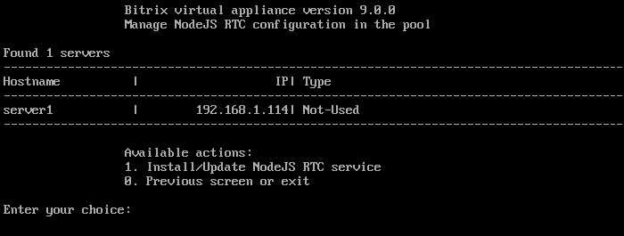
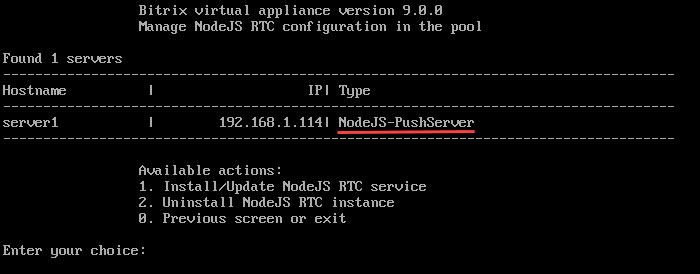
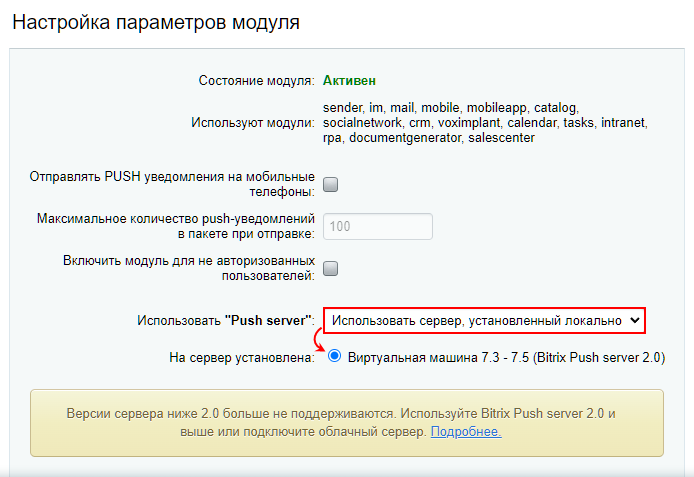
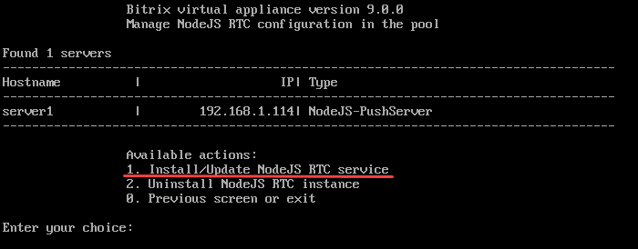

# Настройки модуля и сервера очередей

**Навигация**
- [← Оглавление курса](index.md)
- [← Предыдущий: 21636 — Информация о версиях сервера очередей](lesson_21636.md)
- [Следующий: 8609 — Настройка и запуск push сервера на стороннем окружении →](lesson_8609.md)

Официальная страница урока: https://dev.1c-bitrix.ru/learning/course/index.php?COURSE_ID=48&LESSON_ID=2033

Сложность настройки модуля Push and Pull зависит от выбора типа сервера очередей. Сервер очередей Push and Pull служит для мгновенного взаимодействия между собой многих инструментов продуктов *Битрикс24* и *1С-Битрикс: Управление сайтом*.


### Настройка облачного сервера очередей


Подключить облачный сервер очередей — самый простой вариант. Он требует только активную лицензию на продукты *«1С-Битрикс»* (*Битрикс24* и *1С-Битрикс: Управление сайтом*). А также удобен, если продукт *«1С-Битрикс»* установлен на

			shared-хостинге


Виртуальный хостинг (англ. shared hosting) — вид хостинга, при котором множество веб-сайтов расположено на одном веб-сервере. Это самый экономичный вид хостинга, подходящий для небольших проектов.

		 или вместо *виртуальной машины VMBitrix* используется собственное серверное окружение.


Перейдите в административном разделе по пути Настройки &gt; Настройки продукта &gt; Настройки модулей &gt; Push and Pull. Выберите вариант **Облачный сервер «1С-Битрикс»** и географическое расположение сервера по желанию (можно оставить автоматический выбор). Остается только нажать на кнопку **Зарегистрироваться**:


Все готово, облачный сервер очередей «1С-Битрикс» настроен и активен.


<!-- &lt;p&gt;
&lt;img src="/images/admin_expert/pull/pnp_admin_cloudserver_active.png"&gt;
&lt;/p&gt; -->


### Настройка локального Bitrix Push server


Есть случаи, когда нельзя использовать в качестве сервера очередей *облачный сервер «1С-Битрикс»*. Например, когда политикой безопасности предприятия серверу ограничен доступ в интернет. Для такого случая есть возможность установить локальный сервер очередей *Bitrix Push server 2.0*.


#### 1. Обновление VMBitrix


Обновите виртуальную машину *VMBitrix* до последней стабильной версии: 2. Configure localhost settings &gt; 6. Update server.


Обязательно перед обновлением сделайте резервное копирование вашей *VMBitrix*. Подробнее об обновлении *виртуальной машины VMBitrix* читайте [в специальном курсе](https://dev.1c-bitrix.ru/learning/course/index.php?COURSE_ID=37&LESSON_ID=29284).


#### 2. Запуск Bitrix Push server 2.0


По умолчанию в *виртуальной машине VMBitrix* версии 9.x сервер очередей не запущен.


В меню переходим в пункт 6. Configure Push/RTC service for the pool:





Далее выбираем 1. Install/Update NodeJS RTC service, вводим название хоста **Hostname** и подтверждаем установку:


Дожидаемся, пока задача по установке и запуску службы *NodeJS-PushServer* будет закончена:


> Проверить текущие выполняемые задачи можно с помощью меню 10. Background tasks in the pool &gt; 1. View running tasks. Лог-файлы выполнения задач находятся в директории **/opt/webdir/temp**.


Когда задача выполнится, перейдите в 6. Configure Push/RTC service for the pool. Теперь вы увидите, что в поле Type указан **NodeJS-PushServer**:





#### 3. Bitrix Push server 2.0 в продуктах «1С-Битрикс»


В опции **Использовать "Push server": установленный локально** выберите **Виртуальная машина 7.3 - 7.5 (Bitrix Push server 2.0)** и сохраните настройки:


На текущий момент название опции содержит упоминание устаревшей версии виртуальной машины 7.3 – 7.5. Выбирайте её и для версии BitrixVM 9.x.





<!-- &lt;p&gt;&lt;a href="javascript:ShowImg('/images/admin_expert/pull/pnp_admin_localserver.png',956,591,'Виртуальная машина 7.3 и новее - Bitrix Push server 2.0')"&gt;&lt;img style="cursor: pointer;" alt="Нажмите на рисунок, чтобы увеличить" src="/images/admin_expert/pull/pnp_admin_localserver_sm.png"&gt;&lt;/a&gt;
&lt;/p&gt; -->


Все готово. Как правило, никаких настроек больше не требуется.


#### Какие ещё настройки можно выполнить


- При необходимости перенастройте **адреса для публикации и чтения команд**. Домен в адресе для чтения сообщений можно указать `#DOMAIN#`: такая нотация будет автоматически заменяться под нужный домен для многодоменных конфигураций. Пример: http://#DOMAIN#:8893/bitrix/sub/.
- Если в системе несколько активных сайтов, то есть возможность выбрать, на каких сайтах не использовать модуль Push and Pull.


#### Возможные ошибки Bitrix Push server 2.0


При установке и первом запуске *Bitrix Push server 2.0* создается уникальный секретный код в файле настроек сервера очередей **/etc/push-server/push-server*.json** в секции `security` в параметре `key`:


```

"security": {
	"key": "<ваш секретный ключ>"
},
```


В *виртуальной машине BitrixVM* при первом запуске *Bitrix Push server 2.0* этот код автоматически прописывается в файл настроек ядра системы **/bitrix/.setting.php** и в базу данных, а также он виден в административном интерфейсе в поле **Код-подпись для взаимодействия с сервером**:


**Примечание**: Кроме порта 8895 можно использовать порт 8893.


Бывают ситуации, когда по каким-либо причинам в файле настроек ядра **/bitrix/.setting.php** и в базе данных секретный код отличается от того, который прописан в настройках сервера очередей. Из-за этого сервер очередей работает некорректно, сообщения не доставляются.


Чтобы решить эту проблему, необходимо в меню *виртуальной машины BitrixVM* пересоздать роль *NodeJS-PushServer*: 6. Configure Push/RTC service for the pool &gt; 1. Install/Update NodeJS RTC service





Если у вас свое серверное окружение, то можно сделать это вручную:


1. Скопировать ключ из файла настроек сервера очередей **/etc/push-server/push-server*.json**.
2. Перейти в административном интерфейсе продукта *«1С-Битрикс»*: Настройки &gt; Настройки продукта &gt; Настройки модулей &gt; Push and Pull и сбросить настройки сервера очередей кнопкой **По умолчанию**.
3. Скопированный ключ вставить в поле **Код-подпись для взаимодействия с сервером** и сохранить настройки.


После этого работа сервера очередей будет восстановлена.


### Доп. материалы


- [Настройки модуля (документация)](http://dev.1c-bitrix.ru/user_help/settings/pull/settings.php)
- [Зачем настраивать модуль Push&Pull](http://dev.1c-bitrix.ru/community/blogs/product_features/why-configure-pushpull.php) (блог)
- Работа с модулем [для разработчиков](https://dev.1c-bitrix.ru/learning/course/index.php?COURSE_ID=43&CHAPTER_ID=05413)
- [API модуля](http://dev.1c-bitrix.ru/api_help/push_pull/index.php)
- [Новые требования к серверному окружению для работы чатов](https://helpdesk.bitrix24.ru/open/12715116/)
- [Исходные коды пакетов виртуальной машины VMBitrix](/learning/course/index.php?COURSE_ID=37&LESSON_ID=11161)
- [Установка БУС/КП на другие окружения](/learning/course/index.php?COURSE_ID=135&CHAPTER_ID=020866)
