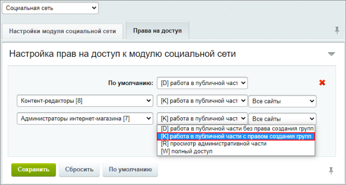
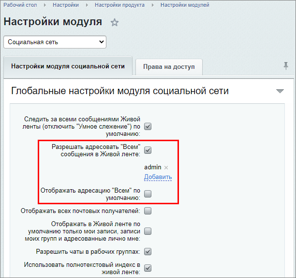
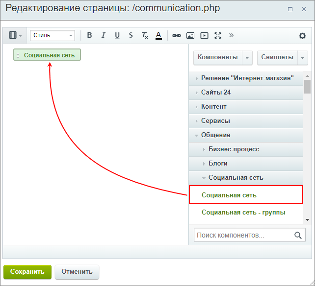

# Практические задания

**Навигация**
- [← Оглавление курса](index.md)
- [← Предыдущий: 20364 — Проверьте себя](lesson_20364.md)
- [Следующий: 3697 — Возможности Универсальных списков →](lesson_3697.md)

Официальная страница урока: https://dev.1c-bitrix.ru/learning/course/index.php?COURSE_ID=48&LESSON_ID=20354

После изучения главы рекомендуем выполнить несколько практических заданий.

### Практические задания

Практические задания состоят из вопроса, скриншота или видео с конечным результатом и объяснением, как это получить в спойлере. Не торопитесь подглядывать в спойлер. 

1. Выполните настройки модуля **Социальная сеть**:
  ## Решение
  **Задание составлено по материалу урока:**
  - [Настройки модуля](lesson_2779.md).
  **Результат:**
  На странице настройки модуля **Социальная сеть** (Настройки &gt; Настройки продукта &gt; Настройки модулей &gt; Социальная сеть):
  
  

  1. Оставьте возможность отправлять всем сообщения в живой ленте только **Администратору**;
  2. Отключите адресацию сообщений всем по умолчанию;
  3. Настройте права на доступ:

    - **По умолчанию** - работа в публичной части **без права** создания групп;
    - Для **Контент-редакторов** и **Администраторов интернет-магазина** - работа в публичной части **с правом** создания групп.
2. Опубликуйте социальную сеть на сайте.
  ## Решение
  **Задание составлено по материалам уроков:**
  - [Личная страница сотрудника](lesson_2781.md);
  - [Страница рабочей группы](lesson_2782.md).
  **Результат:**
  Для публикации социальной сети нам понадобится разместить на странице комплексный компонент [Социальная сеть](https://dev.1c-bitrix.ru/user_help/components/obschenie/social_network/socnet.php) (socialnetwork).
  
3. Создайте **тему групп** и **рабочую группу** по этой теме. Проверьте настройки модуля, выполненные в первом задании, авторизуясь под разными пользователями: администратором сайта, контент-редактором (или администратором ИМ) и обычным зарегистрированным пользователем. После удалите рабочую группу из интерфейса административного раздела.
  **Примечание**: Для того, чтобы проверить отправку сообщений в живую ленту, понадобится
  			создать группу блогов
                      Создание и изменение групп выполняется на странице **Группы блогов** (Сервисы &gt; Блоги &gt; Группы блогов)
   Подробнее в курсе [Контент-менеджер](lesson_2934.md).
  		 и указать её в настройках компонента в секции **Настройки блогов**. Иначе, при попытке отправить сообщение, Вы увидите уведомление об ошибке.
  ## Решение
  **Задание составлено по материалам урока:**
  - [Управление темами групп](lesson_2780.md).
  **Результат:**

### Где выполнять задания?

Выполнять их необходимо на установленной на локальный компьютер

			пробной версии Битрикс24 в коробке

                    В главе описаны предварительные шаги для установки продукта, шаги мастера установки, а также выбор и первоначальная настройка портала для быстрого развертывания своего проекта.

[Подробнее](https://dev.1c-bitrix.ru/learning/course/index.php?COURSE_ID=135&CHAPTER_ID=04702&LESSON_PATH=10495.4495.4702)...

		. Демоверсия работает 30 дней.

Самый простой способ – это подготовить демоверсию с помощью виртуальной машины. Подробная информация об установке представлена в уроке [Где практиковаться и выполнять задания](lesson_10241.md).

**Примечания:**

1. Настоятельно рекомендуем **НЕ** выполнять задания на работающем, «боевом» портале.
2. Если вы всё же пытаетесь выполнять задания на работающем портале, где вы не являетесь администратором, то не все задания можно выполнить.
