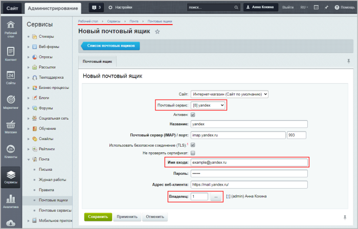
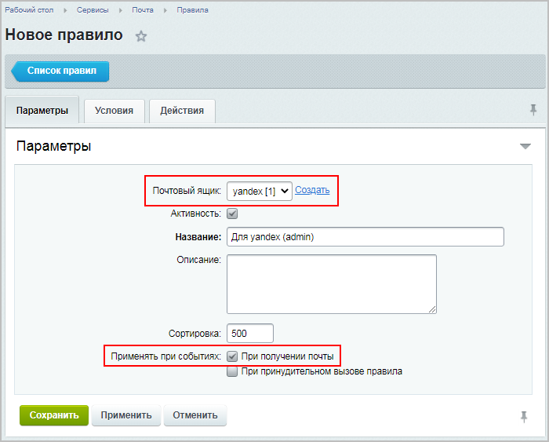
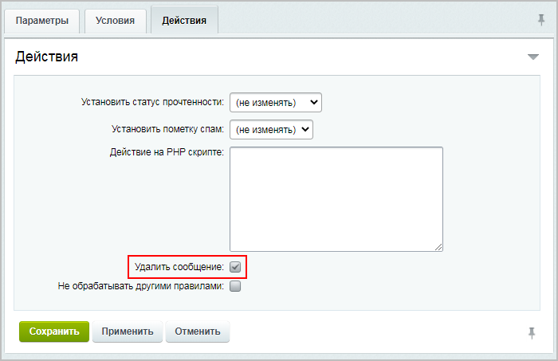

# Практические задания

**Навигация**
- [← Оглавление курса](index.md)
- [← Предыдущий: 20360 — Проверьте себя](lesson_20360.md)
- [Следующий: 11335 — Установка модуля →](lesson_11335.md)

Официальная страница урока: https://dev.1c-bitrix.ru/learning/course/index.php?COURSE_ID=48&LESSON_ID=20362

После изучения главы рекомендуем выполнить несколько практических заданий.

### Практические задания

Практические задания состоят из вопроса, скриншота или видео с конечным результатом и объяснением, как это получить в спойлере. Не торопитесь подглядывать в спойлер. 

1. В списке всех типов почтовых событий найдите тип **Зарегистрировался новый пользователь**. Отредактируйте почтовый шаблон этого типа согласно условиям:
  ## Решение
  **Задание составлено по материалам уроков:**
  - [Типы почтовых событий](lesson_3534.md).
  - [Работа с почтовыми шаблонами](lesson_3523.md).
  **Результат:**

  - В поле **Кому** должен подставляться email пользователя, зарегистрировавшегося на сайте;
  - Нужно отправлять скрытую копию письма на email администратора сайта, указанный в настройках **Главного модуля**;
  - В тему письма должно подставляться название сайта и текст "Поздравляем с успешной регистрацией!";
  - В тексте письма нужно сообщить пользователю его логин на сайте.
2. Добавьте новый пользовательский почтовый ящик и в качестве владельца укажите себя:
  ## Решение
  **Задание составлено по материалам урока:**
  - [Почтовые ящики](lesson_2862.md).
  **Результат:**
  

  - Почтовый сервис: yandex
  - Почтовый адрес (имя входа): example@yandex.ru
3. Для созданного ранее почтового ящика добавьте правило обработки почты, при котором будут удаляться все сообщения, удовлетворяющие следующим условиям:
  Правило должно срабатывать сразу же при получении почты.
  ## Решение
  **Задание составлено по материалам урока:**
  - [Правила](lesson_2665.md).
  **Результат:**
  - Вкладка **Параметры**:
    
  - Вкладка **Условия**:
    
  - Вкладка **Действия**:
    

  - Вероятность что сообщение спам: больше 30%
  - Размер сообщения: больше 2 мегабайт

### Где выполнять задания?

Выполнять их необходимо на установленной на локальный компьютер

			пробной версии Битрикс24 в коробке

                    В главе описаны предварительные шаги для установки продукта, шаги мастера установки, а также выбор и первоначальная настройка портала для быстрого развертывания своего проекта.

[Подробнее](https://dev.1c-bitrix.ru/learning/course/index.php?COURSE_ID=135&CHAPTER_ID=04702&LESSON_PATH=10495.4495.4702)...

		. Демоверсия работает 30 дней.

Самый простой способ – это подготовить демоверсию с помощью виртуальной машины. Подробная информация об установке представлена в уроке [Где практиковаться и выполнять задания](lesson_10241.md).

**Примечания:**

1. Настоятельно рекомендуем **НЕ** выполнять задания на работающем, «боевом» портале.
2. Если вы всё же пытаетесь выполнять задания на работающем портале, где вы не являетесь администратором, то не все задания можно выполнить.
