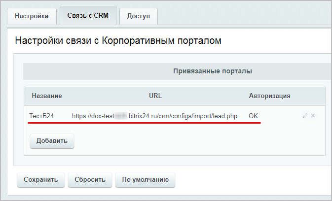

# Практические задания

**Навигация**
- [← Оглавление курса](index.md)
- [← Предыдущий: 20366 — Проверьте себя](lesson_20366.md)
- [Следующий: 3463 — Публикация в Живую ленту →](lesson_3463.md)

Официальная страница урока: https://dev.1c-bitrix.ru/learning/course/index.php?COURSE_ID=48&LESSON_ID=20368

После изучения главы рекомендуем выполнить несколько практических заданий.

### Практические задания

Практические задания состоят из вопроса, скриншота или видео с конечным результатом и объяснением, как это получить в спойлере. Не торопитесь подглядывать в спойлер. 

- Выполните следующие настройки модуля **Веб-формы**:
  ## Решение
  **Задание составлено по материалам урока:**
  - [Настройки модуля](lesson_2858.md).
  **Результат:**
  На странице настроек модуля (Настройки &gt; Настройки продукта &gt; Настройки модулей &gt; Веб-формы выполним настройки:
  - Вкладка **Настройки**:
    
  - Вкладка **Связь с CRM**:
    
    

  - Включите расширенный режим работы;
  - Установите право по умолчанию для вновь создаваемых веб-форм уровня **заполнение формы**;
  - Создайте новый портал *Битрикс24* и настройте передачу данных о заполнении веб-форм на этот портал;
- Добавьте новую веб-форму **Обратная связь** (feedback) согласно следующим требованиям:
  Для этой веб-формы создайте и настройте два статуса:
  ## Решение
  **Задание составлено по материалам уроков:**
  - [Создание и редактирование веб-формы](lesson_5153.md).
  - [Настройка статусов веб-формы](lesson_5154.md).
  **Результат:**

  - Обязательно использование CAPTCHA;
  - Для неавторизованных пользователей доступ закрыт;
  - Зарегистрированные пользователи могут работать со своим результатом в соответствии с его статусом;
  - Контент-редакторы могут работать со всеми результатами в соответствии с их статусами.

  - **Сообщение отправлено** - статус должен присваиваться всем новым документам. Создатель результата может в данном статусе выполнять все действия с документом, а контент-редакторы могут только просматривать результат в данном статусе;
  - **Сообщение принято** - переводить документы в данный статус, просматривать и удалять их  могут только контент-менеджеры, но они не имеют право на редактирование результата.

### Где выполнять задания?

Выполнять их необходимо на установленной на локальный компьютер

			пробной версии Битрикс24 в коробке

                    В главе описаны предварительные шаги для установки продукта, шаги мастера установки, а также выбор и первоначальная настройка портала для быстрого развертывания своего проекта.

[Подробнее](https://dev.1c-bitrix.ru/learning/course/index.php?COURSE_ID=135&CHAPTER_ID=04702&LESSON_PATH=10495.4495.4702)...

		. Демоверсия работает 30 дней.

Самый простой способ – это подготовить демоверсию с помощью виртуальной машины. Подробная информация об установке представлена в уроке [Где практиковаться и выполнять задания](lesson_10241.md).

**Примечания:**

1. Настоятельно рекомендуем **НЕ** выполнять задания на работающем, «боевом» портале.
2. Если вы всё же пытаетесь выполнять задания на работающем портале, где вы не являетесь администратором, то не все задания можно выполнить.
