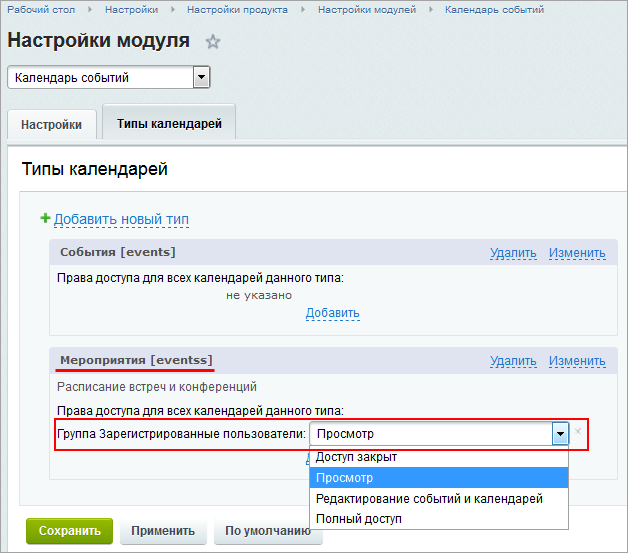
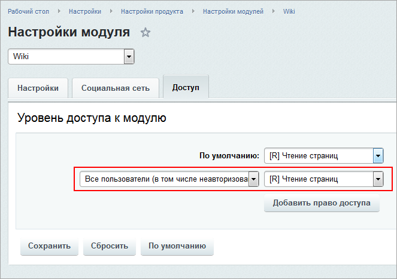

# Практические задания по темам Wiki, Веб-мессенджер, Календарь, Опросы

**Навигация**
- [← Оглавление курса](index.md)
- [← Предыдущий: 20384 — Проверьте себя по темам Wiki, Веб-мессенджер, Календарь, Опросы](lesson_20384.md)
- [Следующий: 8405 — Настройки сервера и модуля портала →](lesson_8405.md)

Официальная страница урока: https://dev.1c-bitrix.ru/learning/course/index.php?COURSE_ID=48&LESSON_ID=20386

После изучения главы рекомендуем выполнить несколько практических заданий.

### Практические задания

Практические задания состоят из вопроса, скриншота или видео с конечным результатом и объяснением, как это получить в спойлере. Не торопитесь подглядывать в спойлер. 

1. Cоздайте новый тип **Календаря событий** и задайте права на его просмотр всем зарегистрированным пользователям.
  ## Решение
  **Задание составлено по материалу урока:**
  - [Настройки модуля календарей](lesson_12147.md).
  - [Настройки календаря](lesson_3500.md).
   **Результат:**
  
  
2. Задайте права на запись **Опросов** Контент-менеджеру.
  ## Решение
  **Задание составлено по материалам урока:**
  - [Опросы, голосования](lesson_4685.md).
   **Результат:**
  
3. Задайте всем пользователям права на чтение страниц **Wiki** и настройте максимальный размер загружаемого изображения 800 на 800 пикселей.
  ## Решение
  **Задание составлено по материалам урока:**
  - [Wiki](lesson_4562.md).
   **Результат:**
  
  

### Где выполнять задания?

Выполнять их необходимо на установленной на локальный компьютер

			пробной версии Битрикс24 в коробке

                    В главе описаны предварительные шаги для установки продукта, шаги мастера установки, а также выбор и первоначальная настройка портала для быстрого развертывания своего проекта.

[Подробнее](https://dev.1c-bitrix.ru/learning/course/index.php?COURSE_ID=135&CHAPTER_ID=04702&LESSON_PATH=10495.4495.4702)...

		. Демоверсия работает 30 дней.

Самый простой способ – это подготовить демоверсию с помощью виртуальной машины. Подробная информация об установке представлена в уроке [Где практиковаться и выполнять задания](lesson_10241.md).

**Примечания:**

1. Настоятельно рекомендуем **НЕ** выполнять задания на работающем, «боевом» портале.
2. Если вы всё же пытаетесь выполнять задания на работающем портале, где вы не являетесь администратором, то не все задания можно выполнить.
