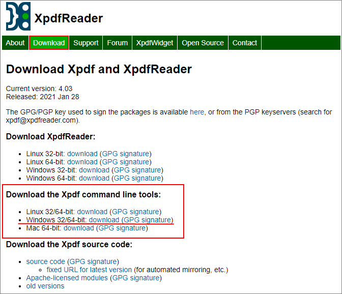
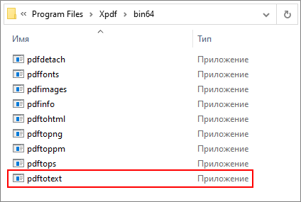
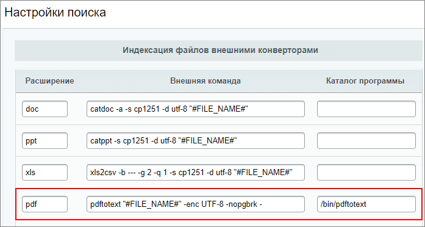

# Поиск PDF документов

**Навигация**
- [← Оглавление курса](index.md)
- [← Предыдущий: 2464 — Добавление новых форматов](lesson_2464.md)
- [Следующий: 2679 — Файловое хранилище →](lesson_2679.md)

Официальная страница урока: https://dev.1c-bitrix.ru/learning/course/index.php?COURSE_ID=48&LESSON_ID=20446

Для индексации и поиска документов PDF нам понадобится утилита pdftotext.
 **pdftotext** - это утилита командной строки, которая преобразует PDF-файлы в обычный текст.


### Установка в *nix


В виртуальной машине [BitrixVM](https://dev.1c-bitrix.ru/learning/course/index.php?COURSE_ID=37) или окружении [BitrixEnv](https://dev.1c-bitrix.ru/learning/course/index.php?COURSE_ID=37&LESSON_ID=8811) утилита pdftotext уже установлена.


Для проверки, установлена ли утилита, воспользуйтесь командой:


```
which pdftotext
```


Если утилита установлена, то в результате выполнения команды отобразится путь к исполняемому файлу. Например: `/bin/pdftotext`.


Утилита **pdftotext** является частью пакета

			Poppler

                    **Poppler** - библиотека для рендеринга PDF-файлов. В пакет Poppler входит несколько консольных утилит для работы с PDF-файлами, в том числе pdftotext.

[Подробнее](https://ru.wikipedia.org/wiki/Poppler)...

		 (название пакета зависит от используемого вами дистрибутива, например: poppler-utils (Centos) или poppler-tools (SUSE)). Для получения утилиты вам потребуется установить весь пакет.


Для установки в CentOS 7 выполните:


```
yum install poppler-utils
```


Также утилита **pdftotext** входит в состав инструментов **Xpdf**. Получить их можно на официальном сайте [xpdfreader.com](http://www.xpdfreader.com/). Но у **Xpdf** при работе с файлами PDF возможна некорректная индексация части русскоязычных файлов.


### Установка в Windows


Утилита **pdftotext** входит в состав инструментов Xpdf.


- Перейдите на официальный сайт Xpdf [xpdfreader.com](http://www.xpdfreader.com/)  и скачайте архив **Xpdf command line tools** для Windows:
  
- Распакуйте архив в удобную для Вас директорию. Например: `C:\Program Files\Xpdf`;
- В папке с требуемой разрядностью (зависит от установленной ОС) находится набор приложений. Среди них нужное нам:
  


Перечисленных действий достаточно для установки в операционной системе Windows. В настройках модуля Интранет достаточно будет указать путь до этого приложения (`C:\Program Files\Xpdf\bin64\pdftotext.exe`) и параметры его запуска.


**Примечание:** В скачанном архиве в папке `\doc` лежит документация по утилитам с описанием и доступными параметрами.


### Настройки поиска PDF файлов


Перейдите в настройки модуля Интранет (Настройки &gt; Настройки продукта &gt; Настройки модулей &gt; Интранет) закладку **Поиск**.


Добавьте формат PDF, заполнив поля таким образом:


- Расширение: **pdf**;
- Внешняя команда с нужными опциями. Список всех доступных опций и можно посмотреть в документации к утилите. Рекомендуемые опции:
  В итоговом варианте заполнения поля Внешняя команда имеет, например, такой вид:

  - **-enc** - устанавливает кодировку для вывода текста. По умолчанию кодировка Latin1 (встроенная);
  - **-nopgbrk** - не вставлять разрывы между страницами файла.

  - для **Linux**:  `pdftotext "#FILE_NAME#" -enc UTF-8 -nopgbrk -`;
  - для **Windows**: `"C:\Program Files\Xpdf\bin64\pdftotext.exe" "#FILE_NAME#" -enc UTF-8 -nopgbrk -`.
- Каталог программы: например `/bin/pdftotext` для Linux или `C:\Program Files\Xpdf\bin64\` для Windows.



