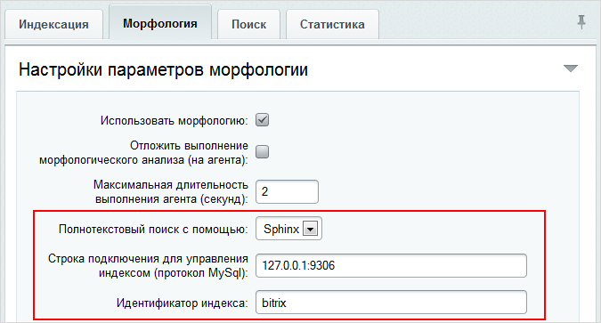
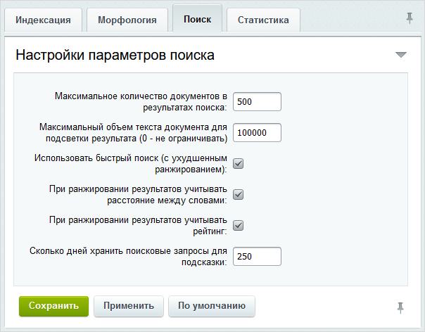

# Настройки модуля "Поиск"

**Навигация**
- [← Оглавление курса](index.md)
- [← Предыдущий: 2454 — Основные сведения](lesson_2454.md)
- [Следующий: 2335 — Настройки инфоблока для корректного поиска элементов →](lesson_2335.md)

Официальная страница урока: https://dev.1c-bitrix.ru/learning/course/index.php?COURSE_ID=48&LESSON_ID=2046

### Настройка модуля

**Важные замечания:**

- При проведении поиска учитывается
  			уровень прав
  Поиск информации по запросу пользователя будет осуществляться в разделах и на страницах сайта, правом на доступ к которым обладает данный пользователь.
  		 пользователя, создавшего запрос.
- Содержимое включаемых областей не
  			индексируется
                      **Индексирование** – процесс сбора, классификации и сохранения данных с целью облегчить быстрый и точный поиск информации.
  		 поиском.
- Слова, состоящие из
  			одного символа,
  К примеру, поисковый запрос "iPhone 5" не будет учитывать цифру.
  		 не индексируются поиском.
- В системе нет полного соответствия морфологии русского языка. Например, не учитываются
  			беглые гласные
  Если в каталоге есть товары: Ремень Радуга, Ремень Элегантность, Ремень Плетение, то при вводе запроса "Ремень" они находятся. Но другие формы этого слова, например "Ремни", "Ремней", "Ремня", уже не находят товар, так как поисковое ядро считает корнем "Ремен" и будет искать "ремени", а не "ремни".
  		 при склонении слова по падежам.
- Возможно использование полнотекстового индекса Mysql, но это требует дополнительных
  			действий разработчика
                      Модуль Поиск существует очень давно и включает в себя сквозной индекс по разным сущностям, отдельные фильтры по атрибутам сущностей, поддержку стемминга, точный поиск по атрибутам и связанным сущностям. Но появилась потребность изменить поиск в связи с новым пользовательским сценарием работы.
  [Подробнее ...](https://dev.1c-bitrix.ru/learning/course/index.php?COURSE_ID=43&LESSON_ID=9901&LESSON_PATH=3913.4776.9901)
  		.

Наладка на сайте поиска начинается с настройки параметров модуля. В административном разделе сайта откройте страницу *Настройки &gt; Настройки продукта &gt; Настройки модулей &gt; Поиск*:

### Закладки

Для удобства заполнения форма разбита на закладки:

1. Индексация
                      
  		 – настраивается ограничение поиска по целому ряду параметров. Например, по размеру файлов, типу файлов, папкам, которые не нужно индексировать.

  - **Максимальный размер индексируемого документа в килобайтах** – позволяет ограничить документы, участвующие в поиске, по их размеру. Пустое значение означает отсутствие ограничения.
  - **Маска включения** – позволяет задать
    			маску
                        Другими словами, это шаблон, с помощью которого задаётся формат. Например, маска ***.php** указывает, что в поиске будут участвовать любые документы с расширением **.php**.
    		, по которой будут выбираться документы, участвующие в поиске.
  - **Маска исключения** – определяется условие, на основе которого документы будут исключаться из индекса и поиска.
  - **Код свойства страницы в котором хранятся теги** – указывается код свойства страницы, в котором хранятся теги.
2. Морфология
                      
  		 – можно разрешить/запретить морфологический поиск на сайте и настроить его параметры.
  > **Морфологический поиск** – возможность поисковой системы искать слово в документах во всех его морфологических формах.
  При морфологическом анализе модуль **Поиск** разбивает предложения на слова, используя стандартные символы-разделители (пробел, точка, запятая и т.п.). Однако, существуют символы, которые, не будучи буквами, все же являются частями слов (например, дефисы). Чтобы в подобных случаях разбивка слов не выполнялась, в поле **Cимволы, по которым не производится разделение документа на слова** укажите символы, которые морфологический анализатор должен рассматривать как части слов. По умолчанию там стоит дефис.
  При желании отложите выполнение морфологического анализа на агентов с помощью соответствующей опции.
  Морфологический поиск поддерживает работу со всеми языками, установленными в системе.
  В поле **Полнотекстовый поиск с помощью** вы выбираете подходящую вам поисковую систему:
  - Bitrix
    Удобная встроенная поисковая система, обеспечивающая качественный поиск на сайте.
  - Sphinx
                         Внешняя поисковая система, обеспечивающая более быстрый поиск на сайте и снижение нагрузки на сервер.
    		 (доступен с версии 14.0.0)
    **Примечание**:  полнотекстовый поиск **Sphinx** можно подключить в том случае, если на сервере установлен и настроен **Sphinx**, кроме того, к нему можно подключиться из **PHP**.
    Ручная настройка поискового механизма **Sphinx** описана в данном
    			уроке
    Внешний полнотекстовый поиск Sphinx позволяет сделать быстрым и качественным поиск на вашем сайте, снизить нагрузку на сервер. Он доступен в продуктах «1С-Битрикс» с версии 14.0.0 и полностью интегрирован с компонентами модуля Поиск.
    Если по каким-либо причинам не используется эталонная среда Виртуальная машина VMBitrix версии 7.0 и выше, в которую уже включен Sphinx , то можно настроить его самим, следуя данным рекомендациям.
    [Подробнее](https://dev.1c-bitrix.ru/learning/course/index.php?COURSE_ID=35&LESSON_ID=5935)...
    		.
    При выборе системы **Sphinx** необходимо указать
    			строку подключения
                        
    		 к серверу **Sphinx** и задать произвольный идентификатор индекса.
    Начиная с версии 2.2.2 в **Sphinx** поддерживается только кодировка UTF-8. На сайтах с кодировкой Windows-1251 поиск **Sphinx**'ом работать не будет.
  - Полнотекстовый поиск MySql
    Возможность настроить инструмент полнотекстового поиска  системы управления базы данных **MySQL**. При выборе этого варианта все настройки придётся выполнять самостоятельно.
    [Подробнее](https://dev.1c-bitrix.ru/learning/course/index.php?COURSE_ID=43&LESSON_ID=9901)...
    		(доступен с версии 17.0.1)
3. Поиск
                      
  		 – задаются собственно параметры поиска:

  - Для некоторых проектов вполне допустимо и использование опции **Использовать быстрый поиск (с ухудшенным ранжированием)**. В этом случае поиск по сайту будет работать быстрее, но ранжирование не будет оптимальным, то есть документы, максимально точно отвечающие запросам, не будут собираться в начале первой страницы, а будут выводиться по мере нахождения.
    > **Ранжирование** (англ. ranking) – это процесс выстраивания найденных по запросу пользователя страниц в порядке наибольшего соответствия искомому запросу.
  - С помощью поля **Максимальное количество документов в результатах поиска** можно ограничить количество документов, которые будут показаны из всего результата поиска.
  - В поле **Максимальный объем текста документа для подсветки результата (0 – не ограничивать)** указывается количество символов, до которых будет обрезано содержимое документа в процессе выдачи поискового результата. Отсчет количества символов ведется с начала документа.
  - Опция **При ранжировании результатов учитывать расстояние между словами** позволяет в поисковой выдаче выводить выше те материалы, искомые слова в которых расположены ближе друг к другу в тексте.
  - Опция **При ранжировании результатов учитывать рейтинг** позволяет в поисковой выдаче выводить выше те материалы, за которые больше проголосовали.
    **Примечание:** для включения настроек **При ранжировании результатов учитывать расстояние между словами** и **При ранжировании результатов учитывать рейтинг** требуется переустановка модуля без сохранения таблиц с последующей полной переиндексацией.
  - Поле **Сколько дней хранить поисковые запросы для подсказки** определяет время, в течение которого будут храниться поисковые запросы, выводимые в подсказке.
4. Статистика
                      
  		 – задаются параметры хранения статистики поисковых фраз и запросов.
  > **Статистика** – это инструмент для сбора и анализа информации с целью дальнейшей корректировки контента сайта под типовые поисковые запросы.

### Документация по теме

- [Поиск. Настройки модуля](https://dev.1c-bitrix.ru/user_help/settings/search/settings.php) (пользовательская документация)
