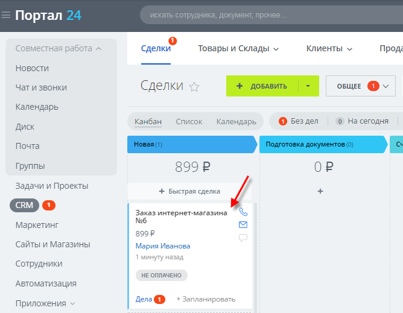
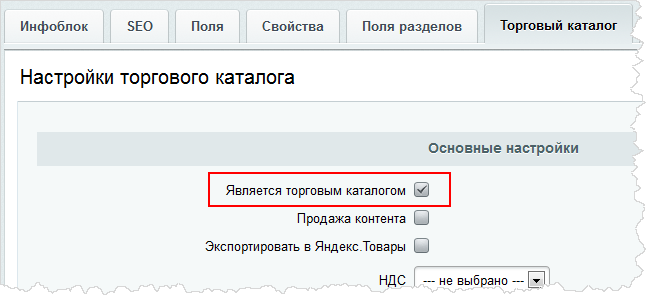
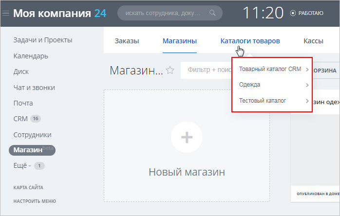
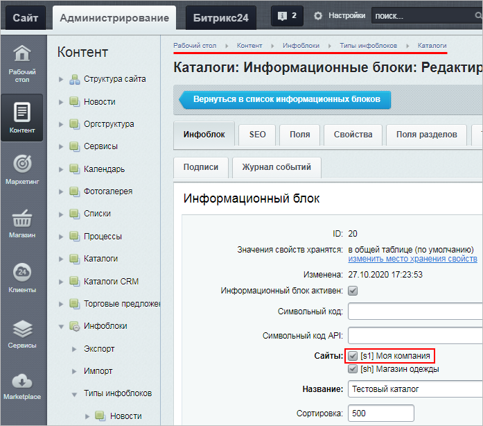
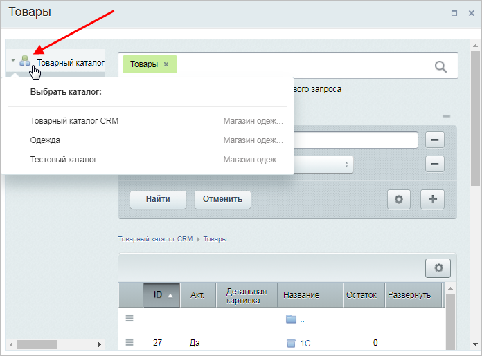
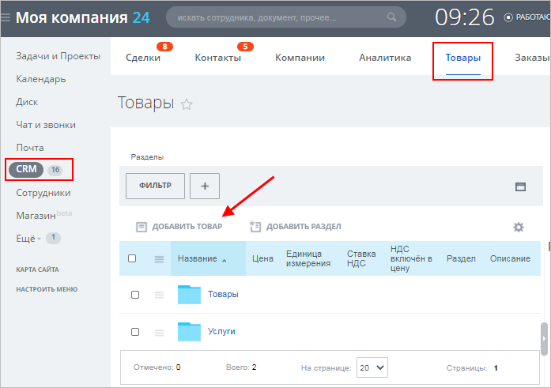
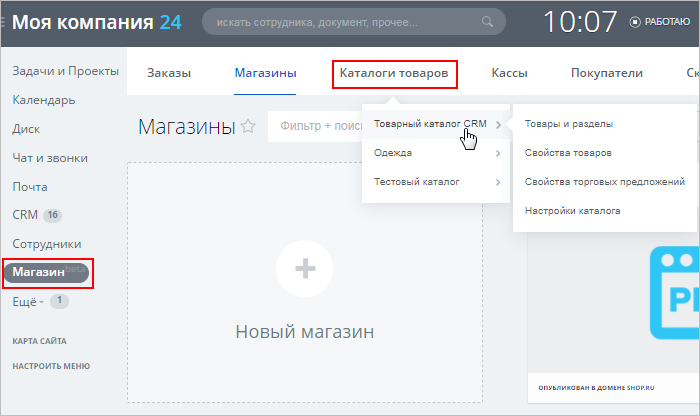
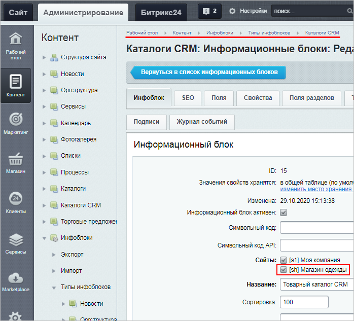

# Каталоги в «1С-Битрикс24: Интернет-магазин+CRM»

**Навигация**
- [← Оглавление курса](index.md)
- [← Предыдущий: 12908 — Инструменты списка заказов](lesson_12908.md)
- [Следующий: 12912 — Настройка формы оформления заказа →](lesson_12912.md)

Официальная страница урока: https://dev.1c-bitrix.ru/learning/course/index.php?COURSE_ID=48&LESSON_ID=20556

В данном уроке рассматриваются каталоги интернет-магазина в интерфейсе *Битрикс24* в режиме **Сделки + Заказы**. В этом режиме все заказы интернет-магазина отображаются в *Битрикс24* тоже в виде Заказов.

**Важно!** С версии модуля **CRM 22.200.0** в *Битрикс24* поддерживается работа только в режиме

			Без заказов

При этом сценарии вы сможете работать в сделке, а не в заказах. Работа со сделками имеет ряд преимуществ:

- Это более привычный сценарий работы, который легче использовать;
- Вся информация собирается в одной карточке. Вы сможете быстрее найти информацию о клиенте или процессе продажи;
- Можно более широко использовать автоматизацию - бизнес-процессы, приложения, туннели и направления сделок.

[Подробнее](https://helpdesk.bitrix24.ru/open/13632830/)...

		. В этом режиме все заказы, созданные на стороне интернет-магазина, отображаются в интерфейсе *Битрикс24* в виде

			Сделок

		. Подробнее о Сделках читайте [в статье Поддержки24](https://helpdesk.bitrix24.ru/open/5493461/).

Если вы уже работаете в режиме **Сделки + Заказы**, то он продолжит работать без изменений. Если вы случайно перешли в режим **Без заказов** и хотите вернуть прежний режим **Сделки + Заказы**, то обратитесь в [техподдержку](https://dev.1c-bitrix.ru/support/) (штатными средствами вернуть этот режим нельзя).

|  |
| --- |

|  | ### Виды каталогов |
| --- | --- |

В *«1С-Битрикс24: Интернет-магазин+CRM»* есть и обычные

			торговые каталоги

Главная составляющая интернет-магазина на CMS *«1С-Битрикс: Управление сайтом»* - каталог товаров.  Его легко организовать, если использовать инструменты модуля **Торговый каталог**.

[Подробнее](https://dev.1c-bitrix.ru/learning/course/index.php?COURSE_ID=42&CHAPTER_ID=04771&LESSON_PATH=3912.4771)...

		 (характерные для продукта *«1С-Битрикс: Управление сайтом»*), и свойственный продукту *Битрикс24* Товарный каталог CRM. Рассмотрим основные моменты, которые важны в работе с этими каталогами.

### Торговые каталоги

- Практически все
  Исключение – торговые каталоги, у которых [внешний код](https://dev.1c-bitrix.ru/user_help/content/iblock/iblock_edit.php) содержит префикс **crm_external** (такие каталоги создаются при [интеграции *Битрикс24* с внешними интернет-магазинами](https://dev.1c-bitrix.ru/learning/course/index.php?COURSE_ID=42&LESSON_ID=3645)).
  Эти каталоги в любом случае не будут отображаться на странице Магазин &gt; Каталоги товаров.
  		 торговые каталоги (инфоблоки, у которых в настройках отмечена опция
  			Является торговым каталогом
  
  		) отображаются на странице Магазин &gt; Каталоги товаров:
  
  **Примечание**: Если торговый каталог не отображается в этом списке,
  			привяжите
  Привязка к сайтам осуществляется на странице
  Контент &gt; Инфоблоки &gt; Типы инфоблоков &gt; [ваш тип инфоблоков] &gt; [ваш инфоблок]:
  
  		 его к сайту *Битрикс24*.
- Товары из торговых каталогов можно добавить в
  			Заказы.
  Заказы - цель и основа работы любого интернет-магазина. В этой статье мы научимся работать с заказами внутри CRM - создавать их, обрабатывать и завершать.
  Перейдем в раздел Магазин - Заказы.
  [Подробнее](https://helpdesk.bitrix24.ru/open/8236909/?sphrase_id=71473072)...
- В Заказе для смены каталога кликните по
  			значку текущего каталога
  
  		 – откроется список всех доступных каталогов.

### Товарный каталог CRM

> **Товарный каталог CRM** – это встроенный каталог CRM-системы *Битрикс24*. Товары именно этого каталога можно прикреплять к
>
> 			Сделкам
>
>
>
>
> Сделка - основная цель бизнеса и результат работы с клиентом. По сути это и есть продажа товара или услуги:)
>
>
>
> В Битрикс24.CRM сделка - важный элемент рабочего процесса. Потенциальные клиенты постепенно приходят к сделке, а сама сделка в процессе работы превращается в коммерческое предложение или счёт на оплату.
>
>
> [Подробнее](https://helpdesk.bitrix24.ru/open/5493461/?sphrase_id=71466214)...
>
>
>
> 		 – важнейшему инструменту *Битрикс24* для взаимодействия с клиентами.

- Товарный каталог CRM может быть только **один**.
- Для работы с товарным каталогом CRM необходимо иметь права на модуль **Торговый каталог** не ниже [Менеджер магазина](lesson_10491.md#shop).
- В интерфейсе *Битрикс24* товары в Товарный каталог CRM можно добавить несколькими способами:
  **Способ 1:** по пути
  			CRM &gt; Товары
  
  		 (можно создать только
  			простые товары
  Любая компания предлагает клиентам какие-то товары или услуги. Разберём работу с каталогом товаров в Битрикс24.
  Список товаров расположен в разделе CRM - Товары.
  [Подробнее](https://helpdesk.bitrix24.ru/open/5493761/?sphrase_id=71435178)...
  		).
  **Способ 2:** по пути
  			Магазин &gt; Каталоги товаров &gt; Товарный каталог CRM
  
  		 (можно создать разные типы товаров: простые товары, товары с торговыми предложениями, наборы и комплекты).
  Форма создания товаров
  Рассмотрим подробно, какие товары создаются с помощью пунктов меню кнопки **Создать другие типы товаров**.
  [Подробнее](https://dev.1c-bitrix.ru/learning/course/index.php?COURSE_ID=42&LESSON_ID=5830)...
  		 такая же, как и в продукте *«1С-Битрикс: Управление сайтом»*.
  **Важно!** Типы товаров, созданные по второму способу, будут корректно выводиться в
  			магазине Битрикс24
  Создайте интернет-магазин в Битрикс24 всего за пару кликов. И сразу же начинайте продавать - ваш магазин автоматически будет связан с CRM! Не нужно никаких сложных настроек и танцев с бубном :)
  [Подробнее](https://helpdesk.bitrix24.ru/open/8236943/?sphrase_id=71470244)...
  		, однако в списке товаров (CRM &gt; Товары) они будут отображаться как простые товары.
  Это связано с тем, что в Сделки можно добавлять только простые товары (но в поле, где указывается сам товар, можно вручную отредактировать цену/название).
- Чтобы товары из Товарного каталога CRM можно было добавлять не только в Сделки, но и в Заказы,
  			привяжите
  Привязка к сайтам осуществляется на странице
  Контент &gt; Инфоблоки &gt; Типы инфоблоков &gt; Каталоги CRM &gt; Товарный каталог CRM:
  
  		 его к сайту вашего магазина.
- При
  			переходе
  В этом уроке рассмотрим, как перейти на *«1С-Битрикс24: Интернет-магазин+ CRM»* с продукта *«1С-Битрикс: Управление сайтом»*.
  При переходе на *«1С-Битрикс24: Интернет-магазин+ CRM»* сохранятся те приложения из **Marketplace**, которые созданы для изменения публичной части сайта (например, приложения типа "готовый сайт").
  [Подробнее](https://dev.1c-bitrix.ru/learning/course/index.php?COURSE_ID=42&LESSON_ID=12834)...
  		 на *«1С-Битрикс24: Интернет-магазин+CRM»* с продукта *«1С-Битрикс: Управление сайтом»* Мастер выбирает первый попавшийся каталог, который становится Товарным каталогом CRM.
  Сменить Товарный каталог CRM штатными средствами системы **нельзя**, так как будет нарушена работа многих сущностей (например, могут быть проблемы с созданными Сделками, в которых указаны товары из одного каталога, а после смены этот каталог станет недоступен).
  **Примечание**: Товарный каталог CRM можно наполнить через штатные инструменты
  			экспорта/импорта
  Модуль **Торговый каталог** позволяет выполнять экспорт и импорт данных информационных блоков, работающих в режиме торгового каталога (Магазин &gt; Настройки).
  [Подробнее](https://dev.1c-bitrix.ru/learning/course/index.php?COURSE_ID=42&LESSON_ID=12317)...
  		 каталога.
