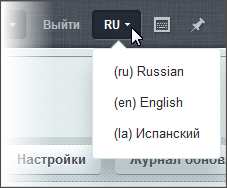

# Управление языками

**Навигация**
- [← Оглавление курса](index.md)
- [← Предыдущий: 2070 — Языки интерфейса](lesson_2070.md)
- [Следующий: 8575 — Региональные настройки →](lesson_8575.md)

Официальная страница урока: https://dev.1c-bitrix.ru/learning/course/index.php?COURSE_ID=48&LESSON_ID=2071

### Языки. Видеоурок

Управление языками интерфейса системы выполняется на странице **Языки интерфейса** (Настройки &gt; Настройки продукта &gt; Языковые параметры &gt; Языки интерфейса). В списке отображены языки, доступные для выбора в качестве языка административного интерфейса. На выбранном языке будут отображаться системные сообщения: информационные сообщения, сообщения об ошибках, заголовки таблиц, надписи на кнопках управления и т.д.

**Примечание**: управление параметрами языков публичного раздела сайта выполняется отдельно для [каждого сайта](https://dev.1c-bitrix.ru/learning/course/index.php?COURSE_ID=35&LESSON_ID=1991).

### Пример добавления языка в систему

Рассмотрим добавление в систему нового языка на примере испанского (для Латинской Америки). Для этого:

1. Создадим учетную запись языка (кнопка
  			Добавить язык
                      
  		 на контекстной панели страницы **Языки интерфейса**).
  
  Значения полей ясны из названий, если возникло непонимание, обратитесь к
  			пользовательской документации
  						[Описание компонента «Создание и редактирование языка интерфейса» в пользовательской документации.](http://dev.1c-bitrix.ru/user_help/detail.php?ID=63444)
  		. Одно обязательное пояснение:
  **ID** - символьный идентификатор языка используется для загрузки соответствующих языковых файлов, поэтому он должен совпадать с идентификатором языка в системе обновлений. Например, языковые файлы для испанского (для Латинской Америки) языка доступны на сервере обновлений с идентификатором **la**. Поэтому при создании испанского языка используйте в поле **ID** – **la**.
  ## Список идентификаторов языков
  | Язык& | Идентификатор | Кодировка |
  | --- | --- | --- |
  | Russian | ru | iso-8859-5, windows-1251, koi8-r |
  | English | en | iso-8859-1, windows-1252 |
  | Afrikaans | af | iso-8859-1, windows-1252 |
  | Albanian | sq | iso-8859-1, windows-1250 |
  | Arabic | ar | iso-8859-6, windows-1256 |
  | Basque | eu | iso-8859-1, windows-1252 |
  | Bulgarian | bg | iso-8859-5, windows-1251 |
  | Belorussian | be | iso-8859-5, windows-1251 |
  | Catalan | ca | iso-8859-15, windows-1252 |
  | Croatian | hr | iso-8859-2, windows-1250 |
  | Czech | cs | iso-8859-2, windows-1250 |
  | Danish | da | iso-8859-1, windows-1252 |
  | Dutch | nl | iso-8859-1, windows-1252 |
  | Esperanto | eo | iso-8859-3 |
  | Estonian | et | iso-8859-15, windows-1257 |
  | Faroese | fo | iso-8859-1, windows-1252 |
  | Finnish | fi | iso-8859-1, windows-1252 |
  | French | fr | iso-8859-1, windows-1252 |
  | Galician | gl | iso-8859-1, windows-1252 |
  | German | de | iso-8859-1, windows-1252 |
  | Greek | el | iso-8859-7 |
  | Hebrew | iw | iso-8859-8 |
  | Hungarian | hu | iso-8859-2, windows-1250 |
  | Icelandic | is | iso-8859-1, windows-1252 |
  | Irish | ga | iso-8859-1, windows-1252 |
  | Italian | it | iso-8859-1, windows-1252 |
  | Japanese | ja | shift_jis, iso-2022-jp, euc-jp |
  | Korean | ko | euc-kr |
  | Latvian | lv | iso-8859-13, windows-1257 |
  | Lithuanian | lt | iso-8859-13, windows-1257 |
  | Macedonian | mk | iso-8859-5, windows-1251 |
  | Maltese | mt | iso-8859-3 |
  | Norwegian | no | iso-8859-1, windows-1252 |
  | Polish | pl | iso-8859-2, windows-1250 |
  | Portuguese | pt | iso-8859-1, windows-1252 |
  | Portuguese (бразильский) | br | iso-8859-1, windows-1252 |
  | Romanian | ro | iso-8859-2, windows-1250 |
  | Scottish | gd | iso-8859-1, windows-1252 |
  | Serbian cyrillic | sr | iso-8859-5, windows-1251 |
  | Serbian latin | sr | iso-8859-2, windows-1250 |
  | Slovak | sk | iso-8859-2, windows-1250 |
  | Slovenian | sl | iso-8859-2, windows-1250 |
  | Spanish | la | iso-8859-1, windows-1252 |
  | Swedish | sv | iso-8859-1, windows-1252 |
  | Turkish | tr | iso-8859-9, windows-1254 |
  | Ukrainian | ua | windows-1251, koi8-u |
2. После сохранения запись нового языка будет добавлена в общий список на странице
  			Языки интерфейса
                      
  		.
3. Также в кнопке для переключения языков на административной панели появится выбор добавленного языка:
  
4. Далее выполните
  			загрузку языковых файлов
                       Загрузка производится через штатную систему обновлений.
   [Подробнее](lesson_2072.md)...
  		 для созданного языка.

Список языков интерфейса, доступных для штатной установки в продуктах *«1С-Битрикс: Управление сайтом»* и коробочной версии *«Битрикс24»*:

- украинский
- испанский (Латинская Америка)
- португальский (Бразилия)
- французский (Канада)
- польский

Удалить любой язык, кроме системного, можно с помощью пункта контекстного меню **Удалить**.

### Документация по теме

- [Языки интерфейса](https://dev.1c-bitrix.ru/user_help/settings/settings/lang_parametrs/lang_admin.php)
