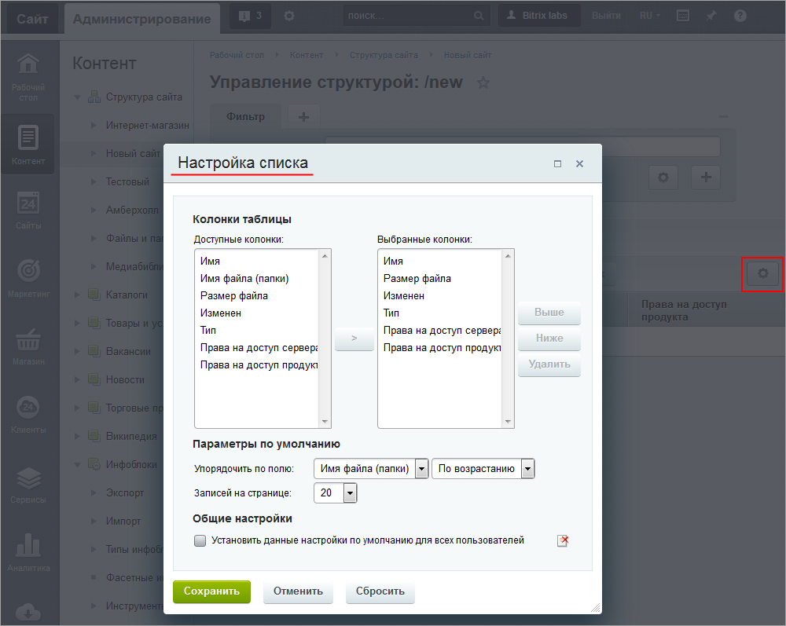

# Пользовательские настройки

**Навигация**
- [← Оглавление курса](index.md)
- [← Предыдущий: 12822 — Практические задания](lesson_12822.md)
- [Следующий: 8587 — Административные настройки →](lesson_8587.md)

Официальная страница урока: https://dev.1c-bitrix.ru/learning/course/index.php?COURSE_ID=48&LESSON_ID=2074

|  | ### Настройка под себя |
| --- | --- |

*Bitrix Framework* позволяет настраивать и запоминать настройки интерфейса для каждого зарегистрированного пользователя, имеющего доступ в административный раздел.

**Примечание:** Дополнительную информацию по настройке интерфейса форм смотрите в следующих уроках:

- Настройка формы редактирования элемента
                      Каждый элемент системы можно изменить: отредактировать новость, изменить описание товара, изменить SEO параметры страницы, создать скидку, настроить параметры модуля и так далее. Форма изменения появляется по команде Изменить.
  [Подробнее ...](lesson_1841.md)
- Настройка формы отчета (Списки элементов)
                      Согласитесь, что при постоянной работе с однотипными файлами (в нашем случае - со списком элементов) хочется, чтобы все самые важные параметры были на виду, т.е. не приходилось открывать каждый элемент, а можно было все просмотреть в единой таблице. Это значительно экономит время и позволяет избегать рутинных действий.
  [Подробнее ...](lesson_11801.md#form_settings)
- Настройки форм инфоблоков
                      Стандартные формы редактирования элементов и разделов имеют множество полей, что создает трудности при заполнении. Облегчите свою ежедневную работу вместе с предустановленными данными для полей. Выполните настройки на закладках Поля и Поля разделов формы редактирования инфоблока.
  [Подробнее ...](/learning/course/index.php?COURSE_ID=34&LESSON_ID=1912)

На многих страницах административного раздела на контекстной панели расположена кнопка **Настроить** . При нажатии на неё вызывается диалог **Настройка списка**:

Система сохранит произведенные настройки для конкретного пользователя. Каждый раз этот список для этого пользователя будет открываться в заданном виде. Пользователь может [настроить каждый из списков](lesson_11767.md#list_settings) в административной части "под себя".
