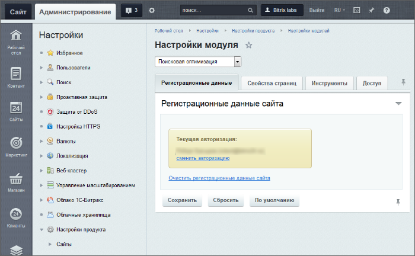
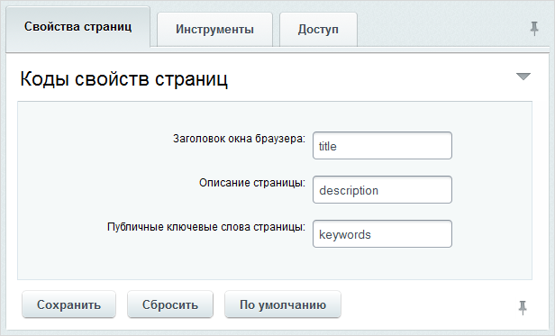
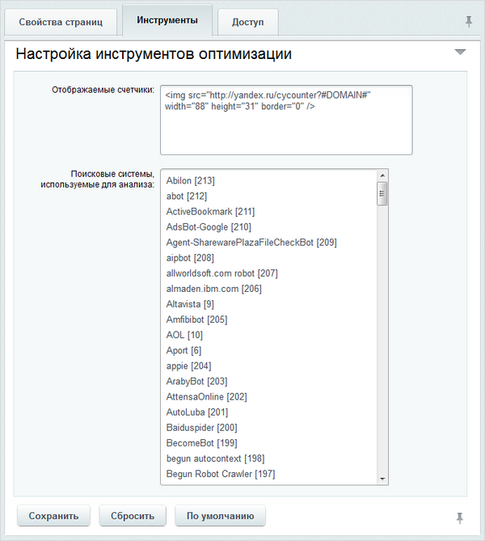

# Поисковая оптимизация

**Навигация**
- [← Оглавление курса](index.md)
- [← Предыдущий: 4966 — Примеры кастомизации](lesson_4966.md)
- [Следующий: 2808 — Настройка модуля DAV →](lesson_2808.md)

Официальная страница урока: https://dev.1c-bitrix.ru/learning/course/index.php?COURSE_ID=48&LESSON_ID=2095

Для работы по SEO в Битрикс создан специальный модуль **Поисковая оптимизация**. Работа модуля облегчает ежедневную работу по продвижению сайта в рейтингах поисковых машин.

### Возможности модуля Поисковая оптимизация

Этот модуль анализирует техническое исполнение сайта, отображает параметры, влияющие на оптимизацию, и дает рекомендации по улучшению этих параметров.  Небольшая часть функционала модуля **Поисковая оптимизация** реализуется с помощью  модуля **Аналитика** и доступна только в редакции **Бизнес**.

Для продвижения сайта в WWW модуль предоставляет инструменты для поисковой оптимизации по страницам и сайту в целом:

- Выводит всю необходимую информацию в публичной части для модификации страницы или сайта.
- Отображает специальную информацию о странице: частота индексации поисковиками; запросы, которые приводят на эту страницу, дополнительную статистическую информацию.
- Даёт наглядную оценку результативности работы страницы и сайта.
- Возможность тут же вызвать необходимые диалоги и произвести изменения на странице.
- Применительно ко всему сайту выводит: общее ссылочное ранжирование, цитирование, количество ссылок, поисковые слова, индексация поисковиками.

|  | #### Работа с инструментами модуля |
| --- | --- |

Работа с модулем описана в курсе

			Продвижение сайта и Маркетинг

                    Поисковая оптимизация подразумевает постоянную работу, а не разовые акции по продвижению информационных ресурсов. На оценку поисковой системы влияют десятки различных факторов, начиная с имени домена и заканчивая качеством каналов связи.

[Подробнее ...](https://dev.1c-bitrix.ru/learning/course/index.php?COURSE_ID=139&CHAPTER_ID=04545&LESSON_PATH=11427.4545)

		.

### Настраиваем модуль и сайт

#### Настройки модуля

Настройки модуля  (*Настройки &gt; Настройки продукта &gt; Настройки модулей &gt; Поисковая оптимизация*) дают возможность изменить коды свойств страницы, настроить параметры сбора статистики и управлять правами доступа к модулю.

На закладке **Регистрационные данные** отображается аккаунт, с которого осуществлена авторизация, есть возможность сменить аккаунт и

			очистить данные

                    В Базе данных сайта хранятся некоторые настройки для поисковиков: **access_token** и данные для него, **host_id** на стороне Яндекса, client_id для seo-прокси сайта и прочее. Иногда бывает надо это очистить.

		.

На закладке

			Свойства страниц

                    

		 изменяются коды используемых свойств страницы. Делать это нужно только в случае, если используемые по умолчанию значения были изменены в ходе разработки сайта.

На закладке

			Инструменты

                    

		 задаются основные параметры для получения статистики о странице сайта.

- В поле **Отображаемые счетчики** введите все счётчики

  , которые вы получили от поисковых машин для установки на сайте.
- В поле
  			Поисковые системы, используемые для анализа
                      Данные для этого поля берутся из списка поисковых систем модуля **Аналитика**, который есть только в редакции **Бизнес**. Соответственно, на младших редакциях **"1С-Битрикс: Управление сайтом"**, это поле настроек отсутствует.
  		 выберите поисковые системы, которые должны использоваться для анализа. Выбор нескольких систем осуществляется с помощью клавиши CTRL. Выбранные поисковые системы после сохранения измененных параметров отобразятся в строке **Сейчас выбрано**.

На закладке

			Доступ

                    

		 установите нужный уровень

			прав доступа к модулю

                    Настройка прав доступа к модулям системы позволяет определить диапазон допустимых действий пользователя над модулем и его контентом.

[Подробнее ...](lesson_2016.md)

		 различных групп пользователей. Имеется три вида доступа:

- **Полный доступ** – доступны инструменты анализа и управление настройками, рекомендуется для администраторов сайта;
- **Анализ страниц и сайта** – доступны инструменты анализа, рекомендуется для редакторов, SEO-оптимизаторов и контролирующих лиц заказчика.;
- **Доступ запрещен** – запрет на доступ к модулю.

Модуль настроен на работу.

#### Настройки сайта

Если сайт доступен по нестандартному порту (например, **6448** в случае использования пакета **«Битрикс: Веб-окружение»**), то необходимо убедиться, что этот порт указан в настройке главного модуля в поле URL сайта (и в аналогичных настройках каждого из сайтов в случае многосайтовости

			на одном домене

                    Принципиальная необходимость для многосайтовости на одном домене - разделение сайтов по подкаталогам, так, чтобы структура файлов не пересекалась.

[Подробнее ...](https://dev.1c-bitrix.ru/learning/course/index.php?COURSE_ID=103&LESSON_ID=286)

		).

### Важно!

На хостинге иногда устанавливают ограничение на размер текста страницы. Соответствующее ограничение задается в параметре

			pcre.backtrack_limit

                    Настройка **pcre.backtrack_limit** файла **php.ini** ограничивает максимальную длину текста, обрабатываемого регулярными выражениями.

		 файла **php.ini**. Если такое ограничение наложено, и объем текста на странице его превышает, то данные, выводимые в других инструментах, могут быть некорректными.

Сообщение о превышении ограничения будет отображено в поле **Рекомендации и исправления**

			инструмента Страница

                    Инструмент **Страница** предназначен для вывода общей статистики по странице и состоит из четырех групп параметров...

[Подробнее...](/learning/course/index.php?COURSE_ID=139&LESSON_ID=2180)

		.
