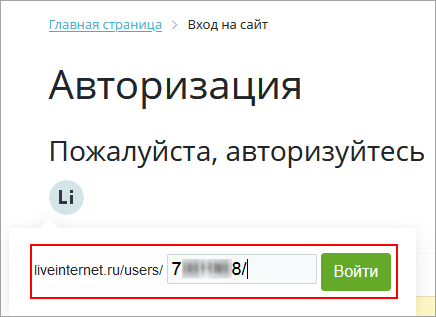

# Liveinternet

**Навигация**
- [← Оглавление курса](index.md)
- [← Предыдущий: 12846 — Mail.ru](lesson_12846.md)
- [Следующий: 20010 — Проверьте себя →](lesson_20010.md)

Официальная страница урока: https://dev.1c-bitrix.ru/learning/course/index.php?COURSE_ID=48&LESSON_ID=21600

|  | ### Liveinternet |
| --- | --- |

Для подключения возможности авторизации через сервис дневников (блогов) [www.liveinternet.ru](https://www.liveinternet.ru/) необходимо в настройках модуля **Социальные сервисы** (Настройки &gt; Настройки продукта &gt; Настройки модулей &gt; Социальные сервисы) отметить галочкой опцию Liveinternet и сохранить настройки:

 

Сразу после этого при входе на сайт появится логотип .

При клике на него для авторизации будет предложено ввести ID дневника и войти:

**Примечание:**Со временем социальные сервисы могут изменять внешний вид мастеров регистрации приложений. В уроках могут не отображаться последние изменения. Пожалуйста, сообщайте нам о замеченных вами изменениях.

	 Для отправки комментария воспользуйтесь расположенной в правом нижнем углу окна браузера кнопкой:
