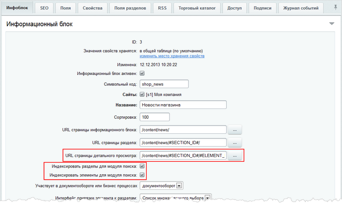

# Типичные ошибки

**Навигация**
- [← Оглавление курса](index.md)
- [← Предыдущий: 2173 — Полезные советы](lesson_2173.md)
- [Следующий: 2651 — Поиск элементов инфоблока по их свойствам →](lesson_2651.md)

Официальная страница урока: https://dev.1c-bitrix.ru/learning/course/index.php?COURSE_ID=48&LESSON_ID=2165

В уроке рассмотрим решение ошибок поискового характера:

  [Поиск выдаёт ссылки на несуществующие страницы](#mistake_1)
  ["Зависает" переиндексация статических файлов](#mistake_2)

|  | #### Поиск выдаёт ссылки на несуществующие страницы (404 - HTTP not found) |
| --- | --- |

- Ошибки поиска элементов инфоблока связаны с неправильно указанным
  			URL'ом страницы детального просмотра элемента
                      
  		. Этот URL используется при формировании страницы результатов поиска. Соответственно, если он проставлен неправильно или указывает на несуществующую страницу, то пользователь по ссылке попадет не на страницу просмотра найденного элемента, а на 404-ю.
  Кроме того, похожая ситуация возникает, если компонент работает в режиме ЧПУ, а URL в настройках инфоблока прописан не в ЧПУ. В данной ситуации следует указать URL по правилам ЧПУ.
  **Примечание:** чтобы разделы и элементы инфоблока могли участвовать в поиске, в форме настройки инфоблока также следует отметить опции **Индексировать разделы для модуля поиска** и **Индексировать элементы для модуля поиска**. Подробнее читайте в уроке [Настройки инфоблока для корректного поиска элементов](lesson_2335.md).
- Проблема может возникать со ссылками на страницы форума и блога. Проверьте корректность шаблонов путей к сообщениям форума, блога.

**Внимание!** После изменения путей обязательно выполните переиндексацию сайта.

|  | #### "Зависает" переиндексация статических файлов |
| --- | --- |

**Проблема**: информационные блоки индексируются нормально, а статические файлы - нет. Переиндексация зависает и изменение шага индексации на странице Настройки &gt; Поиск &gt; Переиндексация не помогает.

**Решение**: причиной является большой файл на сайте, который не успевает проиндексироваться за шаг. В [настройках модуля Поиска](lesson_2046.md) установите ограничение на размер в поле **Максимальный размер индексируемого документа в килобайтах**.
