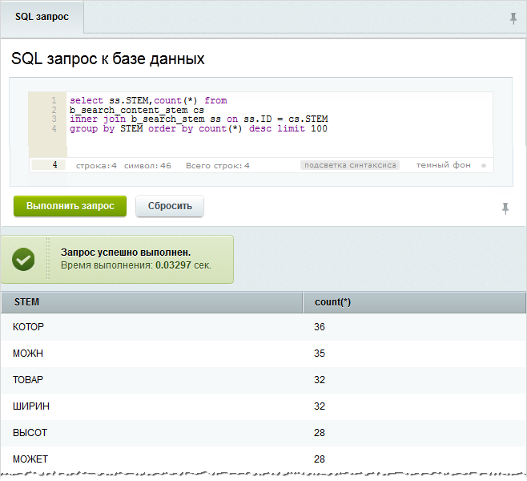

# Полезные советы

**Навигация**
- [← Оглавление курса](index.md)
- [← Предыдущий: 2057 — Логические операторы](lesson_2057.md)
- [Следующий: 2165 — Типичные ошибки →](lesson_2165.md)

Официальная страница урока: https://dev.1c-bitrix.ru/learning/course/index.php?COURSE_ID=48&LESSON_ID=2173

Знаете ли вы, что эффективность полнотекстового поиска можно значительно увеличить, если исключить из индекса слова встречающиеся очень часто? Например, если в каждом сообщении на форуме встречается слово "привет", то поиск по этому слову выдаст все сообщения, что не может удовлетворить инициатора такого запроса. Такие слова называются "СТОП" словами.


Практика показывает, что при использовании списка стоп-слов размер индекса уменьшается примерно на 10-15%, а возможный прирост скорости поиска бывает в десятки раз (20-50).


Задача по увеличению эффективности полнотекстового поиска решается в 3 этапа.


#### Этап 1. Определение наиболее "популярных" слов


Чтобы определить стоп-слова, выполните следующее:


- Перейдите на страницу **SQL запрос** (Настройки &gt; Инструменты &gt; SQL запрос).
- Выполните запрос:
  ```
  select ss.STEM,count(*) from b_search_content_stem cs inner join b_search_stem ss on ss.ID = cs.STEM group by STEM order by count(*) desc limit 100
  ```
  **Примечание:** до 11-й версии модуля необходимо использовать другой запрос:
  ```
  select STEM,count(*) from b_search_content_stem group by STEM order by count(*) desc limit 100
  ```
  В результате на странице будут отражены
  			100 самых популярных
                      
  		 терминов на сайте.
  **Внимание!** Этот запрос может быть очень "тяжелым". Не торопитесь и выполните его во время наименьшей нагрузки на сайт. А если вдруг есть актуальная резервная копия на тестовом сайте, то лучше выполнить запрос на ней.


Есть и немного другой вариант получения списка стоп-слов:


- Создайте страницу со следующим содержимым:
  ```
  <?
  require($_SERVER["DOCUMENT_ROOT"]."/bitrix/header.php");
  $query = $DB->Query("select ss.STEM,count(*) from b_search_content_stem cs inner join b_search_stem ss on ss.ID = cs.STEM group by STEM order by count(*) desc limit 100");
  while($ar = $query->Fetch())
     echo " ,",$ar["STEM"];
  require($_SERVER["DOCUMENT_ROOT"]."/bitrix/footer.php");
  ?>
  ```
  Так, вы быстро скопируете список самых популярных слов.
  **Внимание:** Обязательно **удалите** эту страницу после ее выполнения!


#### Этап 2. Исключение слов из полнотекстового индекса


Для исключения слов из полнотекстового индекса и поисковых запросов добавьте в **init.php** через запятую слова, которые необходимо исключить:


```
define("STEMMING_STOP_RU", "ЗДЕСЬ, СПИСОК, СТОП, СЛОВ");
```


**Примечание:** Система поддерживает стемминг 2-х языков: русского и английского.
Для первого обрабатывается константа `STEMMING_STOP_RU`, для второго - `STEMMING_STOP_EN`.


#### Этап 3. Переиндексация


После внесенных изменений выполните полную переиндексацию для обновления поискового индекса. Используйте форму **Переиндексация сайта** (Настройки &gt; Поиск &gt; Переиндексация).


**Примечание:** подробнее про индексацию читайте в уроке [Индексация](lesson_2048.md).


|  | #### Обратите внимание: |
| --- | --- |


- Наиболее эффективным будет удаление/установка модуля поиска без сохранения таблиц.
- Начиная с версии форума 5.9.3, у модуля появилась настройка, значительно ускоряющая переиндексацию - **Количество документов, переиндексируемых за шаг**. Разумное значение 2-3 тысячи.
- По окончании переиндексации **обязательно** выполните оптимизацию БД на странице **Проверка/восстановление таблиц** (Настройки &gt; Инструменты &gt; Диагностика &gt; Оптимизация БД).
