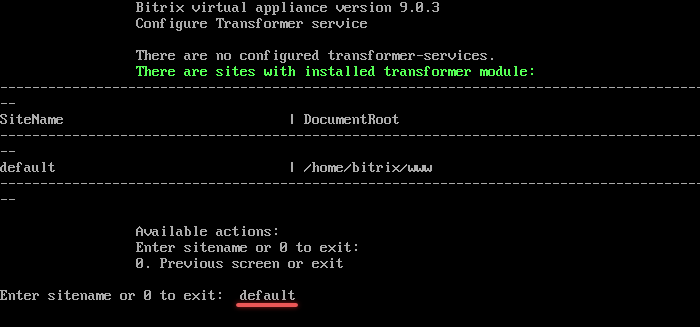
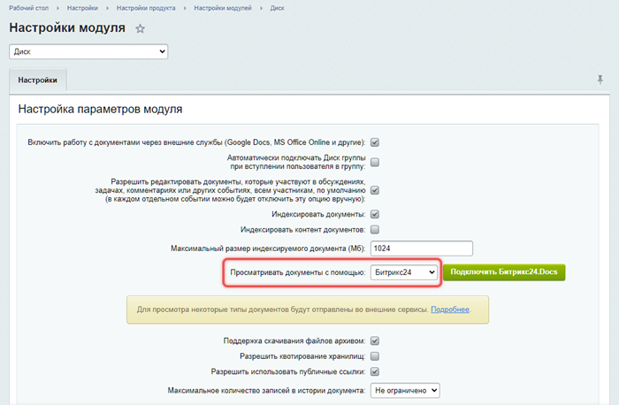

# Установка и настройка сервера конвертации файлов

**Навигация**
- [← Оглавление курса](index.md)
- [← Предыдущий: 20376 — Проверьте себя](lesson_20376.md)
- [Следующий: 21878 — Нагрузка и логирование →](lesson_21878.md)

Официальная страница урока: https://dev.1c-bitrix.ru/learning/course/index.php?COURSE_ID=48&LESSON_ID=21876

### Подготовка сайта для роли Transformer

Роль Конвертер файлов доступна c версии VMBitrix 7.5.0 и выше.

Для работы серверной роли Конвертер файлов необходимо, чтобы в 1С-Битрикс24 были установлены:

- Модуль «Конвертер файлов» (transformer) версии 20.100.0 и выше.
- Модуль «Сервер конвертации файлов» (transformercontroller) версии 20.100.0 и выше.

**Внимание.** Модуль Сервер конвертации файлов доступен только в редакции 1С-Битрикс24: Энтерпрайз.

Модули не нужно настраивать вручную. Запустите роль в BitrixVM, после активации она сама настроит нужные опции для вашего сайта.

<!-- &lt;p&gt;После установки модулей настройки будут такие: &lt;/p&gt;
&lt;ul class="fa fa-circle sz-sm"&gt;

&lt;li&gt;Сервер конвертации файлов transformercontroller — во всех вкладках будет пусто. Во вкладке Статус работать будет только функция exec.
&lt;p&gt;&lt;img src="/images/bitrixvm/vmbitrix75/transformer/bx_transformer41m.png"&gt;&lt;/p&gt;

&lt;/li&gt;

&lt;li&gt;«Конвертер файлов» (transformer):
&lt;p&gt;&lt;img src="/images/bitrixvm/vmbitrix75/transformer/bx_transformer0m.png"&gt;&lt;/p&gt;

&lt;/li&gt;
&lt;/ul&gt; -->

### Запуск роли Transformer

1. В главном меню виртуальной машины запустите задачу на установку роли Transformer: *7. Configure Transformer service &gt; 1. Configure Transformer service* и введите имя сайта. В примере `default`.
  
  **Примечание.** Подробнее о запуске роли Transformer читайте [в курсе виртуальной машины VMBitrix](https://dev.1c-bitrix.ru/learning/course/index.php?COURSE_ID=37&LESSON_ID=30268).
2. Далее установите в административном интерфейсе в настройках модуля Диск *Настройки &gt; Настройки продукта &gt; Настройки модулей &gt; Диск* опцию
  			Просматривать документы с помощью Битрикс24
                      
  		.

Все готово. Все настройки для локального сервера конвертации документов для сайта выполнены.

### Проверка работы

После настройки новой роли для сайта проверить работу можно в публичной части продукта:

1. В ленте Новостей — преобразование документов и видеофайлов в сообщениях или комментариях:
  <!-- &lt;p width="853" height="480"&gt;
  &lt;iframe title="Проверка работы конвертера файлов в ленте Новостей" width="853" height="480" src="https://www.youtube.com/embed/reFGmYbT1BE?feature=oembed&rel=0&VQ=HD720" frameborder="0" allow="accelerometer; autoplay; clipboard-write; encrypted-media; gyroscope; picture-in-picture" allowfullscreen=""&gt;
  &lt;/iframe&gt;
  &lt;/p&gt; -->
2. В разделе Диск — просмотр файлов:
  <!-- &lt;p width="853" height="480"&gt;
  &lt;iframe title="Проверка работы конвертера файлов в Битрикс24.Диск" width="853" height="480" src="https://www.youtube.com/embed/ZhJwIjtMESw?feature=oembed&rel=0&VQ=HD720" frameborder="0" allow="accelerometer; autoplay; clipboard-write; encrypted-media; gyroscope; picture-in-picture" allowfullscreen=""&gt;
  &lt;/iframe&gt;
  &lt;/p&gt; -->
3. В CRM — генерация документов по шаблонам, например для сделок:
  <!-- &lt;p width="853" height="480"&gt;
  &lt;iframe title="Проверка работы конвертера файлов в сделках CRM" width="853" height="480" src="https://www.youtube.com/embed/PCrfSiZsLA0?feature=oembed&rel=0&VQ=HD720" frameborder="0" allow="accelerometer; autoplay; clipboard-write; encrypted-media; gyroscope; picture-in-picture" allowfullscreen=""&gt;
  &lt;/iframe&gt;
   &lt;/p&gt; -->

#### Уроки по теме:

- [Нагрузка и логирование](lesson_21878.md)
- [Использование сервера конвертации файлов другими сайтами](lesson_21882.md)
