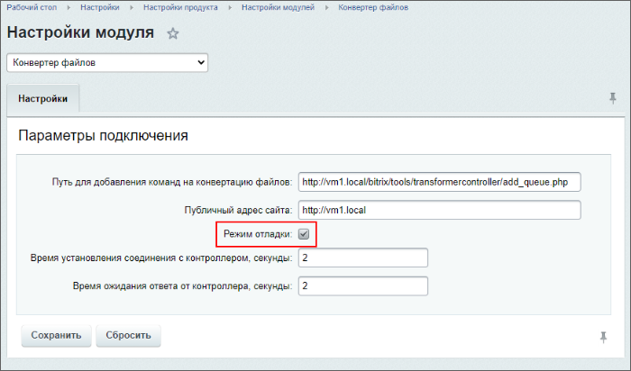
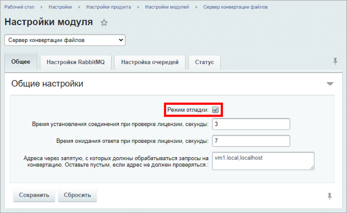

# Нагрузка и логирование

**Навигация**
- [← Оглавление курса](index.md)
- [← Предыдущий: 21876 — Установка и настройка сервера конвертации файлов](lesson_21876.md)
- [Следующий: 21882 — Сервер конвертации для нескольких сайтов →](lesson_21882.md)

Официальная страница урока: https://dev.1c-bitrix.ru/learning/course/index.php?COURSE_ID=48&LESSON_ID=21878

|  | ### Контролируем состояние |
| --- | --- |


Стоит учитывать, что работа серверной части может потреблять значительные ресурсы процессора и оперативной памяти вашего сервера, особенно при конвертации видеофайлов. При возникновении каких-либо ошибок стоит проверить логи сервера и логи клиента.


Для включения логов работы модуля **Конвертер файлов** (transformer) нужно предварительно включить режим отладки в его настройках:





После включения режима отладки логи клиентской части (сайта) будут храниться в директориях:


- для сайта default: `/home/bitrix/www/bitrix/modules/transformer.log`
- для остальных сайтов: `/home/bitrix/ext_www/vm1.local/bitrix/modules/transformer.log`


**Примечание**. С версии 23.0.0:

- лог пишется в формате JSON;
- модуль поддерживает логирование через [PSR-логгеры](https://dev.1c-bitrix.ru/learning/course/index.php?COURSE_ID=43&LESSON_ID=15330). Можно переопределить логгер по умолчанию через файл [.settings.php](https://dev.1c-bitrix.ru/learning/course/index.php?COURSE_ID=43&CHAPTER_ID=02795) (id логгера – transformer.Default).


Для включения логов работы модуля «Сервер конвертации файлов» (transformercontroller) нужно предварительно включить режим отладки в его настройках:





Логи серверной части роли *Transformer* хранятся в директориях сервера в формате JSON:


- `/var/log/rabbitmq/`
- `/var/log/transformer/`


Статус демона *rabbitmq* можно проверить командой: `systemctl status rabbitmq-server.service`:


```

# systemctl status rabbitmq-server.service
? rabbitmq-server.service - RabbitMQ broker
  Loaded: loaded (/usr/lib/systemd/system/rabbitmq-server.service; enabled; vendor preset: disabled)
  Active: active (running) since Tue 2021-02-02 12:38:41 EET; 3h 15min ago
Main PID: 63057 (beam.smp)
  Status: "Initialized"
  CGroup: /system.slice/rabbitmq-server.service
          +-63057 /usr/lib64/erlang/erts-11.1.7/bin/beam.smp -W w -MBas ageffcbf -MHas ageffcbf -MBlmbcs 512 -MHlmbcs 512 -MMmcs 30 -P 1048576 -t 5000000 -stbt db -zdbbl 128000 -A 128 -- -root /usr/lib64/...
          +-63199 erl_child_setup 32768
          +-63229 /usr/lib64/erlang/erts-11.1.7/bin/epmd -daemon
          +-63256 inet_gethost 4
          L-63257 inet_gethost 4

Feb 02 12:38:40 server44 rabbitmq-server[63057]: ##########  Licensed under the MPL 2.0. Website: https://rabbitmq.com
Feb 02 12:38:40 server44 rabbitmq-server[63057]: Doc guides: https://rabbitmq.com/documentation.html
Feb 02 12:38:40 server44 rabbitmq-server[63057]: Support:    https://rabbitmq.com/contact.html
Feb 02 12:38:40 server44 rabbitmq-server[63057]: Tutorials:  https://rabbitmq.com/getstarted.html
Feb 02 12:38:40 server44 rabbitmq-server[63057]: Monitoring: https://rabbitmq.com/monitoring.html
Feb 02 12:38:40 server44 rabbitmq-server[63057]: Logs: /var/log/rabbitmq/rabbit@server44.log
Feb 02 12:38:40 server44 rabbitmq-server[63057]: /var/log/rabbitmq/rabbit@server44_upgrade.log
Feb 02 12:38:40 server44 rabbitmq-server[63057]: Config file(s): /etc/rabbitmq/rabbitmq.conf
Feb 02 12:38:41 server44 rabbitmq-server[63057]: Starting broker... completed with 0 plugins.
Feb 02 12:38:41 server44 systemd[1]: Started RabbitMQ broker.
```


Статус демона *transformer* можно проверить командой: `systemctl status transformer.service`:


```

# systemctl status transformer.service
? transformer.service - Transformer worker daemon
  Loaded: loaded (/etc/systemd/system/transformer.service; enabled; vendor preset: disabled)
  Active: active (running) since Tue 2021-02-02 12:42:29 EET; 3h 12min ago
 Process: 66444 ExecStart=/bin/bash /usr/local/sbin/transformer-workerd start (code=exited, status=0/SUCCESS)
Main PID: 66449 (php)
  CGroup: /system.slice/transformer.service
          +-66449 /usr/bin/php -f /home/bitrix/www/bitrix/modules/transformercontroller/tools/­sys_workerd.php 30
          +-66848 /usr/bin/php -f /home/bitrix/www/bitrix/modules/transformercontroller/tools/­sys_workerd.php 30
          +-66849 /usr/bin/php -f /home/bitrix/www/bitrix/modules/transformercontroller/tools/­sys_workerd.php 30
          +-66850 /usr/bin/php -f /home/bitrix/www/bitrix/modules/transformercontroller/tools/­sys_workerd.php 30
          +-66851 /usr/bin/php -f /home/bitrix/www/bitrix/modules/transformercontroller/tools/­sys_workerd.php 30
          +-66852 /usr/bin/php -f /home/bitrix/www/bitrix/modules/transformercontroller/tools/­sys_workerd.php 30
          +-66854 /usr/bin/php -f /home/bitrix/www/bitrix/modules/transformercontroller/tools/­sys_workerd.php 30
          +-66855 /usr/bin/php -f /home/bitrix/www/bitrix/modules/transformercontroller/tools/­sys_workerd.php 30
          +-66856 /usr/bin/php -f /home/bitrix/www/bitrix/modules/transformercontroller/tools/­sys_workerd.php 30
          +-66857 /usr/bin/php -f /home/bitrix/www/bitrix/modules/transformercontroller/tools/­sys_workerd.php 30
          +-66858 /usr/bin/php -f /home/bitrix/www/bitrix/modules/transformercontroller/tools/­sys_workerd.php 30
          +-66859 /usr/bin/php -f /home/bitrix/www/bitrix/modules/transformercontroller/tools/­sys_workerd.php 30
          +-66860 /usr/bin/php -f /home/bitrix/www/bitrix/modules/transformercontroller/tools/­sys_workerd.php 30
          +-66862 /usr/bin/php -f /home/bitrix/www/bitrix/modules/transformercontroller/tools/­sys_workerd.php 30
          +-66863 /usr/bin/php -f /home/bitrix/www/bitrix/modules/transformercontroller/tools/­sys_workerd.php 30
          +-66864 /usr/bin/php -f /home/bitrix/www/bitrix/modules/transformercontroller/tools/­sys_workerd.php 30
          +-66865 /usr/bin/php -f /home/bitrix/www/bitrix/modules/transformercontroller/tools/­sys_workerd.php 30
          +-66866 /usr/bin/php -f /home/bitrix/www/bitrix/modules/transformercontroller/tools/­sys_workerd.php 30
          +-66867 /usr/bin/php -f /home/bitrix/www/bitrix/modules/transformercontroller/tools/­sys_workerd.php 30
          +-66868 /usr/bin/php -f /home/bitrix/www/bitrix/modules/transformercontroller/tools/­sys_workerd.php 30
          +-66869 /usr/bin/php -f /home/bitrix/www/bitrix/modules/transformercontroller/tools/­sys_workerd.php 30
          +-66870 /usr/bin/php -f /home/bitrix/www/bitrix/modules/transformercontroller/tools/­sys_workerd.php 30
          +-66871 /usr/bin/php -f /home/bitrix/www/bitrix/modules/transformercontroller/tools/­sys_workerd.php 30
          +-66872 /usr/bin/php -f /home/bitrix/www/bitrix/modules/transformercontroller/tools/­sys_workerd.php 30
          +-66873 /usr/bin/php -f /home/bitrix/www/bitrix/modules/transformercontroller/tools/­sys_workerd.php 30
          +-66875 /usr/bin/php -f /home/bitrix/www/bitrix/modules/transformercontroller/tools/­sys_workerd.php 30
          +-66876 /usr/bin/php -f /home/bitrix/www/bitrix/modules/transformercontroller/tools/­sys_workerd.php 30
          +-75386 /usr/bin/php -f /home/bitrix/www/bitrix/modules/transformercontroller/tools/­sys_workerd.php 30
          +-84400 /usr/bin/php -f /home/bitrix/www/bitrix/modules/transformercontroller/tools/­sys_workerd.php 30
          +-84789 /usr/bin/php -f /home/bitrix/www/bitrix/modules/transformercontroller/tools/­sys_workerd.php 30
          L-84938 /usr/bin/php -f /home/bitrix/www/bitrix/modules/transformercontroller/tools/­sys_workerd.php 30

Feb 02 12:42:29 server44 systemd[1]: Starting Transformer worker daemon...
Feb 02 12:42:29 server44 systemd[1]: Started Transformer worker daemon.
```
