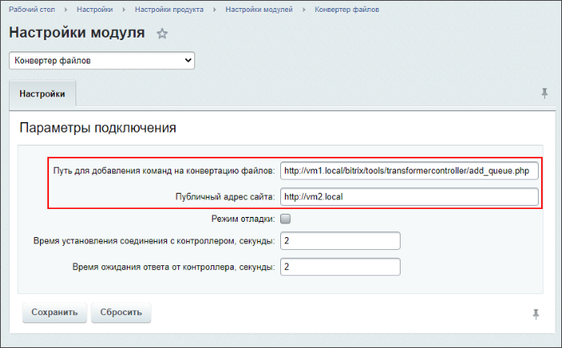

# Сервер конвертации для нескольких сайтов

**Навигация**
- [← Оглавление курса](index.md)
- [← Предыдущий: 21878 — Нагрузка и логирование](lesson_21878.md)
- [Следующий: 4619 — Проверка работы →](lesson_4619.md)

Официальная страница урока: https://dev.1c-bitrix.ru/learning/course/index.php?COURSE_ID=48&LESSON_ID=21882

|  | ### Один сервер на несколько сайтов |
| --- | --- |

Сайт с установленной ролью *Transformer* может конвертировать документы не только для себя, но и для внешних сайтов.

Для сайтов, которые будут обращаться к серверу (сайту с ролью *Transformer*) за конвертацией файлов, версия серверного окружения не важна – это может быть как *VMBitrix*, так и любой хостинг.
Важно лишь наличие установленного модуля «Конвертер файлов» (transformer) версии 20.100.0 и выше.

В качестве примера рассмотрим вариант, когда имеется сайт vm1.local с редакцией *«1С-Битрикс24: Энтерпрайз»* и [настроенной ролью *Transformer*](lesson_21876.md). Необходимо подключить сайт vm2.local так, чтобы конвертация документов производилась на сайте vm1.local.

### Настройка сервера

На сайте, выполняющем роль *Transformer* (в примере  vm1.local), в настройках модуля **Сервер конвертации файлов** (Настройки – Настройки продукта – Настройки модулей – Сервер конвертации файлов) нужно указать адрес подключаемого сайта в поле **Адреса через запятую, с которых должны обрабатываться запросы на конвертацию**: vm2.local и сохранить настройки:

### Настройка сайта клиента

На подключаемом сайте (в примере  vm2.local), в настройках модуля **Конвертер файлов** (Настройки – Настройки продукта – Настройки модулей – Конвертер файлов) нужно указать параметры:

- Поле **Путь для добавления команд на конвертацию файлов** указать адрес сайта сервера конвертации файлов: http://vm1.local/bitrix/tools/transformercontroller/add_queue.php
- Поле **Публичный адрес сайта** оставить адрес текущего сайта: http://vm2.local

И сохранить настройки.

Таким образом, можно подключить несколько сайтов к единому серверу конвертации файлов.
