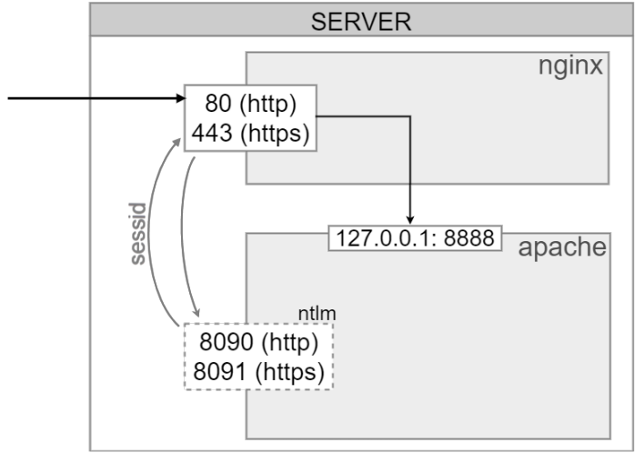

# NTLM-авторизация в стороннем окружении

**Навигация**
- [← Оглавление курса](index.md)
- [← Предыдущий: 3590 — Настройка NTLM модуля Linux для Битрикс](lesson_3590.md)
- [Следующий: 5077 — Настройка браузеров сотрудников →](lesson_5077.md)

Официальная страница урока: https://dev.1c-bitrix.ru/learning/course/index.php?COURSE_ID=48&LESSON_ID=23106

|  | ### Как настроить NTLM-авторизацию в стороннем окружении |
| --- | --- |


Поддержка **NTLM-авторизации** по умолчанию

			включена в дистрибутив продукта

                    Во всех лицензиях *Битрикс24 в коробке* и
в лицензии Энтерпрайз продукта *1С-Битрикс: Управление сайтом*.

		. Мы рекомендуем использовать виртуальную машину BitrixVM, в ней настройка окружения для NTLM-авторизации выполняется просто через специальный

			пункт меню

                    В меню BitrixVM пункт
*8. Управление сайтами (Configure pool sites) &gt; 7. Настроить NTLM авторизацию (Configure NTLM auth for sites)*.

Подробнее в курсе [Виртуальная машина BitrixVM](https://dev.1c-bitrix.ru/learning/course/index.php?COURSE_ID=37&CHAPTER_ID=030272).

		.


Если же вы по каким-то причинам не используете BitrixVM, то для корректной работы NTLM-авторизации в вашем окружении понадобится выполнить настройки аналогичные схеме работы в виртуальной машине.


**Внимание!** Для поддержки механизма NTLM-авторизации продуктами *«1С-Битрикс: Управление сайтом»* и *«Битрикс24 в коробке»* необходим модуль **AD/LDAP интеграция** версии 11.5.0 и выше.


#### Описание механизма работы


Внутренний механизм работы NTLM в виртуальной машине выглядит так:


- В виртуальной машине Nginx слушает порты **80/443** на всех интерфейсах, Apache - **localhost: 8888**. Это основной маршрут для работы с проектом (без NTLM-авторизации);
- Apache также слушает на внешнем интерфейсе порты **8090** и **8091**. Этот хост может направлять на основную папку проекта или на подготовленную, с симлинками ядра. Для этого location в Apache настроена NTLM-авторизация;
- В настройках модуля LDAP должна быть включена опция
  			Включить переадресацию NTLM авторизации
                      Перейдите на страницу **Настройки модуля** (Настройки &gt; Настройки продукта &gt; Настройки модулей &gt; AD/LDAP интеграция).
  [Подробнее](lesson_2544.md)...
  		.


Cетевые взаимодействия схематично:





После включения и настройки механизм NTLM-авторизации начинает работать следующим образом:


1. Неавторизованный посетитель приходит на проект и попадает на 80 порт для http или 443 порт для https;
2. Продукт обработчиком события перенаправляет его на открытый порт Apache (8090 для http или 8091 для https);
3. Apache выполняет NTLM-авторизацию пользователя, создается сессия;
4. Ядро продукта перенаправляет пользователя назад на 80 или 443 порт (для http и https соответственно);
5. Следующие переходы по сайту пользователь выполняет в обычном режиме, пока не истечет сессия.


Таким образом все переадресации берет на себя ядро продукта.


В спойлерах ниже можно посмотреть пример шаблонов для настройки location в Apache, смотрящего наружу. Или скачайте файлы примера в виде [архива](/docs/chm_files/apache_ntlm_template.zip).


## mod_ntlm.conf.j2

```

# {{ ansible_managed }}
# create virtual hosts for NTLM





<IfModule !auth_ntlm_winbind_module.c>
	LoadModule auth_ntlm_winbind_module modules/mod_auth_ntlm_winbind.so
</IfModule>

Listen {{ ntlm_http_port }}
Listen {{ ntlm_https_port }}

<IfModule !ssl_module.c>
	LoadModule ssl_module modules/mod_ssl.so
    
    # httpd 2.4
    LoadModule socache_shmcb_module modules/mod_socache_shmcb.so
	SSLSessionCache			shmcb:/var/cache/httpd/ssl/scache(512000)

    
    # httpd 2.2
    SSLMutex                default
	SSLSessionCache			shmcb:/var/cache/mod_ssl/scache(512000)

    

	SSLPassPhraseDialog		builtin
	SSLSessionCacheTimeout	300
	SSLRandomSeed startup file:/dev/urandom  256
	SSLRandomSeed connect builtin
	SSLCryptoDevice builtin
    SSLCipherSuite HIGH:MEDIUM:!aNULL:!MD5
    SSLProtocol All -SSLv2 -SSLv3
</IfModule>
```


## ntlm_site.conf.j2

```

# {{ ansible_managed }}
# create virtual hosts for NTLM
# site: {{ item.SiteName }}
#





<VirtualHost *:{{ ntlm_http_port }}>

    ServerAdmin webmaster@localhost
    ServerName {{ item.ServerName }}
    ServerAlias *.{{ item.ServerName }}
	DocumentRoot {{ item.DocumentRoot }}
	KeepAlive On

	# Possible values include: debug, info, notice, warn, error, crit, alert, emerg.
	LogLevel warn
	ErrorLog logs/{{ item.SiteShort }}_error_log
    #CustomLog logs/{{ item.SiteShort }}_access_log combined
    #

    
    # configure {{ item.SiteCharset }}
    php_admin_value mbstring.internal_encoding cp1251
    php_admin_value mbstring.func_overload 0
    php_admin_value default_charset cp1251
    

    <Directory />
        Options FollowSymLinks
        AllowOverride None
    </Directory>

    <DirectoryMatch .*\.(svn|git|hg)/.*>
    
        Require all denied
    
        Deny From All
    
    </DirectoryMatch>

    <DirectoryMatch {{ item.DocumentRoot }}/bitrix/(cache|managed_cache|local_cache|stack_cache)>
        AllowOverride none
        AddType text/plain php,php3,php4,php5,php6,phtml,pl,asp,aspx,cgi,dll,exe,ico,shtm,shtml,fcg,fcgi,fpl,asmx,pht
        php_value engine off
    </DirectoryMatch>

    <DirectoryMatch {{ item.DocumentRoot }}/(upload|bitrix/images|bitrix/tmp)>
        AllowOverride none
        AddType text/plain php,php3,php4,php5,php6,phtml,pl,asp,aspx,cgi,dll,exe,ico,shtm,shtml,fcg,fcgi,fpl,asmx,pht
        php_value engine off
    </DirectoryMatch>

	<Directory {{ item.DocumentRoot }}/>
		Options FollowSymLinks MultiViews
		AllowOverride All
		DirectoryIndex index.php index.html index.htm

		AuthName "NTLM Authentication thingy"
		NTLMAuth on
		NTLMAuthHelper "/usr/bin/ntlm_auth --helper-protocol=squid-2.5-ntlmssp"
		NTLMBasicAuthoritative on
		AuthType NTLM
		Require valid-user

		php_admin_value session.save_path {{ item.phpSessionDir }}
		php_admin_value upload_tmp_dir {{ item.phpUploadDir }}
	</Directory>

    <Directory {{ item.DocumentRoot }}/upload/support/not_image>
        AllowOverride none
        
            Require all denied
        
            Order allow,deny
            Deny from all
        
    </Directory>

</VirtualHost>


<VirtualHost *:{{ ntlm_https_port }}>
	ServerAdmin webmaster@localhost
    ServerName {{ item.ServerName }}
    ServerAlias *.{{ item.ServerName }}
	DocumentRoot {{ item.DocumentRoot }}
	KeepAlive On

	# Possible values include: debug, info, notice, warn, error, crit, alert, emerg.
	LogLevel warn
	ErrorLog logs/{{ item.SiteShort }}_error_log
  #CustomLog logs/{{ item.SiteShort }}_access_log combined

	SSLEngine on
	SSLProtocol all -SSLv2
	SSLCipherSuite ALL:!ADH:!EXPORT:!SSLv2:RC4+RSA:+HIGH:+MEDIUM:+LOW
    # CERTIFICATE ANSIBLE MANAGED BLOCK
	SSLCertificateFile {{ item.HTTPSCert }}
	SSLCertificateKeyFile {{ item.HTTPSPriv }}
    # CERTIFICATE ANSIBLE MANAGED BLOCK

    
    # configure {{ item.SiteCharset }}
    php_admin_value mbstring.internal_encoding cp1251
    php_admin_value default_charset cp1251
    


    <Directory />
        Options FollowSymLinks
        AllowOverride None
    </Directory>

    <DirectoryMatch .*\.(svn|git|hg)/.*>
    
        Require all denied
    
        Deny From All
    
    </DirectoryMatch>

    <DirectoryMatch {{ item.DocumentRoot }}/bitrix/(cache|managed_cache|local_cache|stack_cache)>
        AllowOverride none
        AddType text/plain php,php3,php4,php5,php6,phtml,pl,asp,aspx,cgi,dll,exe,ico,shtm,shtml,fcg,fcgi,fpl,asmx,pht
        php_value engine off
    </DirectoryMatch>

    <DirectoryMatch {{ item.DocumentRoot }}/(upload|bitrix/images|bitrix/tmp)>
        AllowOverride none
        AddType text/plain php,php3,php4,php5,php6,phtml,pl,asp,aspx,cgi,dll,exe,ico,shtm,shtml,fcg,fcgi,fpl,asmx,pht
        php_value engine off
    </DirectoryMatch>

	<Directory {{ item.DocumentRoot }}/>
		Options FollowSymLinks MultiViews
		AllowOverride All
		DirectoryIndex index.php index.html index.htm

		AuthName "NTLM Authentication thingy"
		NTLMAuth on
		NTLMAuthHelper "/usr/bin/ntlm_auth --helper-protocol=squid-2.5-ntlmssp"
		NTLMBasicAuthoritative on
		AuthType NTLM
		Require valid-user

		php_admin_value session.save_path {{ item.phpSessionDir }}
		php_admin_value upload_tmp_dir {{ item.phpUploadDir }}
	</Directory>

    <Directory {{ item.DocumentRoot }}/upload/support/not_image>
        AllowOverride none
        
            Require all denied
        
            Order allow,deny
            Deny from all
        
    </Directory>
</VirtualHost>


```


Подробно настройки со стороны административной части продукта описаны в уроках:

- [Настройка NTLM авторизации со стороны продукта](lesson_5078.md) курса Администратор. Базовый;
- [7. Настройка NTLM-авторизации на всех сайтах](https://dev.1c-bitrix.ru/learning/course/index.php?COURSE_ID=37&CHAPTER_ID=030272) курса Виртуальная машина BitrixVM.
